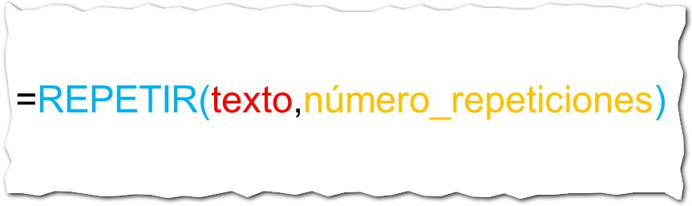

Cr칠ditos imagen: [Freeimages](http://www.freeimages.com/photo/360165)

## 쯈u칠 hace?

La funci칩n Repetir, se usa para repetir una cadena de texto el n칰mero de veces que le indiques.

Si, por ejemplo, quisieras repetir un texto tres veces, deber치s de escribir la f칩rmula con dos argumentos: el texto a repetir y el n칰mero tres.

## 쯇ara qu칠 sirve?

Podr칤as, por ejemplo, utilizarla para hacer mini-gr치ficos de texto para un cuadro de presentaci칩n de datos o un tablero de control.

## 쮺칩mo se usa?

Imagina que tienes en Excel una lista de pel칤culas a las cuales debes dar una맊alificaci칩n맋el uno al cinco. En este listado, vamos a utilizar un peque침o gr치fico, como el que utilizan en las p치ginas web: Un peque침o coraz칩n por cada punto obtenido.

As칤, cada pel칤cula tendr치 una calificaci칩n de entre uno y cinco corazones. Vamos a realizar el ejemplo paso a paso:

1. El cuadro inicial. En esta imagen te muestro el cuadro inicial con el que comienzo el ejemplo. Como ves, tengo el t칤tulo la calificaci칩n y una columna adicional donde haremos nuestro mini-gr치fico.  
2. Usar la funci칩n Repetir. En la columna 'Gr치fico', insertaremos la funci칩n Repetir, d치ndole como primer par치metro el texto que deseamos que se repita. Como te dije, vamos a usar un coraz칩n. Esto lo consigues con la combinaci칩n de teclas ALT + 3 (utiliza el teclado num칠rico). Como segundo par치metro le vamos a pasar la celda en la que escribimos la calificaci칩n: 
3. Copiar la f칩rmula. Ahora copias hacia abajo la f칩rmula para que realice su trabajo. Le pondr치s el color de fuente en rojo y tendr치s algo como esto: 

Por supuesto, las calificaciones son al azar y no tienen nada que ver con una calificaci칩n real por mi parte. Es solo un ejemplo para mostrarte paso a paso c칩mo realizar un mini-gr치fico de forma r치pida y sencilla.

쯈u칠 te parece? Una forma diferente de mostrar tus datos en Excel, utilizando una f칩rmula en lugar de un gr치fico.

## 쯏 t칰, ya usas la funci칩n Repetir?

쮻e qu칠 forma aprovechas la funci칩n repetir? 쯈u칠 otras aplicaciones le has encontrado t칰? D칠jame tus comentarios m치s abajo y seguimos conversando.

춰Nos vemos! \[firma\]

## Descarga el archivo con el ejemplo.

Haz clic en el siguiente enlace para descargarte el archivo terminado.

[Descargar archivo.](http://static.raymundoycaza.com/funcion-repetir.xlsx)
