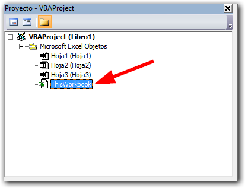
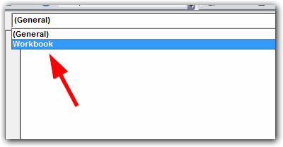
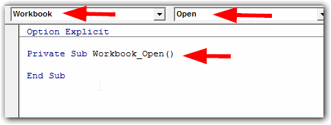
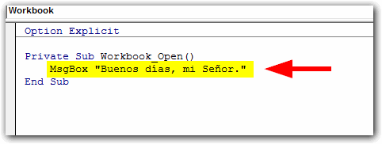
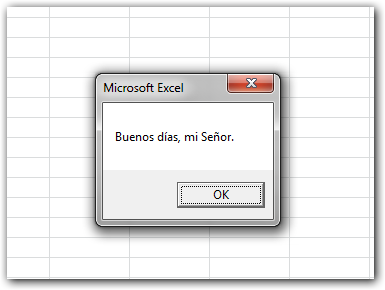

Foto cortesía de [Freeimages.](http://www.freeimages.com/photo/995000 "Freeimages")

Ya te he mostrado los [primeros ejemplos](http://raymundoycaza.com/macros-de-excel/) para trabajar con macros, en los que inclusive has escrito tu primer código en VBA. Sin embargo, es muy frecuente que necesites ejecutar una **macro al abrir Excel**.

Esto es un tema muy sencillo, una vez que conoces cómo se realiza. Hoy voy a mostrarte rápidamente cómo y dónde debes escribir tu código para ejecutar cualquier macro al abrir tu libro de trabajo.

## Cómo ejecutar una macro al abrir Excel, en tres pasos.

La ejecución automática de una macro, depende del lugar donde escribas tu código, así pues, los pasos que debes seguir son los siguientes:

### 1\. Trabaja con el objeto ThisWorkbook.

Abre la ventana del editor de código con el atajo CTRL + F11 y en el panel de la izquierda, haz un doble clic sobre el objeto ThisWorkbook.

### 2\.  Ubica el evento Open.

Si has realizado el paso anterior, aparecerá la ventana que te muestro en la siguiente imagen y en ella, deberás ubicar el objeto Workbook a la izquierda y el evento 'Open' a la derecha, así:

Al final, debes de tener el objeto Workbook a la izquierda y el evento 'Open' a la derecha. Entonces aparecerá abajo una sub-rutina cuyo nombre será una combinación de estos dos: Workbook\_open()

Es dentro de estas dos líneas que debes escribir tu código. Todo lo que tu escribas aquí, se ejecutará automáticamente al abrir el archivo de Excel, sin que el usuario tenga que hacer nada.

Nota: Para que una macro funcione directamente, deben estar habilitadas las macros en Excel. Esto depende del nivel de seguridad que tengas configurado previamente.

### 3\. Escribe tu código.

Finalmente, solo debes escribir el código que necesitas ejecutar. En mi caso, voy a codificar un simple saludo para que Excel te de los buenos días, cada vez que comiences a trabajar por las mañanas :)

Este código del que te hablo, es tan sencillo como esto:

## Mostrando el mensaje.

Una vez hecho esto, cada vez que tú abras tu archivo de Excel, se mostrará un mensaje con el mensaje que escribimos, así como te muestro en esta imagen:

Tan sencillo como eso. Así mismo puedes ejecutar cualquier código que necesites, por ejemplo: verificar si un archivo existe, traer datos desde otro archivo, generar un reporte dinámico o lo que se te ocurra.

### Descarga el ejemplo terminado.

Si quieres descargar el ejemplo para revisarlo por dentro, solo pincha en el siguiente botón:

[Descargar archivo.](http://raymundoycaza.com/wp-content/uploads/macro-al-abrir-excel.xlsm "Descargar Archivo")

## ¿Para qué usarías una macro que se ejecute al abrir Excel?

Pues eso, ¿en qué crees que te resultaría útil una macro que se ejecute automáticamente al abrir tu libro de trabajo?

Junta todas las técnicas de Excel que has aprendido y súmale tu imaginación, entonces descubrirás que tienes entre manos una herramienta realmente poderosa que podrás usar para satisfacer la mayoría de tus necesidades tecnológicas en la oficina o en tu negocio.

¡Nos vemos!

\[firma\]
