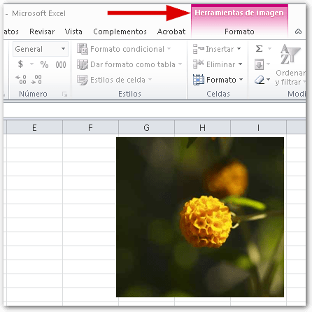
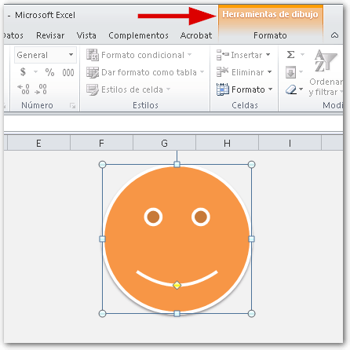
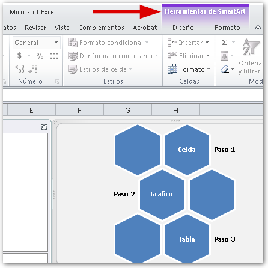
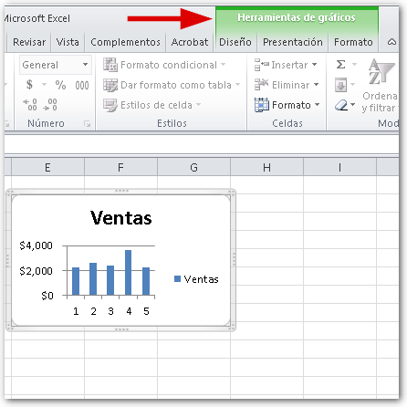
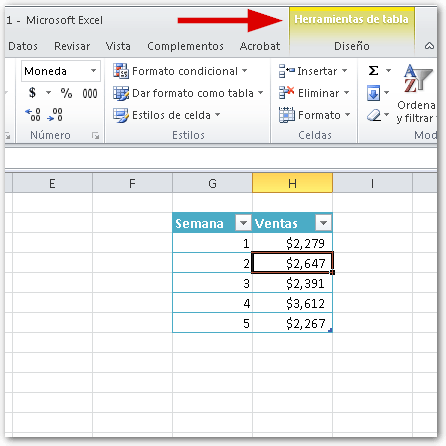

Las Fichas Contextuales en Excel, son un tipo especial de fichas que agrupan comandos relacionados con un objeto determinado y solo se muestran cuando dicho objeto está seleccionado.

## ¿Y por qué se llaman 'Contextuales'?

¡Buena pregunta!

Las Fichas Contextuales, tienen este nombre porque su presencia depende del contexto, es decir, depende del entorno o de la situación actual.

Y el contexto -o la situación- en que aparecen, es aquel en el que un objeto (de entre un grupo determinado de objetos) está seleccionado.

Esto quiere decir que si no se cumple esta condición, estas fichas, simplemente, no se mostrarán.

## Lo tengo; pero ¿cuáles son esos objetos de los que me hablas?

De acuerdo, te conté que las Fichas Contextuales aparecen únicamente cuando ciertos objetos están seleccionados. Eso está claro; pero ¿cuáles son esos objetos de los que te hablo? Bueno, pues existen varios, sin embargo, puedo contarte sobre estos que considero son los más comunes:

### Imágenes o ilustraciones.

Si insertas una foto o imagen que tengas guardada en tu computadora y seleccionas dicha imagen, verás aparecer la Ficha Contextual **"Herramientas de Imagen"**.

Si insertas una forma en tu hoja de trabajo y seleccionas la misma, verás aparecer la Ficha Contextual **"Herramientas de Dibujo"**.

Los Objetos SmartArt, también tienen su propia Ficha Contextual: **"Herramientas de SmartArt"**.

### Gráficos.

¿También los gráficos tienen Ficha Contextual? ¡Así es!

En este caso, la ficha se llama **"Herramientas de Gráfico"**.

### Tablas.

Inserta una tabla y selecciónala. Entonces verás aparecer la Ficha Contextual **"Herramientas de Tabla"**.

## Las Fichas Contextuales agrupan... ¡Más fichas!

Pues sí, como lo oyes (o mejor dicho, como lo lees). Si te fijas en las imágenes anteriores, verás que las Fichas Contextuales son fichas que pueden tener en su interior una o más fichas, que a su vez contienen varios comandos especializados para realizar tareas relacionadas con el objeto seleccionado.

## ¿Es esto una forma de ahorrar espacio?

Tal vez te preguntes por qué esto de las Fichas Contextuales funciona como lo hace. Tal vez sea una buena forma de ahorrar espacio en la Cinta de Opciones y así evitar la saturación con elementos que no son utilizados más que en situaciones específicas.

Los muchachos de Microsoft trabajan mucho en la usabilidad y seguramente esta es la mejor opción. El resultado es palpable, porque una vez que te acostumbras a usar la nueva interfaz de Excel, a partir de la versión 2007, ya no extrañas los antiguos menús. :D

¡Nos vemos!
