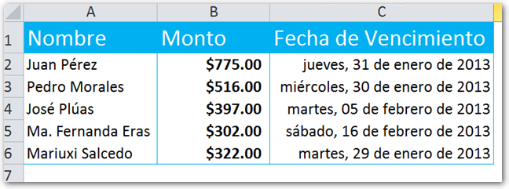
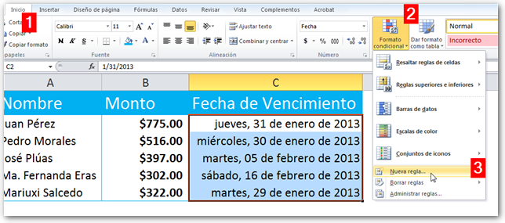
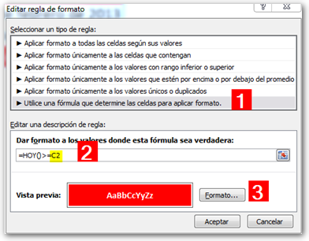
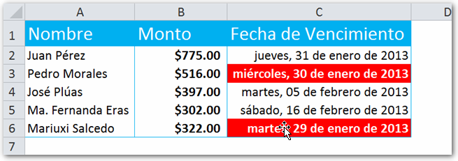

Foto cortesía de [Freeimages.](http://www.freeimages.com/photo/1043303 "Freeimages")

¿Manejas algún listado de clientes? ¿Tienes cartera vencida y te gustaría poder resaltar aquellos registros cuya fecha de pago ya expiró? Aquí te cuento mi forma de hacerlo automáticamente.

Hace un tiempo, en la sección de consultas del blog, recibí un mensaje de una persona que quería resaltar los registros en los que se ha vencido la fecha de pago. Hoy quiero compartir contigo los pasos que se requieren para lograr este efecto en nuestras hojas de Excel.

## El objetivo.

Imagina que tienes un listado de créditos o préstamos otorgados a ciertos clientes.

En este listado sencillo, has anotado el nombre, el monto y la fecha de vencimiento (la fecha en la que te tiene que pagar).

### El objetivo, por lo tanto, es realizar lo siguiente:

1\. Comparar la fecha de vencimiento contra la fecha actual. 2. Si ya se ha cumplido la fecha de pago, pintar en rojo la fecha (no vamos a pintar toda la línea).

## Resaltar una fecha de vencimiento en 3 pasos.

Para lograr nuestro objetivo, vamos a utilizar el formato condicional. Míralo paso a paso:

1\. Selecciona el rango donde están las fechas y pincha en la pestaña "Inicio" (1) Luego pincha en el botón "Formato Condicional" (2) y por último pincha en la opción "Nueva regla..."

2\. Ahora, en el cuadro de diálogo que aparece, elige la opción "Utilice una fórmula que determine las celdas para aplicar formato." (1)

3\. El siguiente paso es utilizar una fórmula para realizar la comparación entre la fecha actual y la fecha de vencimiento (2). La fórmula que estoy utilizando aquí es la siguiente:

\[aviso type="yellow" titulo="Fórmula"\]

\=HOY()>=C2

\[/aviso\]

\[aviso type="purple" titulo="Recuerda"\] La función HOY() devuelve la fecha actual, sin fracciones.\[/aviso\]

Aquí estoy haciéndole una pregunta a Excel: \[resaltar\]"¿Es la fecha de HOY, mayor o igual a la fecha que está en la celda C2?\[/resaltar\]

Si la respuesta es sí, entonces Excel aplicará los colores y tipo de letra que le indiquemos pinchando en el botón 'Formato' (3).

\[resaltar\]Fíjate que no he utilizado 'anclajes' en la referencia C2, es decir, no he utilizado el símbolo $, ya que me interesa que la fórmula se desplace y así la validación se realice en todas las celdas del rango.\[/resaltar\]

 

4\. ¡Listo! Ya puedes pinchar en el botón 'Aceptar' y habrás terminado tu archivo de cartera, en el que automáticamente se resaltarán aquellos registros en los que se haya alcanzado la fecha de vencimiento. ¡Hora de cobrar! :D

## ¡Ponte manos a la obra!

No te quedes con el conocimiento sin llevarlo a la práctica. Utiliza esta técnica en tus archivos ahora mismo. Esa es la mejor forma de retener lo aprendido. Verás qué útil te resulta.

Practica, practica y practica... Hazlo con ganas y pronto estarás convirtiéndote en un Maestro del Excel.

¡Nos Vemos!

\[firma\]
