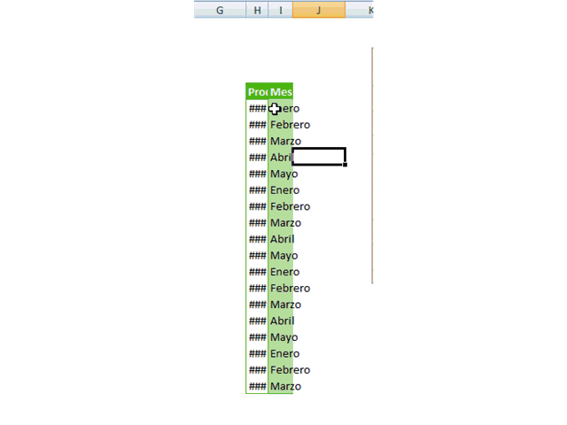
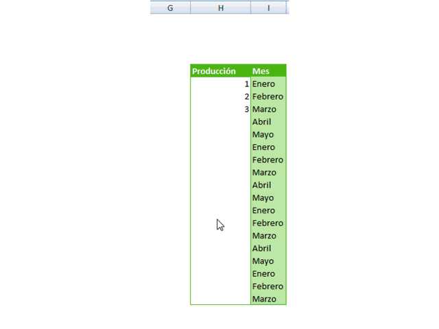
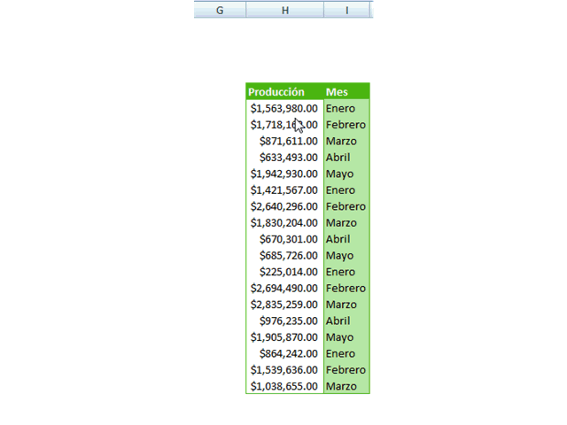
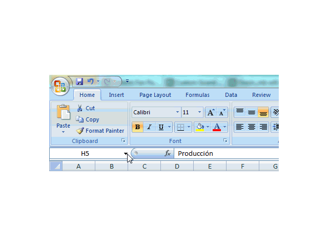
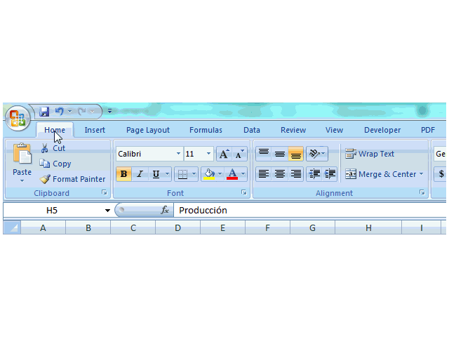
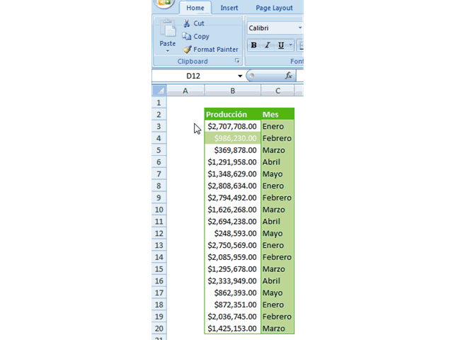

Imagen cortesía de [Freeimages](http://www.freeimages.com/photo/1435507 "Freeimages")

¿Te he mencionado alguna vez que los Tips que ayudan a mejorar mi Productividad son mis favoritos?

Los atajos de teclado son muy efectivos para incrementar nuestra velocidad de trabajo con Excel y si los combinamos con atajos de ratón, la cosa pasa a otro nivel. Por eso **no te pierdas** estos consejos que comparto contigo a continuación.

### #1 Cerrar el Archivo Actual, con un doble clic en el Botón o Logo de Office.

Así de simple. Si no has guardado el trabajo actual, Excel te preguntará si deseas hacerlo antes de cerrar. Para cerrar el archivo actual, suele ser más rápido que 'apuntarle' con el ratón a la segunda X de la esquina superior derecha de la ventana.

Esto equivale a presionar: \[atajo\] CTRL + F4\[/atajo\]

### Ajustar el Ancho de varias columnas a la vez, con un doble clic justo entre ellas.

¿Nunca te ha pasado que necesitas ajustar el ancho de las columnas para que se adapte al contenido? Y en muchas ocasiones hemos terminado haciéndolo columna por columna. Pues si seleccionas todas las columnas y haces un doble clic, justo en la parte donde se unen dos columnas, conseguirás que todas se ajusten automáticamente a su contenido.

### #2 Rellenar Automáticamente una serie, con un doble clic.

Puedes indicarle a Excel que complete automáticamente una serie, si seleccionas lo que has escrito hasta el momento, y haces un doble clic sobre la esquina inferior derecha (el puntero se transformará en una pequeña cruz) 

### #4 Salta a la última columna o fila con un doble clic.

Si quieres desplazarte hasta la última fila o columna, puedes hacerlo sin necesidad de soltar el ratón. Basta con que hagas un doble clic sobre uno de los lados de la celda activa y Excel automáticamente se desplazará hasta la última celda con contenido, en la misma dirección que elegiste. Mira la siguiente animación para quedar más claros.

Esto equivale a presionar: \[atajo\]CTRL + ↓

o

CTRL + →

o

CTRL + ↑

o

CTRL + ←

o

CTRL + ↓ \[/atajo\]

 

Y verás como la celda activa "salta" hasta la última celda con datos en la dirección de la flecha que presionaste: 

### #5 Gana más espacio en tu área de trabajo haciendo que la cinta de Excel se esconda con un doble clic.

¿Quisieras tener más espacio para trabajar? ¡Entonces quitemos la cinta de Excel! O bueno, basta con esconderla. :)

Para hacerlo, debes hacer doble clic sobre cualquiera de las pestañas que marcan las diferentes secciones de la cinta, tal y como lo muestra la siguiente animación.

Esto equivale a presionar:

\[atajo\]CTRL + F1 \[/atajo\]

### #6 Desplazarte por las secciones de la cinta de Excel, usando la ruedita del ratón.

¿Quieres desplazarte más rápido por las opciones de la cinta de Excel? Pincha sobre una ficha y entonces utiliza la ruedita del ratón. ¡Del ratón no desaprovechamos nada! 

### #7 Reutilizar un formato cuantas veces necesites, con un doble clic.

Dime: ¿Cuántas veces quisiste dejar una celda exactamente igual a otra, pero no recordabas todos los pasos que hiciste al momento de darle formato? O tal vez eran muchos pasos.

Ayudaría mucho si usaras una forma de copiar esos pasos de una sola ves. ¿No lo crees?

Para lograrlo podrías hacer un pegado especial, o podrías usar la Brocha de Formato. El inconveniente con la brocha, es que tendrías que copiar el formato dando clic sobre este icono y luego sobre la celda destino, repitiendo estos dos pasos **por cada celda que necesites formatear**.

Hay un truco muy sencillo que consiste en hacer doble clic sobre el icono de la brocha y esta quedará 'anclada', de manera que el formato no se perderá y podrás aplicarlo tantas veces como desees, hasta que lo 'liberes' con un clic nuevamente sobre el icono.

## Ahora es momento de probar tus Superpoderes

Bueno, ni tanto :) Lo cierto es que si utilizas estos tips y los complementas con [tus atajos de teclado](http://raymundoycaza.com/atajos-de-teclado-descarga/ "Los Atajos de Teclado para Excel más interesantes.") favoritos, te convertirás en una máquina de productividad al momento de trabajar con Excel.

Que no se quede en tu memoria nada más. Busca la forma de aplicarlos en tu día a día. Seguramente más de uno te servirá ;)

## ¿Tienes un atajo de ratón favorito?

Me gustaría saber cuál es tu atajo de ratón favorito. ¿Conoces alguno que te gustaría mencionar? ¿Tienes tu propia lista de atajos de ratón? Cuéntame sobre ello.

Si te ha gustado este artículo o crees que a alguien puede serle de utilidad, no dudes en compartirlo en Twitter o Facebook usando los botones de abajo. Te lo agradezco =)

¡Nos vemos!

\[firma\]
