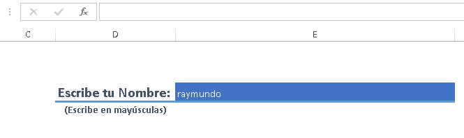
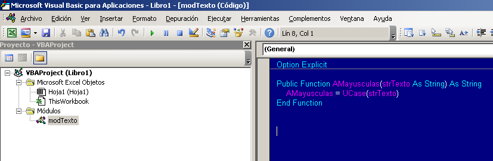
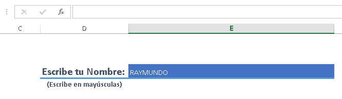

La validación de datos siempre ha sido una de las principales preocupaciones (y dificultades) en nuestros archivos de Excel. Tanto así, que a veces se nos escapan pequeños detalles que pueden llegar a causar grandes molestias.

Por ejemplo, está el caso que ya te mostré, en el que se presenta la situación de necesitar de [bloquear ciertas celdas en Excel, si no se han llenado otras](http://raymundoycaza.com/como-bloquear-ciertas-celdas-en-excel-si-no-se-han-llenado-otras/ "Cómo bloquear ciertas celdas en Excel, si no se han llenado otras.").

También se nos puede presentar la necesidad de obligar al usuario (incluso a nosotros mismos) a escribir siempre en mayúsculas un dato determinado. O lo que es lo mismo, forzar la escritura en mayúsculas.

Pero resulta que no quieres obligar a nuestro, ya de por sí ocupado, usuario a repetir el dato si se equivocó. Entonces la opción sería corregir automáticamente el texto ingresado y transformarlo a mayúsculas.

## Forzar la escritura en mayúsculas, usando Macros.

Para este proceso automatizado utilizaremos a nuestras ya conocidas amigas: Las Macros.

Primero, vas a crear un módulo en el que colocarás una función que se encargue de transformar cualquier texto a mayúsculas. Si no recuerdas cómo se hace todo esto, pásate por aquí: [Escribe tu primera Macro en Excel](http://raymundoycaza.com/escribe-tu-primera-macro-en-excel/ "Escribe tu primera Macro en Excel.").

En el módulo vas a insertar la siguiente función:

Option Explicit

Public Function AMayusculas(strTexto As String) As String
    AMayusculas \= UCase(strTexto)
End Function

De manera que hasta el momento debes tener algo parecido a esto:

 

## Ahora, la explicación

Como ves en el código, solo estoy pasando un [argumento a la función](http://raymundoycaza.com/que-son-los-argumentos-en-excel/ "¿ Qué son los argumentos en Excel ?") que será el texto que deseo convertir a mayúsculas. Luego, lo devuelvo a la función AMayusculas, a través de un "tratamiento"  que le doy usando la función UCase que ya viene incorporada en Excel.

Nota que también llamo a la función UCase pasándole como argumento el texto (strTexto)

Con esta sencilla función podrás convertir cualquier cadena de texto a mayúsculas y reutilizarás este código, en lugar de andar repitiendo lo mismo por aquí y por allá...

## Y finalmente, la implementación

Para llamar a la función desde cualquier hoja de trabajo, deberás utilizar un código similar al que te dejo a continuación y lo colocarás dentro del objeto Hoja.

¿Cuál hoja? Pues la que vayas a utilizar. En este caso, la hoja en la que trabajaré es la Hoja 1, así que allí colocaré el código:

Option Explicit

Private Sub Worksheet\_Change(ByVal Target As Range)
    If Not Intersect(Target, Range(" E4")) Is Nothing Then
        Target.Value \= AMayusculas(Target.Value)
    End If
End Sub

Fíjate que el código debes colocarlo dentro del evento Worksheet\_Changet de la hoja. Puedes copiar y pegar todo el código para no hacerte líos; pero recuerda que es mejor que entiendas el por qué de cada cosa.

### Explicando un poco.

El evento Worksheet\_Change indica que el código se ejecutará solo cuando haya algún cambio en nuestra hoja (es decir cuando escribamos algo o editemos una celda)

Dentro de la función, ya de entrada, nos encontramos con una condición que 'pregunta': Si el rango de la celda que sufrió el cambio, se cruza con el rango E4, entonces contenido de la celda que ha cambiado será igual al mismo contenido, pero en mayúsculas.

Fin de la historia.

Práctico, ¿no lo crees?

Ahora ya puedes guardar tu archivo (no olvides guardarlo como .xlsm) y verás cómo trabaja la macro y automáticamente cambia el texto a mayúsculas, sin importar cómo lo escribas.

## ¿Quieres descargar el archivo terminado?

Solo tienes que hacer clic en el siguiente botón. ¡Es Gratis!

## ¿Qué te parece esta solución?

Ahora te toca a ti, cuéntame tu opinión sobre esta solución a un problema sencillo; pero de consecuencias peliagudas en ciertas ocasiones.

¿Te has topado con esta necesidad en alguna ocasión?

Te espero en los comentarios.

¡Nos vemos!

\[firma\]
