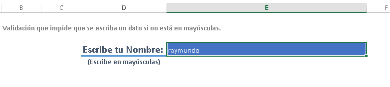
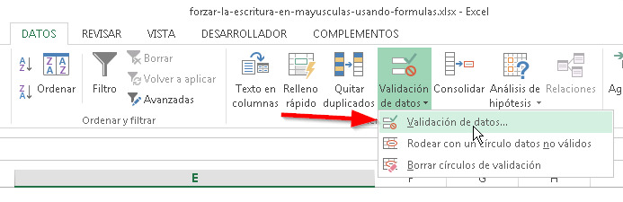
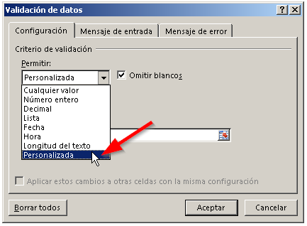
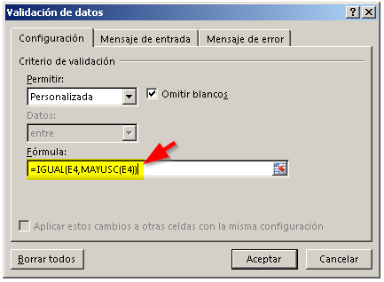
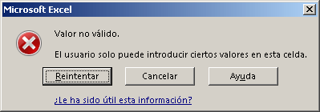
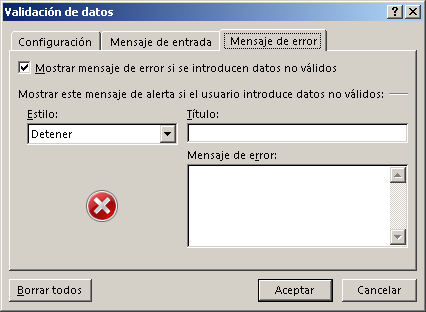
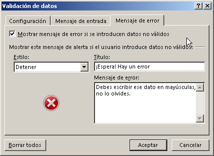
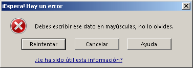

Ya te había contado, [cómo forzar la escritura en mayúsculas usando macros](http://raymundoycaza.com/forzar-la-escritura-en-mayusculas-usando-vba/ "Cómo forzar la escritura en mayúsculas, usando VBA"). Pero ¿y qué si necesitas hacerlo sin utilizar macros?

¿Será que se puede?

¿Tú qué crees?

## Forzar la escritura en mayúsculas, versión sin macros.

Recordemos: Tú quieres obligar al usuario a escribir en mayúsculas y que no acepte ningún dato si no lo ha escrito así. ¿Correcto?

Entonces, podemos valernos da la ya conocida opción "validación de datos".

\[pasos paso="1"\]Selecciona la celda que quieres validar.\[/pasos\]

Te colocas sobre la celda que vas a validar, en este caso la que se muestra en la imagen, para luego insertar la validación.

\[pasos paso="2"\]Utiliza la validación de datos.\[/pasos\]

Te vas a buscar la pestaña "Datos / Validación de datos" y luego eliges la opción "Validación de datos".

 

\[pasos paso="3"\]Inserta una regla de validación.\[/pasos\]

Ahora, en el cuadro que aparece, elige la opción "Personalizada".

Y en el cuadro de texto vas a escribir una fórmula que te explicaré a continuación:

Vamos a hacer uso de la función IGUAL, dentro de la cual anidaremos la función MAYUSC.

\=IGUAL(E4,MAYUSC(E4))

La idea es "preguntarle" a Excel, si el texto escrito es igual al mismo texto, pero escrito en mayúsculas. Si la respuesta es no, la validación de datos falla y no deja escribir al usuario.

Una vez hecho esto. Le das clic en "Aceptar" y la regla estará lista. Si el usuario trata de ingresar un texto que no esté en mayúsculas, sucederá algo como esto:

\[pasos paso="4"\]Personalizando el mensaje al usuario.\[/pasos\]

Seguramente no querrás tener ese mensaje, ya que no es muy claro. El usuario se sentirá algo confundido y no sabrá por qué el sistema no le permite escribir (sí, a pesar de todo, a veces sucede)

Entonces,  ya sea por esta razón o por simple elegancia, colocarás un mensaje propio. Para lograrlo repites el proceso, es decir, seleccionas la celda donde se escribe el dato y te vas a "Datos / Validación de datos" y eliges la opción "Validación de datos".

Pero esta vez, te vas a la pestaña "Mensaje de error".

Ahí escribes un título y un mensaje que verá el usuario, solo en caso de que escriba mal (en minúsculas) el dato en cuestión.

Finalmente, el usuario verá este mensaje de error.

## ¡Y listo!

Cualquier personalización adicional, queda a tu entera disposición. Vamos, que tienes tarea. La idea es practicar.

Lo importante, es que te des cuenta de lo versátil que puede llegar a ser Excel y lo sencillo que puedes implementar mecanismos de control para tener consistencia e integridad de tus datos.

## ¿Quieres descargar el archivo terminado?

Si lo quieres, solo haz clic en el botón:

[Descargar](http://raymundoycaza.com/wp-content/uploads//forzar-la-escritura-en-mayusculas-usando-formulas.xlsx "Descargar el archivo terminado").

## ¿Qué te ha parecido la idea?

¿Te convence? ¿No te convence? ¿Te ha resultado útil?

¿Tienes una mejor propuesta? Me gustaría que siguiéramos la conversación en los comentarios. Te espero allá.

¡Nos vemos!

\[firma\]
