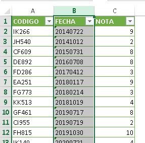
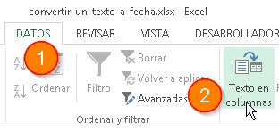
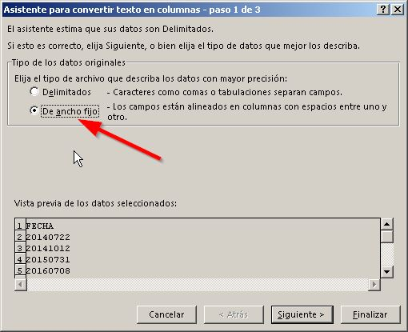
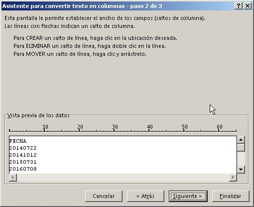
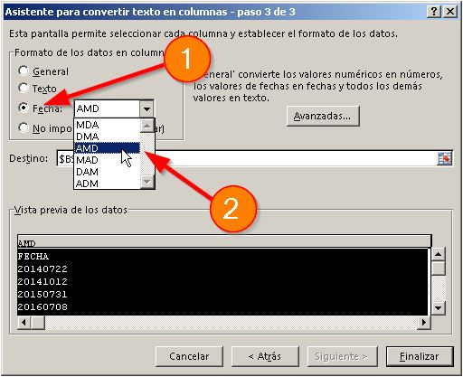
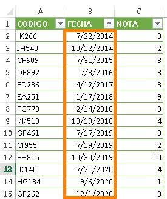

Es cosa común encontrarnos con fechas que "bajamos" de algún sistema y vienen en forma de texto. Generalmente, estas fechas en texto vienen con el típico formato AAAAMMDD (año, mes, día). Pero, al tener tantas ventajas en Excel si trabajamos en forma de fecha, no es de extrañar que ahora mismo estés aquí buscando la forma de **convertir un texto a fecha**.

No te preocupes, aquí te muestro cómo hacerlo.

En [artículos como este](http://raymundoycaza.com/diferencia-de-fechas-en-excel/ "Diferencia de fechas en Excel: mostrar como texto"), surge esta pregunta, ya que es realmente un tema muy conocido y nos lo encontramos frecuentemente cuando trabajamos con datos que vienen del "sistema aquel".

Para lograr realizar este pequeño truco, debes tener claro qué es la opción "Texto a Columna". Si aún no sabes bien de qué te estoy hablando, entonces primero pásate por [esta entrada](http://raymundoycaza.com/usando-la-opcion-texto-en-columna/ "Usando la opción Texto en Columna").

¿Ahora sí?

Bien. Empecemos.

## Convertir un texto a fecha (todas las celdas a la vez)

\[pasos paso="1"\]Selecciona la columna con las fechas\[/pasos\]

Obviamente, debes seleccionar o "sombrear" la columna donde están las fechas.  Esto es importante si no quieres hacerlo de a uno por uno :D

\[pasos paso="2"\] Elige la opción "Texto a Columna" que se encuentra en la ficha "Datos".\[/pasos\]

Sin perder la selección (es decir, no toques nada más) ve hacia las pestañas y busca la que tiene el nombre  "Datos". Un poco más a la derecha, verás la opción "Texto a columnas". Solo haz un clic sobre este botón.

\[pasos paso="3"\] Configura las opciones del convertidor.\[/pasos\]

Una vez hecho el paso anterior, se abrirá un cuadro de diálogo en el que tendrás que realizar una pequeña configuración para que el convertidor haga su trabajo correctamente.

Primero, debes seleccionar la opción "De ancho fijo" en la primera pantalla y presiona el botón "Siguiente".

 

Luego,  aparecerá una vista previa de cómo se ven los datos actualmente para el convertidor. Nada que hacer aquí. Presiona el botón "Siguiente".

 

Un último retoque. Debes elegir el formato "Fecha" (por que estamos trabajando en realidad con una fecha ¿o no?)

Y a continuación, seleccionas de la lista desplegable el formato en el que viene. Yo he seleccionado el formato AMD, porque en mi columna primero está el año, luego el mes y finalmente el día.

 

 

Presionas el botón "Finalizar" y...

 

Automágicamente, se ha transformado todas las celdas que estaban como texto al formato fecha común y silvestre que Excel puede interpretar como tal. Ahora solo te queda comenzar a trabajar y disfrutar del tratamiento que Excel le da a las fechas para obtener una segmentación de datos por mes, sía, semana, cuarto, etc.

## Descarga el archivo de ejemplo.

Y practica esta técnica para que no se te olvide.

[Descargar](http://raymundoycaza.com/wp-content/uploads//convertir-un-texto-a-fecha.xlsx "Convertir un texto a fecha").

## ¿Qué opinas de esta técnica?

¿Te ha servido alguna vez? ¿Qué tan seguido te encuentras con la necesidad de convertir fechas como en el ejemplo?

Te espero en los comentarios.

¡Nos vemos!

\[firma\]
