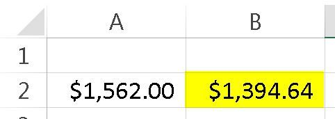
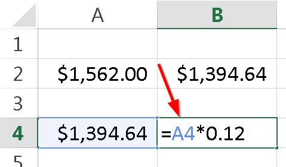
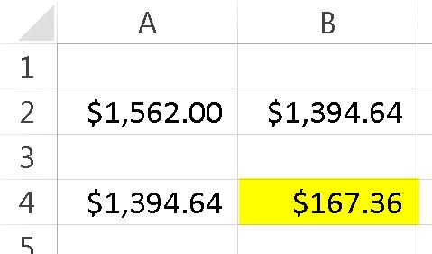
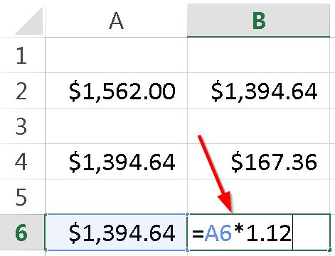
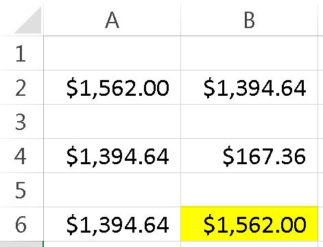

Foto cortesía de [Freeimages](http://www.freeimages.com/photo/649206 "Freeimages")

¿Te has preguntado cómo calcular el IVA cuando ya está incluido en algún precio?

O tal vez desees calcular el valor del IVA de una base imponible. Incluso, necesitamos representar el incremento del IVA y si se puede hacer sin dar muchas vueltas, pues mucho mejor.

Si trabajas con productos en los cuales tienes este dilema, la solución es muy sencilla. Sigue leyendo, porque aquí te muestro las formas de lograr cada uno de estos objetivos.

\[pasos paso="1"\]Calcular el IVA incluido\[/pasos\]

Para lograr averiguar el valor de la base imponible de un artículo que ya tiene el valor del IVA incorporado en su costo, o lo que es lo mismo, calcular el IVA incluido de una artículo, lo único que tendrías que hacer, es dividir el valor total, entre 1.12 (asumiendo que el porcentaje del IVA es de 12)

 

Hacer esto, te dará el siguiente resultado:

### ¿Y cómo se si está bien?

Sencillo. Al valor que te apareció, súmale el 12% . Verás que te dan los $1,562.00 originales.

Para porcentajes distintos, solo debes cambiar el valor que viene después del 1. Es decir, si vives por ejemplo en España, creo que el IVA es del 21%. Entonces la fórmula anterior sería: =A2/1.21

¿Lo tienes?

¡Perfecto!

\[pasos paso="2"\]Obtener el IVA de un precio, directamente.\[/pasos\]

Sencillo. Únicamente debes multiplicar el precio base por el cero y punto más el valor del porcentaje. Es decir, para el IVA del 12%, debes multiplicar por 0.12

Aquí un ejemplo:

Lo que te dará el siguiente resultado:

Ahora, si te fijas, sumando los 167.36 más los 1,394.64 originales, obtendrás los 1,562.00 del ejemplo anterior. Con lo que queda comprobado que la operación inicial está correcta.

\[pasos paso="3"\]Obtener el precio base más el IVA directamente.\[/pasos\]

En lugar de andar multiplicando y sumando en una fórmula innecesariamente larga, lo único que debes hacer para obtener el precio base con su respectivo IVA sumado, es multiplicarlo por 1.12 (o el porcentaje de tu país), así:

 

 

Lo que te dará el siguiente resultado (¡Sí! Adivinaste)

 

¿Te has fijado?

Una vez más obtenemos el valor inicial de 1,562.00 (el cual es el precio con el IVA incluido)

Esto es así, porque ya habíamos calculado la base imponible en el primer ejercicio.

## ¡A practicar!

Ahora que ya tienes un nuevo truco para tu arsenal, anda, ve y ponlo en práctica. Mejora tus fórmulas en ese modelo de Excel que tienes y recuerda, que los pequeños trucos suman para lograr grandes soluciones.

¡Nos vemos!

\[firma\]
