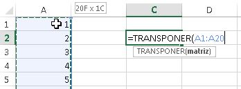
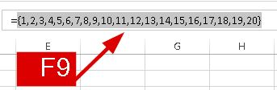
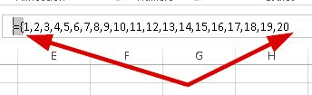
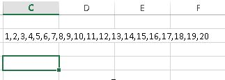

Realmente es muy común encontrarme con personas que buscan saber más sobre macros; pero también hay muchas otras que desean saber cómo solucionar problemas **sin usar macros**.

Por ejemplo, el típico caso: tenemos un rango de datos y queremos concatenarlo. Como ya sabes, la [función concatenar](http://raymundoycaza.com/la-funcion-concatenar-en-excel/ "Función Concatenar") requiere que le pases las celdas que se van a unir, una por una, además de separarlas con una coma.

¡Pero es que esto es demasiado fastidioso!

Y qué te puedo decir. Es verdad.

Por eso, existen soluciones para concatenar un rango utilizando macros a través de una función en [VBA](http://raymundoycaza.com/tag/macros-vba/ "Macros (VBA)").

Entonces, si eres de los que no les gusta complicarse con las macros o quieres una solución que puedas aplicar aquí y ahora, te voy a mostrar un truco sencillo que no es un secreto; pero es poco conocido:

 \[pasos paso="1"\]Utilizar la función TRANSPONER\[/pasos\]

Sí. Vamos a utilizar la función transponer, para utilizar un truco sencillo que nos permitirá conseguir el objetivo deseado.

Para no complicar mucho el ejemplo, voy a imaginar que tengo una lista con números del 1 al 20, la cual quiero concatenar en una celda.

Así, utilizaremos la función transponer escribiéndola seguida del rango en el que se encuentra nuestro listado:

\[pasos paso = "2"\]Aprovechar la tecla F9\[/pasos\]

Ahora, colócate sobre la celda donde colocaste la función en el paso anterior y haz clic en la [barra de fórmulas](http://raymundoycaza.com/la-barra-de-formulas/ "La Barra de Fórmulas"). Acto seguido, presiona la tecla F9

La tecla F9, cuando estás dentro de una fórmula, sirve para depurarla y lo que ves en la imagen anterior, es una representación de la matriz que conforma el rango que le acabas de pasar a la función, mostrando los valores reales en lugar de su referencia a las celdas.

Ya te vas imaginando cómo nos podemos aprovechar de esto, ¿verdad?

\[pasos paso="3"\]Editar la fórmula\[/pasos\]

 Como ves, ya tienes todos los valores concatenados, el trabajo está prácticamente hecho. Lo que necesitas ahora, es quitarle las llaves que están al principio y al final, así como el signo de igual que está junto a la primera llave.

 

## ¡Y ahora está listo!

Una vez realizado esto, tendrás concatenados todos los valores dentro del rango sin usar macros y una vez que lo hagas la primera vez, te darás cuenta de que es más fácil de lo que parece.

¿Qué me dices ahora, te animas a probarlo?

Seguro te podrá sacar de algún apuro (que siempre aparece alguno por ahí)

¡Nos vemos!

\[firma\]
