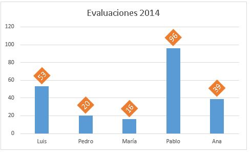
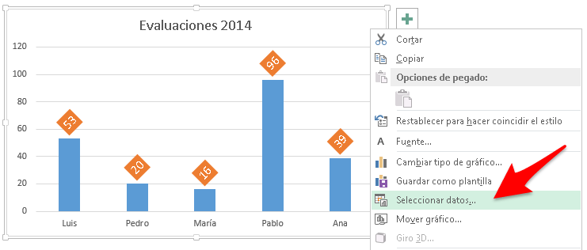
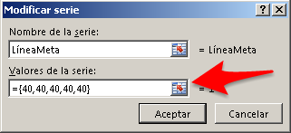
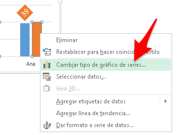
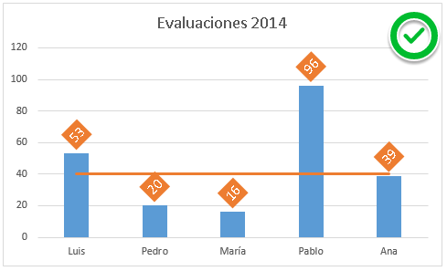

¿Crear una línea de meta? ¡Espera! ¿Y eso qué es? ¿Para qué me sirve a mi?

Si utilizas Excel, seguramente has tenido la tarea de realizar algún gráfico para tus reportes. ¿No es verdad?

Y seguramente, en alguno de esos reportes has comparado días, personas, áreas, zonas, provincias, ciudades o cualquier conjunto de entre los que me pueden venir a la mente ahora.

Bien, pues vamos a imaginar que tú y yo estamos generando un reporte que compara el rendimiento de cinco personas en las evaluaciones del 2014 que acaban de realizarse en la empresa.

El resultado es el siguiente:

Ideal para saber quién tiene la puntuación más alta y quién la más baja ¿no es así?

Pero, ¡vamos! que en muchas ocasiones esto no es suficiente. Debe existir un punto mínimo. Una meta que alcanzar y queremos ver cuál es esa meta en el gráfico.

Supongamos, que el puntaje mínimo requerido es 40 puntos y queremos que en el gráfico aparezca una línea horizontal que pase justamente a la altura de los 40 puntos.

¿La solución? ¿Crear una columna adicional que tenga el mismo valor (40) en todas las celdas?

Pues... es una posible solución, pero no necesariamente la mejor.

Si no quieres alterar tu tabla, pues lo mejor sería que insertaras los datos directamente en el gráfico, **sin que este los tome de ninguna tabla**.

¡No me digas que se puede!

Sí, sí te lo digo... :D

## Crear una línea de meta "fantasma"

El primer paso es editar los datos de tu gráfico recién creado.

### Aquí viene el truco.

Ahora, crea una nueva serie de datos que llamarás "LineaMeta" y en los datos, en lugar de seleccionar un rango [como lo harías normalmente](http://raymundoycaza.com/crear-un-grafico-de-columnas-en-excel/ "Crear un gráfico"), vas a escribir entre llaves el número 40 tantas veces como series existan.

En este ejemplo, como tenemos cinco personas, escribiremos cinco veces el número 40, separados por comas como ves en la imagen.

Recuerda: Tiene que ser entre llaves, porque así Excel lo considerará como una matriz.

###  Retocando.

No, no te ha quedado la línea que esperabas. ¿Correcto?

Pues no te preocupes. Lo que debes hacer es un clic derecho sobre la serie nueva (en este caso la naranja) y seleccionar la opción "Cambiar tipo de gráfico de series..."

En el cuadro que aparece, elige la serie de la línea meta y haz clic en la lista desplegable. En el menú que te aparece, elige la opción de gráfico de líneas, tal y como te muestro en la imagen.

¡Y listo!

Si llegaste hasta aquí, has terminado tu gráfico personalizado con línea de meta y sin tocar tu tabla de datos original.

¡Perfecto para ese informe que tienes guardado por ahí!

¿No lo crees?

## Tu gráfico terminado.

Ahora ya puedes presumir de tu gráfico personalizado y con esa línea fantasma que sale "de ningún lugar" .

Ya puedo escuchar cómo se van generando las ideas en tu cabeza :D

Y eso es todo. Ya tienes la idea para inspirarte y es hora de que lo pongas en práctica.

Vamos! Que debes buscarle un espacio a tus ideas y ponerlas en acción ¡pero ya!

Si te ha gustado la entrada, por favor compártela con tus amigos y conocidos en las redes sociales. Eso me ayudaría mucho.

¡Nos vemos!

\[firma\]
