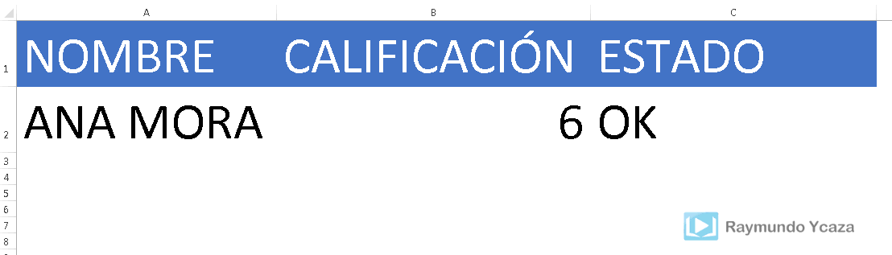

Resaltar una celda en Excel es un tema que ya tocamos [en esta entrada](http://raymundoycaza.com/como-resaltar-celda-activa/ "Resaltar la celda activa."); pero tal vez no resulte algo tan obvio el simplemente cambiar el color y nos resulte mejor algo como **crear una celda intermitente en Excel**.

¿Qué significa esto?

Pues crear una celda que comience a parpadear, avisándonos de su presencia o, mejor aún, sirviéndonos como aviso para eventos importantes. Un caso parecido tratamos ya en la entrada [Resaltar una Fecha de Vencimiento](http://raymundoycaza.com/como-resaltar-una-fecha-de-vencimiento-en-excel/ "Resaltar una Fecha de Vencimiento").

Hoy quiero proponerte algo. Voy a guiarte por todos los artículos que yo he creado y que te servirán para lograr este objetivo, te dejaré el archivo de ejemplo y tú serás quien se encargue de poner en práctica lo aprendido para comprender el funcionamiento y realizar tu propia versión de esta planilla.

¿Te interesa?

¡Pues vamos directo al grano!

### Crear una celda intermitente en Excel.

Usaremos una condición muy sencilla. Imaginemos que tratamos con una calificación del 1 al 10 y queremos que el sistema nos avise cuando la calificación es menor que 5.

Si el valor es menor que 5, una celda comenzará a parpadear, mostrando el mensaje "Reprobado", avisando que existe una novedad importante. En caso contrario, no hará ningún cambio.

¿Y cómo haremos para que la celda se pinte de manera intermitente?

Pues, nos ayudaremos de la entrada [Cómo ejecutar una macro periódicamente](http://raymundoycaza.com/ejecutar-una-macro-periodicamente/ "Cómo ejecutar una macro periódicamente"), que ya vimos hace algún tiempo.

Lo que lograremos será una planilla que nos alertará con una gran celda roja intermitente que se esforzará por decirnos que algo no anda del todo bien.

 

## Además, el archivo terminado.

Aquí te dejo el archivo terminado para que lo revises y puedas orientarte. Quiero que pongas tus cinco sentidos y recuerdes lo que hemos aprendido en los últimos meses para lograr realizar esta aplicación.

[Descargar archivo](http://raymundoycaza.com/wp-content/uploads//crear-una-celda-intermitente.xlsm "Descargar archivo").

### Créditos de imagen de portada:

### [http://www.freeimages.com/photo/506798](http://www.freeimages.com/photo/506798 "Freeimages")

##  Y eso es todo.

Pronto publicaré el paso a paso en vídeo; pero mientras tanto, quiero que me cuentes cómo te fue intentando hacerlo por tu propia cuenta.

¿Qué dices? ¿Te animas?

Nos vemos en los comentarios.

\[firma\]
