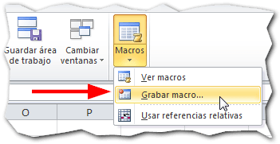
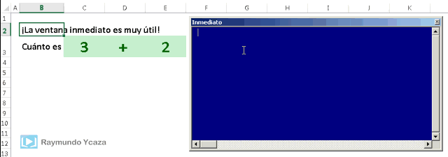
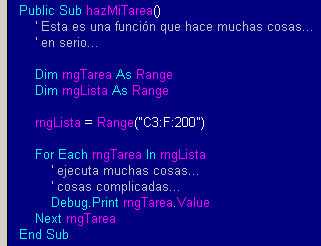

Muchas personas me escriben pidiéndome más material y consejos para **usar macros en Excel,** ya que el miedo a usar las macros está desapareciendo poco a poco (afortunadamente)

Mientras estaba pensando en cómo redactar una entrada sobre este tema, recordé que había leído un decálogo en [Chandoo.org](http://chandoo.org/ "Chandoo") que resume de manera muy clara y concisa cuáles son los principales consejos que puedes y debes seguir para empezar con las macros. Es más, estos consejos te servirán aún después de haber pasado por tu iniciación y convertirte en **un ninja consumado de las macros** :D

Y es que ya resulta innegable la utilidad de usar macros en Excel. Si tu instructor se niega a enseñarte a usar macros, _usando esa misma excusa de siempre_, mejor cambia de instructor ¡pero ya!

Repito, no importa si recién estás empezando a usar macros en Excel o si ya has realizado tus primeras pruebas. Estos 10 consejos que te dejo a continuación, seguro te servirán como una referencia que podrás seguir cada vez que inicies un nuevo proyecto en Excel que contenga macros.

\[pasos paso="1"\]Piénsalo primero, piénsalo en papel.\[/pasos\]

Como en todo en la vida, también cuando usas macros es bueno detenerse a pensarlo un poco antes de acometer contra una gran tarea.  Y lo mejor casi siempre es pensarlo en papel.

Sobre todo si se trata de [un proyecto más grande que unas pocas líneas de código](http://raymundoycaza.com/agenda-en-excel-1/ "Aprende Haciendo: Agenda en Excel que te recuerda los eventos pendientes [1/2]"), trabajarlo en papel activará una conexión entre tu mente y tu mano que dará paso a una mayor creatividad y, si ademas haces unos gráficos, podrás ver varias que se te estaban pasando por alto y que te podrían meter en aprietos si no las consideras antes de empezar.

Detenerte a pensar antes de crear tus macros, te puede ayudar incluso a determinar si tienes ya alguna macro que puedas reutilizar y adaptarla a tu problema actual. Por si fuera poco, puede ayudarte a determinar si en realidad necesitas una macro para lograr tu objetivo.

\[pasos paso="2"\]Haz el borrador, usa el grabador.\[/pasos\]

La [grabadora de macros](http://raymundoycaza.com/como-grabar-macros/ "Cómo grabar macros: Tu primera macro en Excel.") será una de tus más valiosas aliadas a la hora de **empezar a usar macros en Excel**. Te permitirá analizar la sintaxis del código de VBA para que aprendas como se invoca a cada elemento de la ventana de Excel.

¿Cómo escribir en una celda usando macros?

¿Cómo aplicar formato a través de las macros?

Basta con que uses la [grabadora de macros](http://raymundoycaza.com/como-grabar-macros/ "Cómo grabar macros: Tu primera macro en Excel.") , ejecutes la tarea deseada y observes el resultado. Sencillo, ¿no crees?

Yo aún la sigo usando y te puedo decir que es una excelente aliada para poder desarrollar el esqueleto de tu código y ahorrarte algo de tiempo. Es muy útil para crear borradores de tus macros para luego simplemente retocarlas o adaptarlas para su reutilización.

\[pasos paso="3"\]Ayúdate con la ventana inmediato.\[/pasos\]

El editor de VBA tiene una herramienta que puedes aprovechar para ir realizando cambios y pruebas casi en tiempo real. Es como tu campo de tiro donde realizarás las comprobaciones de tu código y comprobarás si está comportándose como esperas.

También es una excelente manera de aprender y practicar :D

Para activarla, simplemente accede al editor de VBA usando el atajo de teclado ALT + F11. Una vez allí, verás la ventana "Inmediato".

En caso de que no puedas verla, actívala con el atajo CTRL + G

#### Así luce una prueba con la ventana Inmediato:

\[pasos paso="4"\]Tu aliado en las pruebas: Usa Debug.Print\[/pasos\]

Nunca te librarás por completo de los errores en tu código y a veces son errores tan extraños que no logras identificarlos al primer vistazo, especialmente si ya son las 3 de la mañana y tienes que entregar el trabajo a las 7 :D

Por esta razón, \[resaltar\]Debug.Print\[/resaltar\] se convierte en uno de tus mejores aliado durante la depuración. Te permite examinar el resultado que arroja una operación en tu código en un momento determinado, sin interrumpir tu código ni ejecutarlo paso a paso con puntos de interrupción:

En el ejemplo de la imagen, se escribirán los valores de cada una de las celdas del rango, conforme se vaya ejecutando el código, dejándote ver si éste funciona correctamente.

\[tuitealo\]¡Mira! Estos consejos para usar macros en #Excel ¡están muy buenos! http://bit.ly/1Mjv5FC\[/tuitealo\]

\[pasos paso="5"\] No inventes el agua tibia: Busca la función correcta.\[/pasos\]

¿Te imaginas si todos hiciéramos lo mismo una y otra vez, en lugar de aprovechar lo que ya está inventado?

¡Jamás avanzaríamos en nada!

Pero la mayoría de las ocasiones en que queremos realizar una tarea, resulta que otra persona ya pasó por esa misma necesidad y encontró una forma de hacerlo. Por eso, mi recomendación es que lo primero que hagas es buscar entre \[resaltar\]las funciones de VBA\[/resaltar\] la solución a tu problema.

Si no encuentras una función que sea nativa, puedes realizar un segundo paso que es buscar en la Internet una función que otra persona haya realizado para este fin.

Te sorprenderías de la cantidad de personas que tienen problemas similares a los tuyos y, de todos modos, siempre es más sencillo retocar un poco una función que hacerla toda desde el principio.

\[pasos paso="6"\] Divide y vencerás.\[/pasos\]

Este es un principio que utilizamos en la programación. No te agobies con esa enorme tarea. Divídela en tareas más pequeñas que sean más fáciles de abordar y menos estresantes.

Esto es lo que llamamos dividir un código en módulos. Dichos módulos quedarán independientes y especializados cada quien en lo suyo, en lugar de tener una sopa de letras que trate de hacerlo todo.

Esto te dará varias ventajas muy claras:

- **Podrás reutilizar tu código:** Si lo divides en módulos que hagan cosas específicas, podrás reutilizarlo posteriormente en otros trabajos haciendo que tu tiempo de diseño sea cada vez menor. Por ejemplo, una función que obtenga la raíz cúbica de un número.
- **Será fácil de comprobar**: Al tener secciones independientes, podrás verificar con mayor facilidad quién está haciendo algo mal (si es que lo hay)
- **Será fácil de mantener:** ¿Cuántas veces has tenido que dejar de lado tu viejo programa y comenzar desde cero uno nuevo, porque simplemente ya no podías seguir haciendo cambios en ese "Frankestein" que habías engendrado? Pues si modularizas tus programas, eso será cosa del pasado.

\[pasos paso="7"\] Un paso a la vez.\[/pasos\]

Sí, todos somos impacientes y queremos las cosas inmediatamente. Pero este es el camino corto al fracaso. Si tratas de abordar todo a la vez, lo más seguro es que no hagas nada o, lo que tal vez es peor, lo poco que hagas lo harás mal.

Regresa a leer el primer paso y comprende lo que tienes que hacer. Cuál es la necesidad real que tienes que abordar y, si usas el paso número 6, podrás encontrar cuáles son los más importantes para decidir con qué módulo empezar.

Esto te ahorrará mucho trabajo, dolores de cabeza y te dará un control mental sobre grandes tareas al más puro estilo de los maestros de Kung-Fu. Impresionarás a tu jefe :D

\[pasos paso="8"\] Mantén a la mano una buena referencia.\[/pasos\]

Si estás decidido o decidida a usar macros frecuentemente, mantener una referencia a la mano es muy importante para poder disipar cualquier duda. Los libros de Excel son una poderosa herramienta que contienen mucha información, consejos y trucos que te permitirán sacarle el jugo a Excel y las macros.

Por ejemplo, una referencia que podrías tener a la mano en tu tableta o teléfono (si no quieres un libro físico) es [Macros con Excel 2007](# "Macros con Excel 2007").

\[tuitealo\]¿Te interesan los consejos sobre #macros? ¡Pues mira ésto! http://bit.ly/1Mjv5FC\[/tuitealo\]

\[pasos paso="9"\]  Acepta desafíos.\[/pasos\]

No te conformes, no esperes, no dudes, no temas, no digas no.

Acepta desafíos que reten a tu mente y acomete contra ellos. El cerebro es como un músculo, mientras más lo ejercites más fuerte se pondrá.

La manera más segura de aprender es desafiándote a ti mismo o a ti misma con nuevas "batallas" que te fortalecerán. Pero comienza con desafíos realistas, no cometas el error de lanzarte a crear un sistema de lanzamiento de cohetes para la NASA con Excel. Eso déjalo para más adelante :D

Lo que sí podrías es tomar los desafíos que yo te iré colocando de cuando en cuando en el blog, [como este](http://raymundoycaza.com/como-crear-una-celda-intermitente-en-excel/ "Cómo crear una celda intermitente en Excel [Desafío]"),  y aplicarte a resolverlo. Verás cómo te diviertes aprendiendo.

\[pasos paso="10"\] Usa las macros solo cuando las necesites.\[/pasos\]

Bien, ya hemos llegado a este punto y tu emoción es grande. **Ya sabes manejar las macros** y quieres resolverlo todo con ellas. Después de todo, si son tan poderosas, deben ser siempre la mejor opción, ¿verdad?

Pues fíjate que no.

Si te detienes a evaluar con calma y objetivamente, verás que no siempre resulta la mejor opción usar macros. Es más, te aconsejo que trates de mantenerte en lo posible apegado a las funciones nativas con Excel. Aparte de que es una buena forma de ejercitar tu creatividad, será una buena forma de mantener optimizada tu planilla en cuanto a uso de memoria y accesibilidad.

Si todo lo demás no te da la solución, entonces usa macros.

### Más consejos y trucos para usar Macros en Excel.

- [Comencemos con las Macros en Excel.](http://raymundoycaza.com/las-macros-en-excel/ "Comencemos con las Macros en Excel.")
- [Cómo grabar macros: Tu primera macro en Excel.](http://raymundoycaza.com/como-grabar-macros/ "Cómo grabar macros: Tu primera macro en Excel.")
- [Cómo mostrar la ficha Programador \[Vídeo\]](http://raymundoycaza.com/ficha-programador/ "Cómo mostrar la ficha Programador [Vídeo]")
- [Escribe tu primera Macro en Excel.](http://raymundoycaza.com/escribe-tu-primera-macro-en-excel/ "Escribe tu primera Macro en Excel.")
- [Cómo cerrar Excel desde una macro? (con un clic de ratón)](http://raymundoycaza.com/como-cerrar-excel-desde-una-macro/ "http://raymundoycaza.com/como-cerrar-excel-desde-una-macro/")
- [Cómo abrir un archivo, con macros en Excel.](http://raymundoycaza.com/abrir-un-archivo-con-macros/ "Cómo abrir un archivo, con macros en Excel.")
- [Cómo marcar una celda con un clic, usando VBA.](http://raymundoycaza.com/como-marcar-una-celda-con-un-clic-usando-vba/ "Cómo marcar una celda con un clic, usando VBA.")
- [Cómo escribir en una celda, usando Macros (VBA)](http://raymundoycaza.com/como-escribir-en-una-celda-usando-macros-vba/ "Cómo escribir en una celda, usando Macros (VBA)")
- [Cómo asignar una Macro de Excel a un botón.](http://raymundoycaza.com/como-asignar-una-macro-de-excel-a-un-boton/ "Cómo asignar una Macro de Excel a un botón.")
- [Ejecutar una Macro al abrir Excel.](http://raymundoycaza.com/macro-al-abrir-excel/ "Ejecutar una Macro al abrir Excel")
- [Cómo bloquear ciertas celdas en Excel, si no se han llenado otras.](http://raymundoycaza.com/como-bloquear-ciertas-celdas-en-excel-si-no-se-han-llenado-otras/ "Cómo bloquear ciertas celdas en Excel, si no se han llenado otras.")

### Más material sobre cómo usar macros en Excel.

¿Te interesa un curso sobre macros con garantía de devolución de tu dinero?

[Pues aquí encontré uno del ServiProfer, échale un ojo.](http://raymundoycaza.com/curso-de-excel-en-video-sin-riesgos/ "Curso de Macros en Excel")

##  ¿Qué otro consejo compartirías tú?

Anímate. Si tienes otro consejo que creas que le puede servir a los usuarios novatos, compártelo en los comentarios. Así me ayudarás a convencerlos de que cualquiera puede aprender a utilizar el poder escondido de VBA.

### Ayúdame a compartir esta entrada.

Si esta entrada te gustó, te pido que la compartas con tus amigos usando los botones de Facebook y Twitter. Suscríbete amis redes sociales y deja tus comentarios. Eso me ayudaría mucho.

Que tengas una buena jornada.

¡Nos vemos!

\[firma\]

Créditos imagen: [Freeimages](http://www.freeimages.com/photo/1428251 "Freeimages")
