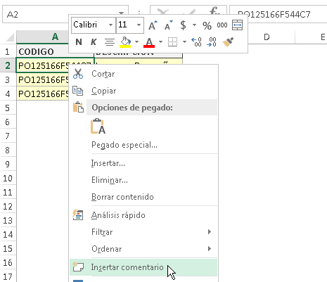
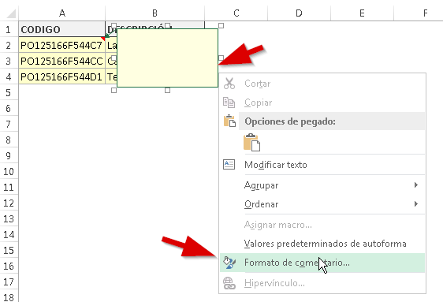
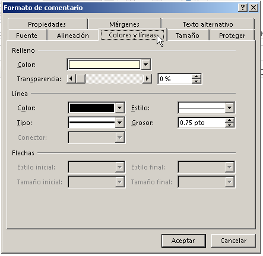
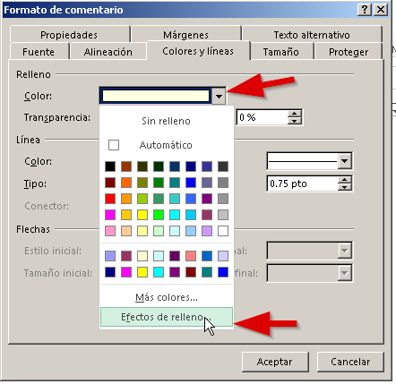
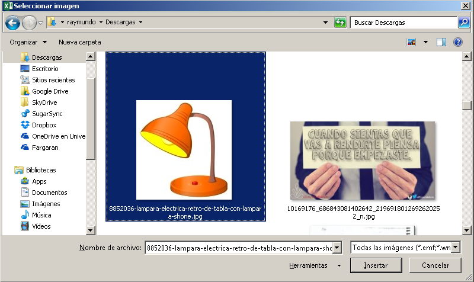

A veces las necesidades más complejas en apariencia, tienen las soluciones más sencillas. No siempre debes hacerte un quebradero de cabeza con Excel. Por ejemplo, existen personas que les interesa tener un catálogo de productos y que además aparezca la imagen junto a su código.

Es más, les gustaría que solo aparezca la imagen cuando se pasa el ratón sobre el código del producto.

¡Esto no se puede hacer en Excel!

Pues déjame decirte que sí  se puede y, gracias a mi querida amiga, [@albarrason](https://twitter.com/albarrason?lang=es "Sonia Albarracín") que me recordó la existencia de este sencillo pero fabuloso truco, hoy te traigo los pasos para realizarlo.

## Insertar imágenes en los comentarios de Excel: Paso a paso.

\[pasos paso="1"\]Inserta un comentario normalmente\[/pasos\]

Clic derecho sobre la celda con el código de producto y clic en "Insertar comentario"

\[pasos paso="1"\]Dale formato al comentario\[/pasos\]

Coloca el puntero del ratón justo en uno de los bordes de la caja de comentario y haz un clic derecho. Elige la opción "Formato de comentario..."

Deberá de aparecerte un cuadro como éste. Si no es así, seguramente es porque no pusiste el puntero justo sobre el borde.

Seleccionas la pestaña "Colores y líneas" que es donde vamos a trabajar.

Para realizar el "truco" vas a elegir la lista desplegable "Color" en la que vas a elegir la opción "Efectos de relleno..."

Se abrirá oootro cuadro en el cual vas a elegir la pestaña "Imagen" y luego harás un clic sobre el botón "Seleccionar imagen..."

 Se abrirá un cuadro en el que simplemente debes buscar y seleccionar la imagen deseada.

Yo voy a buscarme la figura de una lamparita :D

## ¡Y listo!

Con esos sencillos pasos, ya tendrás en funcionamiento un catálogo de productos con un cierto aire de interactivo  :P

Haz la prueba, pasa el puntero del ratón sobre la celda donde insertaste el comentario y verás como aparece la imagen asociada y desaparece cuando quitas el puntero.

¡Perfecto para esa idea que tenías!

¿O no?

Ahora, ¿qué otra cosa podrías hacer para mejorar este sistemita?

Podría ser, por ejemplo, aplicar una macro que busque automáticamente la imagen. ¿Sería posible?

Tú, ¿cómo lo harías?

Espero tu respuesta en los comentarios.

¡Nos vemos!

\[firma\]
