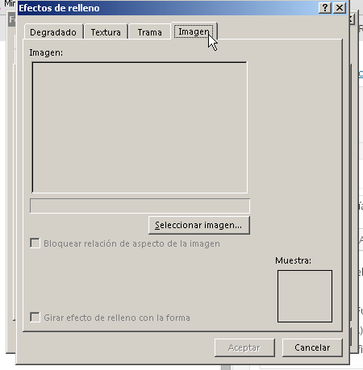

A veces las necesidades m치s complejas en apariencia, tienen las soluciones m치s sencillas. No siempre debes hacerte un quebradero de cabeza con Excel. Por ejemplo, existen personas que les interesa tener un cat치logo de productos y que adem치s aparezca la imagen junto a su c칩digo.

Es m치s, les gustar칤a que solo aparezca la imagen cuando se pasa만l rat칩n sobre el c칩digo del producto.

춰Esto no se puede hacer en Excel!

Pues d칠jame decirte맘ue s칤 맙e puede y, gracias a mi querida amiga, [@albarrason](https://twitter.com/albarrason?lang=es "Sonia Albarrac칤n")맘ue me record칩 la existencia de este sencillo pero fabuloso truco, hoy te traigo los pasos para realizarlo.

## Insertar im치genes en los comentarios de Excel: Paso a paso.

\[pasos paso="1"\]Inserta un comentario normalmente\[/pasos\]

Clic derecho sobre la celda con el c칩digo de producto맟 clic en "Insertar comentario"

\[pasos paso="1"\]Dale formato al comentario\[/pasos\]

Coloca el puntero del rat칩n justo en uno de los bordes de la caja de comentario y haz un clic derecho. Elige la opci칩n "Formato de comentario..."

Deber치 de aparecerte un cuadro como 칠ste. Si no es as칤, seguramente es porque no pusiste el puntero justo sobre el borde.

Seleccionas la pesta침a "Colores y l칤neas" que es donde vamos a trabajar.

Para realizar el "truco" vas a elegir la lista desplegable "Color"만n la que vas a elegir la opci칩n "Efectos de relleno..."

Se abrir치 oootro cuadro en el cual vas a elegir la pesta침a "Imagen" y luego har치s un clic sobre el bot칩n "Seleccionar imagen..."

Se abrir치 un cuadro en el que simplemente debes buscar y seleccionar la imagen deseada.

Yo voy a buscarme la맍igura de una lamparita :D

## 춰Y listo!

Con esos sencillos pasos, ya tendr치s en funcionamiento un cat치logo de productos con un cierto aire de interactivo먝:P

Haz la prueba, pasa el puntero del rat칩n sobre la celda donde insertaste el comentario y ver치s como aparece la imagen asociada y desaparece cuando quitas el puntero.

춰Perfecto para esa idea que ten칤as!

쯆 no?

Ahora, 쯤u칠 otra cosa podr칤as hacer para mejorar este sistemita?

Podr칤a ser, por ejemplo, aplicar una macro que busque autom치ticamente la imagen. 쯉er칤a posible?

T칰, 쯖칩mo lo har칤as?

Espero tu respuesta en los comentarios.

춰Nos vemos!

\[firma\]
