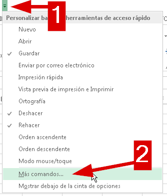
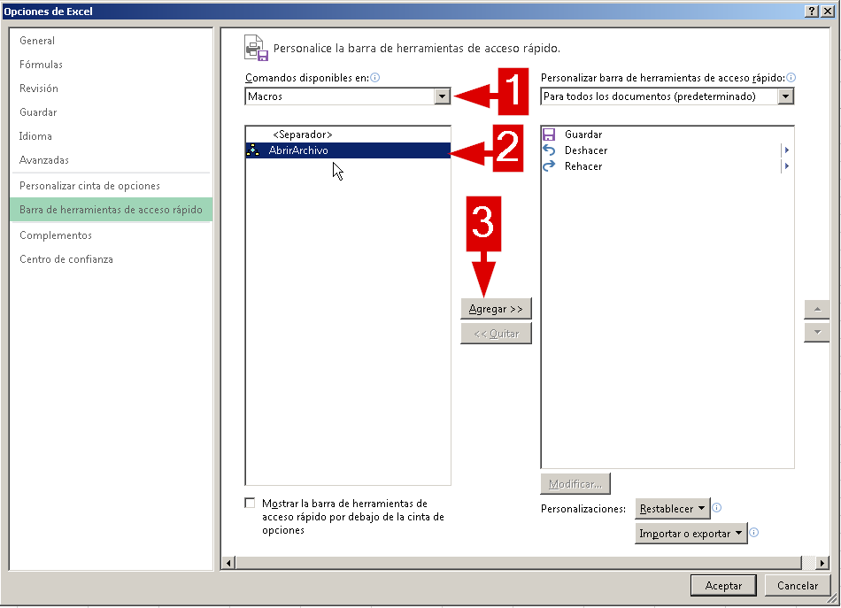
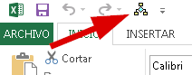
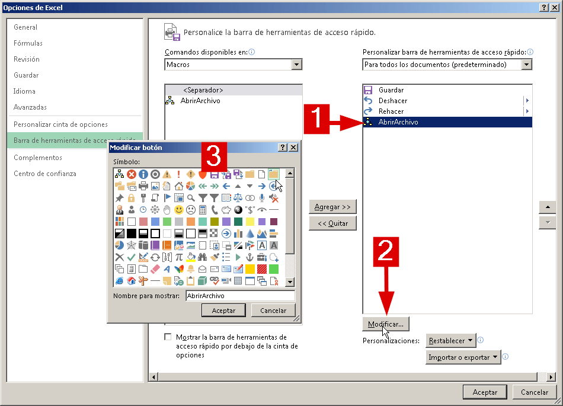

Imaginemos que ya estás [escribiendo tus macros](http://raymundoycaza.com/escribe-tu-primera-macro-en-excel/ "Escribe tu primera macro en Excel") a diestra y siniestra.  Por supuesto, ya tienes tus obras maestras y existirán macros que utilizarás más a menudo que las demás.

Entonces ¿cómo tenerlas más a la mano, tanto como a un clic de distancia?

Pues sigue leyendo porque ahora te lo cuento.

### Agregar una macro a la barra de herramientas de acceso rápido.

Imaginemos que tenemos la macro "AbrirArchivo" que ya [creamos en una entrada anterior](http://raymundoycaza.com/abrir-un-archivo-con-macros/ "Abrir un archivo con macros en Excel"). Lo que queremos es que aparezca un icono en la barra de acceso rápido de Excel y al hacer clic sobre él, se ejecute nuestra macro sin más dilaciones.

Entonces seguirás estos pasos:

\[pasos paso="1"\]Agregar un comando\[/pasos\]

Ve a la flecha que aparece junto a la barra de acceso rápido y haz clic sobre ella. Se mostrará un menú del cual vas a elegir la opción "Más comandos...".

\[pasos paso="2"\]Elige una macro\[/pasos\]

En el cuadro de diálogo que aparece, vas a ver todos los comandos que tienes disponibles en la barra de herramientas de acceso rápido. Ahora, en la lista desplegable "Comandos disponibles en:", vas a seleccionar la opción "Macros".

Verás que aparecen listadas todas las macros disponibles en tu libro. En mi caso solo tengo una. La seleccionas y luego haces clic sobre el botón "Agregar" para que aparezca el botón en la barra de herramientas. Para terminar, haz clic en aceptar.

Ahora verás que aparece un botón adicional en tu **barra de herramientas de acceso rápido** y, si haces clic sobre él, se ejecutará la macro que acabas de crear.

¡Muy útil! ¿No lo crees?

\[pasos paso="3"\]Cambia el aspecto de tu botón\[/pasos\]

¿No te gusta cómo se ve tu botón?

¡No hay problema!

Simplemente, repite los pasos hasta que llegues a donde tienes tu macro. Selecciónala en el lado derecho y haz clic sobre el botón "Modificar". Con esto se abrirá un cuadro en el que aparecerán todas las imágenes disponibles para tu botón, entre las que puedes elegir la que más se adapte a tu necesidad.

## ¡Y está listo!

Ahora ya tienes tu botón en la barra de herramientas de acceso rápido que apunta directamente a tu macro haciendo más rápido (obviamente) el acceso a tu macro favorita.

Anímate y pon en práctica este sencillo consejo. Podrás hacer tu trabajo más cómodo y llevadero si aprovechas todas las ventajas que Excel ha puesto para ti.

\[aviso tipo="red" titulo="Ten en cuenta que..."\]

Este botón se mostrará en todos los libros de Excel que abras. Si haces clic en el botón, mientras tengas abierto un libro en el cual no existe una macro con el mismo nombre, te dará un error.

\[/aviso\]

\[aviso tipo="green" titulo="Te aconsejo que..."\]

Si quieres utilizar tu macro en cualquier libro abierto, entonces coloca tu código en el libro de macros Personal, el cual siempre está abierto (aunque tú no lo veas)

\[/aviso\]

## Y eso es todo por hoy.

Espero que le encuentres una utilidad a este consejo y pueda ayudarte a palear unos segundos de tu ajetreada rutina en tu día a día con Excel.

¡Nos vemos!

\[firma\]
