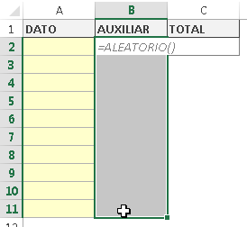
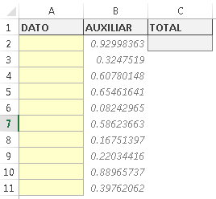
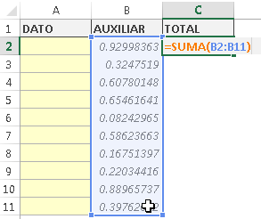
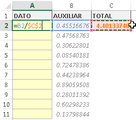
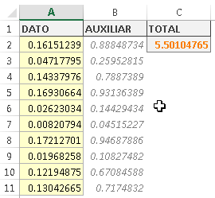
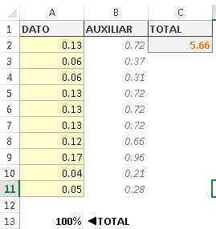

Este fin de semana, revisando entre mis correos recibidos (que cada vez son más y más) me encontré con una consulta sobre cómo **generar datos aleatorios** que me resultó interesante y divertida.

Resulta que Alan trabaja en un laboratorio y necesitaba generar números al azar para sus pruebas y que, al ser sumados, completen exactamente el 100%.

¿Cómo hacer para controlar que los datos sumen exactamente el 100%, si son aleatorios?

Sigue leyendo que ahora te lo cuento.

\[pasos paso="1"\]Primero lo primero: Generar datos aleatorios\[/pasos\]

Obviamente, lo primero que haremos será generar nuestros números aleatorios, por lo que preparamos nuestra hoja de Excel y colocamos en ellos la función =ALEATORIO() y la copiamos en todo el rango que ocupará, según el número de registros que deseamos generar.

Con esto, vamos a tener una serie de números generados aleatoriamente, es decir, generados al azar y que cambiaran cada vez que refrescamos la hoja con la tecla F9.

Si observas con atención la imagen siguiente, vas a darte cuenta de que estoy utilizando una columna auxiliar. Ya verás por qué.

\[pasos paso="2"\]Una celda para sumarlos a todos.\[/pasos\]

Para calcular el porcentaje de cada celda, necesitaremos saber el total sumado por todas ellas. Lógico, ¿verdad? Entonces lo siguiente en la lista es sumar todo ese rango de números aleatorios que generamos en el paso anterior y lo colocaremos en la celda que dice "Total", tal y como te muestro en la imagen.

\[pasos paso="3"\]La verdadera columna .\[/pasos\]

Una vez realizados estos pasos, ya podemos pasar a utilizar la verdadera columna de números aleatorios que aprovecharemos en nuestros cálculos científicos.  :D

Simplemente, vas a dividir cada una de las celdas de la columna auxiliar, para el total de la suma de ellos.

Y copias esta fórmula para cada una de las celdas del rango. Quedándote de la siguiente manera:

 

\[aviso tipo="red" titulo="Precaución"\]

No olvides utilizar el ancla de referencia en esta última fórmula para evitar que se desplace la celda del total, al copiar hacia abajo. Es un error muy común que ocasiona errores que luego no puedes detectar.

**\=B2/$C$2**

\[/aviso\]

## Has terminado. Tus datos aleatorios que respetan el 100%

Si ahora le das unos últimos toques, como formatearlo a dos decimales y sumas con una fórmula el total de la columna "Dato", verás que siempre dará 100%. No importa cuántas veces hagas lo de generar datos aleatorios. Siempre respetará el límite del 100%.

## ¿Quieres descargar el archivo terminado?

Si quieres revisar el archivo terminado y revisarlo para disipar cualquier duda que tengas, aquí te dejo un botón para que lo descargues.

[Descargar el archivo terminado.](http://raymundoycaza.com/wp-content/uploads//1438-generar-datos-aleatorios_que-sumen-100-por-ciento.xlsx "Descargar el archivo")

### ¿En qué estás trabajando?

Me gustaría saber en qué estás utilizando este tipo de trucos o en qué piensas utilizarlo. Cuéntame en los comentarios y así inspiramos a las personas que recién comienzan con Excel, dándoles ideas frescas :D

### Comparte esta entrada en las redes sociales

Si la entrada te ha gustado, por favor compártela con tus amigos en Facebook y Twitter. Eso me ayudaría para darle mayor difusión al blog para llegar a más personas que están deseosas de aprender a utilizar Excel.

¡Nos vemos!

\[firma\]

Créditos imagen de portada: [Freeimages](http://www.freeimages.com/photo/1337707)
