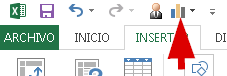

Si vas a comenzar a familiarizarte con el entorno de trabajo de Excel, las barras de herramientas son de las primeras cosas que debes conocer y muy bien. Tal es el caso de la Barra de Herramientas de Acceso Rápido. En esta entrada te cuento acerca de ella.

Lo normal es que, si eres una completa novata o novato en esto de Excel, no conozcas aún a esta barra de herramientas. Es más, la pregunta más lógica sería:

## ¿Qué es la Barra de Herramientas de Acceso Rápido?

Este es el lugar donde colocarás todos los comandos de Excel que necesitas tener más a la mano, tan cerca como a un clic de distancia y puedes verla normalmente en la parte superior de la ventana, justo encima de la cinta de opciones de Excel.

Verás, me explico: Si quisieras insertar un [gráfico de columna agrupada](http://raymundoycaza.com/crear-un-grafico-de-columnas-en-excel/ "Crear un gráfico de Columnas en Excel"), tendrías que ir a la pestaña "Insertar", luego a la sección gráficos, seleccionar el sub-grupo "Columnas" y por último seleccionar la opción "Columnas Agrupadas".

Sencillo, ¿verdad?

Pero ¿y qué si necesitas repetir esta operación todos los días y a cada momento? Llegará el día en que te aburrirás de ésto.

Precisamente, para eso es la **barra de herramientas de acceso rápido**, para colocar ahí un acceso directo a la funcionalidad que quieres tener a la vista y a la mano. En el ejemplo, colocaríamos ahí el comando de "Gráficos de Columnas", para tenerlo más a la mano y así evitarnos dar la vuelta por la ficha "Insertar".

En mi caso, he colocado este comando en la barra de herramientas de acceso rápido y ahora puedes ver que aparece el mismo icono del gráfico de columnas; pero con la diferencia de que ahora lo tengo más "a la mano".

De esta forma, tan solo necesito subir un poco el puntero del ratón y seleccionar mi gráfico de columnas apiladas para insertarlo más fácil, más rápido. ¡Tan sencillo como eso!

¿Quieres ver cómo se hace ésto? Entonces revisa esta entrada en la que [explico la manera en que se usa el editor de la barra de herramientas](http://raymundoycaza.com/como-agregar-una-macro-la-barra-de-herramientas-acceso-rapido/ "Cómo agregar una macro a la barra de herramientas de acceso rápido en Excel"). ¡Verás qué fácil es!

## Sigue practicando y sigue compartiendo.

Si ya te animaste a iniciar tu aprendizaje con Excel, no aflojes ahora. Sigue practicando cada lección para que logres desarrollar la práctica natural en el uso de esta potente herramienta.

Y recuerda, si te ha gustado el artículo, por favor compártelo con tus amigos y conocidos en las redes sociales. Usa los botones de Facebook y Twitter. Así me ayudarás a que este blog llegue a más personas.

¡Nos vemos!

\[firma\]
