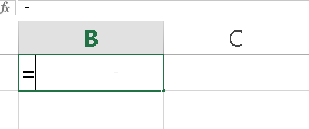
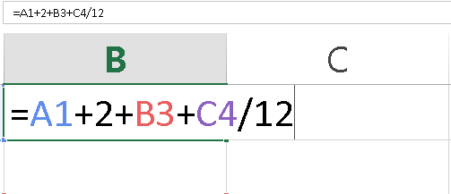
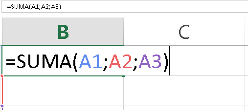
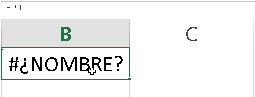

Me arriesgaría a decir que el 80% del trabajo que realizamos en Excel, lo hacemos con fórmulas. Tal vez más. Es por eso que pienso que deberías tomarte 5 minutos de tu tiempo para leer esta entrada.

Verás,  normalmente nos lanzamos a copiar las fórmulas que otros han hecho, ya que nos prometen la solución a nuestro problema ¡y ya!

Claro, no tenemos tiempo.

¿Quién lo tiene?

Pero este es un círculo vicioso. Lo que haces es simplemente copiar una solución, muchas veces sin analizarla realmente, para luego pegarla en tu hoja y armar tu “Frankestein”.

¿Tiene algo de malo?

Tal vez no… tal vez sí. Lo seguro es que no es la mejor opción.

¿Mejor me tomo mi tiempo para aprender a utilizar las fórmulas?

Puede ser.

Aquí es donde nos encontramos con un bicho nuevo.

## La historia se repite

Comienzas a trabajar con Excel y tomas un curso en el que todo va bien, hasta que te topas de frente con las fórmulas. Algunas son muy sencillas; pero otras tienen una forma de hacer las cosas que no encaja con tu propia forma de ver la vida.... Por decirlo de alguna forma.

¿Te ha sucedido?

Y la cosa no termina ahí, no. Encima de eso, te quedas con una sensación de inconformismo, porque no aprendiste lo que esperabas. Regresas a tu puesto de trabajo solo para darte cuenta de que, justamente, la razón por la que los demás te superan en Excel es porque manejan las fórmulas muy bien.

¿Ahora sí te suena conocida la historia?

¡Y no estás solo!

O sola.

Son muchas las personas que pasan por este episodio una y otra vez.

Pero ¿por qué no puedes entender las fórmulas rápidamente?

¿Será porque tratas de aprenderla como un todo que no tiene partes?

¿Un animalejo que no tiene ojos ni brazos?

Si la vida te ha enseñado que las cosas se logran un paso a la vez, entonces, ¿por qué con las fórmulas de Excel habría de ser diferente?

No, mi pequeño saltamontes.

Debes dividir a las fórmulas en sus elementos más básicos y entenderlos, para de esta manera comprender cómo se comportan estos bichos raros y terminarás dándote cuenta de que las fórmulas en Excel, son como andar en bicicleta: luego de que te montas en ella, le pierdes el miedo.

Y recuerda: Todo gran problema, primero se divide en «problemitas».

Si estás de acuerdo conmigo, entonces **sigue leyendo** y acompáñame a este viaje hacia “las entrañas de la bestia”.

## Los elementos básicos de una fórmula en Excel

Vamos a ir desenrollando el ovillo y comenzaremos analizando cuáles son las partes de una fórmula en Excel, revisando rápidamente su significado o su rol, de manera que tengas más claro el por qué están ahí (aunque algunas no puedan verse a simple vista)

###### 1.- El signo igual.

Todas las fórmulas comienzan con el signo “=”. Siempre. ¿Te has dado cuenta?

Ok, vamos a convenir en que a veces comienzan con un “+”, pero esto no es más que un “atajo” para hacerlo más rápido al utilizar el teclado numérico; pero no es la forma en la que se pensó originalmente (e incluso, hay [leyendas urbanas acerca de esto](http://jldexcelsp.blogspot.co.il/2012/08/el-extrano-caso-del-signo-mas-en-excel.html) )

**¿Qué significa el signo igual?**

Sencillamente, significa que estás preparando a Excel para recibir a continuación una fórmula, que puede estar formada por texto, números, funciones o una combinación de todo esto.

Si por casualidad olvidaras utilizar el signo igual antes de escribir tu fórmula, entonces Excel va a detectarla como un texto común y silvestre, mostrándose todo el texto que escribiste, en lugar de el resultado de la fórmula.

**¿El signo igual, es una garantía de que todo saldrá bien?**

No.

Debes tener cuidado, porque si la celda en la que escribes tu fórmula, está formateada como texto, entonces Excel **no la evaluará**, aunque tenga el signo igual por delante.

###### 2.- Números, constantes o referencias.

Esta es la parte de las fórmulas que en realidad **representa a toda la fórmula**.

Una fórmula de Excel, como te dije, puede tener números (constantes) o referencias a celdas (variables). Incluso puede contener funciones que actúan en conjunto.

La ventaja de tener referencias en lugar de constantes en tu fórmula, es que puedes cambiar el comportamiento de un montón de filas e incluso hojas o libros de trabajo, simplemente con cambiar el valor de una o varias celdas.

¿Qué cool, no?

###### 3.- Símbolos matemáticos.

Si tuviéramos los números juntos entre sí, ya sean variables o constantes, pero sin tener símbolos matemáticos que le digan a Excel qué hacer con ellos…

¡Entonces no serviría para nada!

Los símbolos matemáticos pueden ser lo más planos y sencillos de toda la vida:

- Para sumar: +
- Para restar: -
- Para multiplicar: \*
- Para dividir: /

E incluso, podemos utilizar funciones para realizar otros cálculos matemáticos más complejos.

Es más, podríamos alternar constantes y variables, interalados con símbolos matemáticos para hacer nuestras fórmulas, así:

A1+A2+8+30-C4+Z1

¿A poco no se está poniendo interesante?

###### 4.- Los argumentos.

Los [argumentos](http://raymundoycaza.com/que-son-los-argumentos-en-excel/) en una fórmula, van a realizar su aparición en el momento en que utilices las funciones.

Un argumento es la materia prima que le das a una función para que realice el producto para el que está diseñada.

Es decir, si tienes una función SUMA y le pasas tres argumentos: A1, A2, A3

Lo que hará la función será tomar los valores que tengan estos tres argumentos y los sumará entre sí, devolviendo el resultado de dicha suma.

¿Ves? Así, una fórmula que se llame RaízCuadrada, hará algo parecido pero en vez de sumar, calculará la raíz cuadrada del número que le pases como argumento.

Si quieres ver más en detalle los argumentos, éntonces [pásate por esta entrada](http://raymundoycaza.com/que-son-los-argumentos-en-excel/) y sigamos conversando allí.

###### 5.- La celda con el resultado.

Esta es la parte de una fórmula que más suele pasar desapercibida. ¡A pesar de que es la más obvia!

La celda en la que estás escribiendo tu fórmula, es el mismo lugar donde será devuelto el resultado de su evaluación.

¿Qué quiero decir?

Que si ingresas la fórmula: =2+8

En la misma celda verás un 10. Es decir, el resultado de la evaluación de la fórmula se mostrará en la propia celda (tenía que aparecer en algún lado, ¿verdad?)

**Pero no creas que puedes escribir cualquier cosa y ya.**

Si falta algún argumento en alguna de tus funciones, o si tu fórmula está mal escrita o tiene algún error lógico, entonces lo único que verás será un gran cartel de ERROR.

###### 6.- Su cuerpo invisible.

Y a pesar de que te he nombrado un montón de elementos que conforman a una fórmula, decirte que todo esto es invisible sería ¿mucho decir?

Pues sí. En tu celda, luego de presionar la tecla “Enter” y aceptar la escritura de la fórmula que escribiste, ésta, no se mostrará. Sencillamente no la podrás ver.

En serio.

No puedes verla. Y es por eso que resulta importante [la barra de fórmulas](http://raymundoycaza.com/la-barra-de-formulas/) ya que es la única que te muestra el interior de tu fórmula, a menos que presiones la tecla F2 sobre tu celda o que le des un doble clic a ella para entrar en el modo de edición nuevamente.

###### 7.- Su lógica y su orden.

Las matemáticas están en todos lados. Si alguien te dijo que al salir del colegio o de la universidad, dejarías de ver matemáticas, ¡demándalo ahora!

Sí. Una fórmula, como ya habrás intuido, es una expresión matemática. [Ésto ya te lo dije antes](http://raymundoycaza.com/que-es-una-formula-en-excel/), ¿no es verdad?

Entonces, si es una expresión matemática, estará sujeta a una lógica similar y el orden de prioridad de los simbolos matematicos, dice “presente”.

Este orden de prioridad es un tema al que debes prestarle atención (y mucha), porque el no entenderlo bien, es uno de los principales motivos por el que muchas fórmulas fallan sin dar error visible, o sea, el resultado del cálculo es erróneo.

Estos errores “invisibles”, son los más peligrosos y de ellos tienes que cuidarte mucho.

**¿Y cuál es este orden de prioridad de los símbolos matemáticos?**

Pues, el de toda la vida. Si no lo recuerdas bien, a continuación te dejo el orden en que se calculan las operaciones, según su prioridad.

Si escribes una fórmula en la que hayan muchos operadores matemáticos, en la misma línea, Excel realizará cada operación siguiendo un orden pre-establecido, así:

1. Operadores lógicos: Como la negación (-1)
2. Porcentaje: %
3. Potenciación: ^
4. Multiplicación y división: \*, /
5. Suma y resta: +, -
6. Concatenación: &
7. Comparación: <, <=, >=, >, =

**¿Y qué pasaría si existen dos operadores de igual prioridad?**

En estos casos, Excel simplemente comienza por el de la izuquierda y avanza hacia la derecha.

**¿Puedo alterar ese orden de alguna manera?**

Tal cual nos manejábamos con la aritmética y los polinomios en el álgebra, también puedes hacer ésto en una fórmula de Excel.

¿Cómo?

¡Utilizando paréntesis!

Sí. Para conseguir que Excel se fije primero en determinada parte de tu fórmula, simplemente encierra dicha parte con paréntesis. Verás cómo atrapas su interés ;)

**No entiendo. ¿Podrías darme un ejemplo?**

Claro. Para eso están los amigos.

Verás, si te encontrarás con la siguiente fórmula ¿cuál crees que sería el resultado?

\=8+2\*3

Si lo haces de izquierda a derecha, seguramente me dirás que 30.

Pero si has puesto atención, entonces sabrás que el resultado correcto es 14. Porque primero se hace la multiplicación (2 \* 3 = 6) y luego se hace la suma (8 + 6 = 14)

¿Y cómo puedo hacer para que me de como resultado 30?

Sencillo. Dile a Excel que primero haga la suma. Ésto se consigue, como te dije, con los paréntesis, así:

\=(8 + 2) \* 3

Ahora sí, el resultado te dará 30.

Haz las pruebas en tu hoja de Excel y verás cómo se comportan las fórmulas con las diferentes asociaciones que hagas a través de los paréntesis.

## Y hemos terminado por hoy.

Ya revisamos las fórmulas, bastante más a fondo de lo que habíamos visto. Este es un paso muy importante en tu preparación con Excel ya que, como te dije, el 80% de las cosas que hacemos con esta herramienta, la haremos con fórmulas.

Después de haber visto estos ejemplos, seguramente verás con más claridad la relevancia que tienen las fórmulas y el por qué aquellas personas que saben utilizarlas mejor, tienen ventaja sobre ti en el uso de Excel.

Lo que quiero que hagas ahora, es ponerte en práctica. Levántate y ponte a estudiar. Elimina esa desventaja que tienes y toma esa oportunidad sin vacilar.

¡Ah! También quisiera que me ayudaras compartiendo esta entrada con tus amigos en las redes sociales. Dame like en Facebook y sígueme en Twitter. Recuerda que también puedes suscribirte a mi canal de Youtube. Todo esto me ayudaría mucho a seguir realizando más artículos como este.

¡Nos vemos!

\[firma\]

Créditos imagen de portada: [Freeimages](http://www.freeimages.com/photo/291498 "Freeimages")
