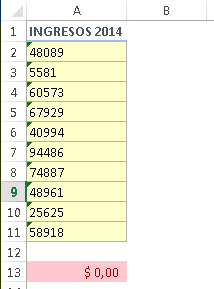
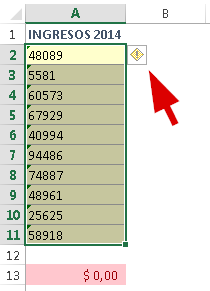
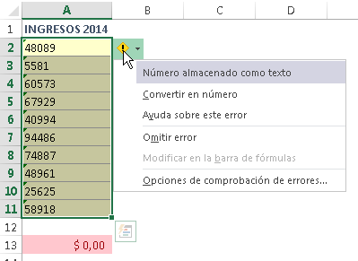
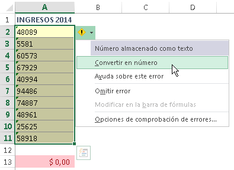
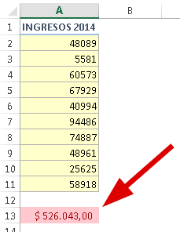

A más de uno el bendito asunto del tiempo en contra nos ha jugado una mala pasada y cosas muy sencillas nos han dejado “casi que impotentes” en ese proyecto que estábamos realizando.

Por ejemplo, esos números que cuando queremos sumarlos, parecieran que no están ahí. Se alinean a la izquierda y, por si fuera poco, esa fastidiosa marca verde que sabes que significa algo; pero no estás seguro de qué es.

¿Te ha pasado?

Esto se debe a que tienes **números almacenados como texto**.

La solución, es muy sencilla.

Ahora, vas a valerte de esta marca de la siguiente forma:

## Convertir números almacenados como texto

### 1.- Simplemente selecciona todo el rango donde están esos números “problema” y verás que esa marca verde sigue presente. Verás que aparece un símbolo en forma de signo de admiración.

### 2.- Haz un clic sobre este símbolo que acaba de aparecer.

### 3.- Selecciona la opción “convertir a número”

### ¡Listo! El problema se ha solucionado.

Aunque te parezca mentira, el problema ya quedó solucionado y ahora todos esos números son… ¡Realmente números!

Ahora ya no tienes excusas, el misterio de las marcas verdes ha sido resuelto. Ponlo en práctica y cuéntame cómo te fue.

¡Nos vemos!

\[firma\]
