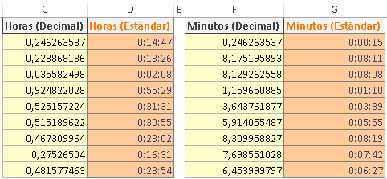
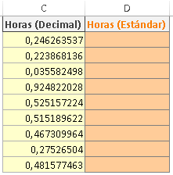
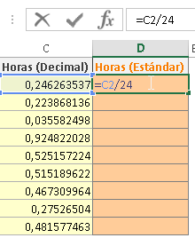
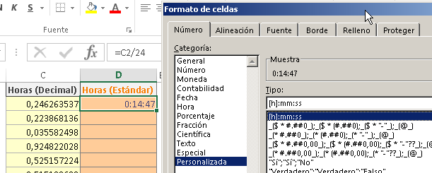
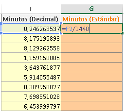

\[resumen\]Convertir Decimales a Horas y Minutos en Excel, es otra de las tareas que frecuentemente se aparecen por la oficina en el momento en que te encuentras más atareada o atareado. Aquí te muestro cómo hacerlo sin perder mucho tiempo.\[/resumen\]

Si bien es cierto que a ti te gusta escribir las horas y minutos en el formato 01:36:38, también es cierto que muchos de esos “nuevos sistemas” que llegan a tu empresa lo manejan de otra forma.

Incluso, algunas personas te pasaran las horas en el formato decimal.

¿Qué quiero decir con horas en formato decimal?

Pues, por ejemplo, para expresar media hora en números decimales, se escribiría de esta forma: \[resaltar\]0,5\[/resaltar\]

¿Y quince minutos, cómo sería?

Al ser la cuarta parte de una hora, quince minutos en decimal se escribiría de esta forma: 0,25

## Bien, bien. Ya entendí. Ahora ¿cómo convertir decimales a horas y minutos?

Sencillo. Si tienes una columna en la que las horas están representadas en el formato decimal, utiliza una columna auxiliar en la que, sencillamente, vas a tomar el valor que tienes en las horas y lo dividirás entre 24 (o sea, entre 24 horas que tiene el día)

Y por último, si Excel no lo hace automáticamente, cambia el formato de la celda por uno que sea del tipo hh:mm:ss (horas, minutos, segundos)

¿Nada más? ¿Solo dividir entre 24? ¿Y cómo así?

Sí, nada más. Verás, lo que sucede es que justamente así es como Excel trata a las fechas, como un número decimal que representa la diferencia entre una fecha y otra, en segundos.

Claro que si quieres una explicación un poco más detallada, puedes hacer [clic en este enlace](http://raymundoycaza.com/que-son-las-fechas-para-excel/) en el que te explico la forma en que Excel maneja las fechas.

## ¿Y qué hago si no son horas, sino minutos?

Interesante pregunta. Por eso me gusta conversar contigo acerca de Excel.

Pues verás, en realidad es muy sencillo, pues si seguimos el mismo razonamiento que en el método anterior, en el cual dividimos las horas para el total de horas que tiene un día… Entonces si tenemos el tiempo expresado en minutos, deberíamos dividirlo entre el número total de minutos que tiene un día.

¡Sí! Muy sencillo ¿no lo crees?

¿Y cuántos minutos tiene un día?

1440 minutos.

Entonces, repetimos el proceso, dividimos el número total de minutos entre 1440 y obtendremos un número decimal más pequeño que, si le damos el formato de hh:mm:ss, entonces Excel va a mostrarlo tal y como estamos acostumbrados a verlo.

¿Ves? Más sencillo que eso, es difícil.

Espero que esta entrada te ayude a disipar tus dudas y que cuentes con muchas oportunidades para ponerlo todo en práctica.

¡Ah! Y no dejes de compartir esta conversación en Facebook y Twitter. Tal vez otras personas encuentren interesante lo que tú y yo hemos tratado aquí.

¡Nos vemos!

\[firma\]
