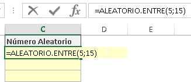
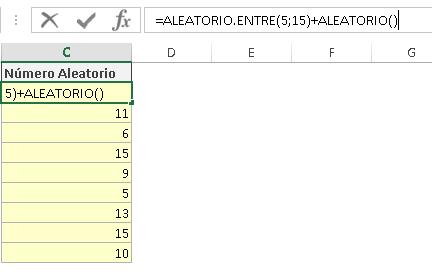
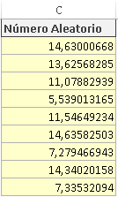

\[resumen\]Cuando generamos un número aleatorio con la función ALEATORIO, generamos un número con decimales, pero siempre entre cero y uno. Si usamos la función ALEATORIO.ENTRE, controlamos el rango; pero no tenemos decimales. Aquí te muestro una forma de tener las dos cosas.\[/resumen\]

Para generar números aleatorios dentro de un rango en Excel y que además tenga decimales, es tan sencillo como hacer la combinación de ambas funciones en una misma fórmula.

A continuación te realizo la propuesta y tú le pondrás las mejoras que consideres necesarias ¿te parece? ¡Pues vamos a ello!

###### 1 Ingresa la fórmula ALEATORIO.ENTRE

Para generar tu número aleatorio, entre un máximo y un mínimo, utiliza la función aleatorio tal y como te muestro en la siguiente imagen. 

###### 2 Súmale la función ALEATORIO

 Sí. Si ya tienes un número aleatorio entero y le sumas un número aleatorio decimal, entonces el resultado será **un número aleatorio** decimal dentro del rango que tú quieras. ¡Fácil! ¿No lo crees? 

## Y hemos terminado.

Como ves, las ideas sencillas son las que más a menudo nos ayudan a resolver las tareas que nos encontramos en nuestro día a día con Excel y otras cosas más.

¿Qué le cambiarías y / o mejorarías?

Espero tus comentarios.

¡Nos vemos!

\[firma\]
