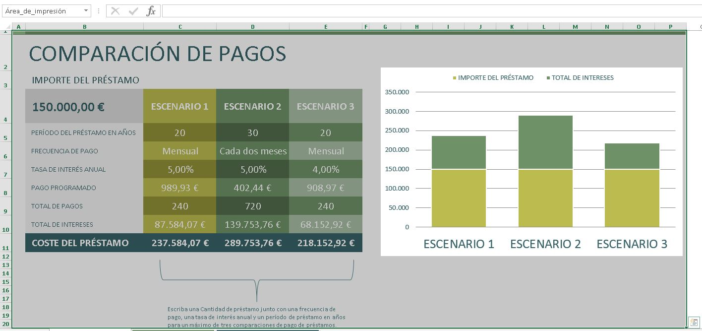
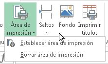
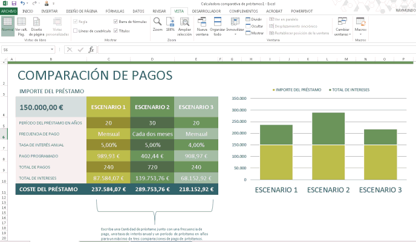

Hace unos días, Silvia me preguntaba en el correo sobre cómo hacer para poder imprimir todo su trabajo en una sola hoja, ya que únicamente le aparecía una parte del mismo.

En esta entrada, te explico la manera de hacerlo y es muy fácil. Empecemos.

\[pasos paso="1"\]Selecciona toda el área que quieres imprimir\[/pasos\]

Sí, es obvio, pero hay que hacerlo. Primero deberás seleccionar toda el área de tu hoja que quieres que salga en la impresión. Ten cuidado, si seleccionas un área demasiado grande, va a caber en tu hoja impresa; pero ni con lupa serás capaz de leer eso.

\[pasos paso="2"\]Establece el área de impresión\[/pasos\]

Ahora que tienes seleccionada o "sombreada" el área, lo siguiente que harás será establecer el área de impresión. Esto lo conseguirás si te diriges a la ficha "Diseño de Página" y en la sección "Configurar Página" haces clic sobre el botón "Área de Impresión".

Una vez hayas hecho clic sobre este botón, se desplegará un menú, en el cual seleccionarás la opción: "Establecer Área de Impresión"

 

\[pasos paso="3"\]Estás list@ para imprimir\[/pasos\]

Ahora ya puedes realizar la impresión de tu planilla y verás que todo cabe en tu hoja, tal y como se mostraba en la vista previa.

Sencillo, ¿no crees?

Espero que te sea de ayuda.

¡Nos vemos!

\[firma\]
