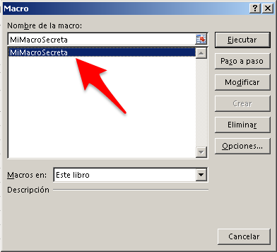
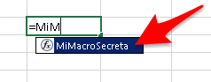

\[resumen\]Si no quieres que tus macros se vean desde la hoja, entonces yo te muestro como esconder tus macros de forma sencilla y sin muchas vueltas.\[/resumen\]

A veces nos parece buena idea esconder nuestras macros, sea por la razón que sea.

Generalmente, cuando queremos hacer esto, es porque no queremos que las macros se vean desde la hoja, ya que éstas han sido diseñadas para trabajar únicamente “por debajo”.

O porque no queremos que se sepa cuál es la función “mágica” que hace esto o aquello.

La razón la pones tú.

La posible solución la pongo yo.

Y esta es una solución sencilla que no busca ser infalible ni mucho menos. Quedas advertido o advertida.

Ahora te mostraré cómo esconder tus macros. Empecemos.

## La situación.

Cuando nos dirigimos normalmente al menú para ver las macros disponible, veremos que nuestra súper-macro aparece listada en esta ventana.

Además, si se trata de una función, también aparecerá listada en la ayuda junto con las demás funciones que vienen con Excel.

Lo que queremos es que no aparezca en ninguno de estos dos lugares.

## ¿Cómo esconder tus  macros ?

Te mostraré dos formas sencillas de hacerlo, para que tú elijas la que más se adapta a tu situación.

\[pasos paso="1"\]Hazla privada\[/pasos\]

Sí, puedes hacerla privada para que no pueda “verse” desde la hoja sino únicamente desde el [módulo](http://raymundoycaza.com/como-insertar-un-modulo-en-excel/ "Cómo insertar un módulo en Excel") en el que tu función reside.

Para lograr esto, basta con que adiciones la palabra reservada “Private” delante del nombre de tu función, así:

Private Function MiMacroSecreta()
'
' MiMacroSecreta Macro
'

'
End Function

\[pasos paso="2"\]Ponle argumentos\[/pasos\] Esta es otra técnica que puedes utilizar para que tus macros no se vean **desde la ventana de macros**. Tu [argumento](http://raymundoycaza.com/que-son-los-argumentos-en-excel/ "¿ Qué son los argumentos en Excel ?") puede ser opcional, si no necesitas utilizarlo realmente.

Private Function MiMacroSecreta(Optional ByVal MiArgumento As String \= "")
'
' MiMacroSecreta Macro
'

'
End Function

Sin embargo sí se podrán ver desde la hoja si escribes el nombre de tu función en una celda cualquiera.

Esta segunda forma podría serte útil si precisamente quieres que tu macro no se vea desde la ventana de macros, pero que sí se vea en la caja de ayuda de fórmulas.

## Es todo por hoy.

Y con esto, queda en tus manos hacer la mejor elección para tu caso. Recuerda que esto no te da ningún nivel de seguridad, solo significa acomodar un poco las cosas, a tu conveniencia.

En una próxima entrada, abordaré el tema de colocarle seguridad a las macros para que nadie pueda verlas ni modificarlas.

Por ahora, lo dejamos hasta aquí.

¡Nos vemos!

\[firma\]
