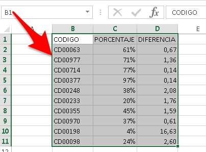
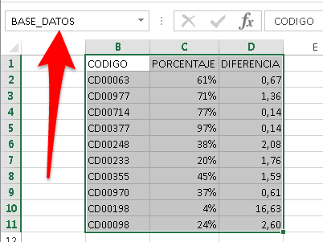
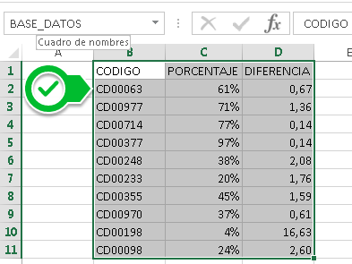
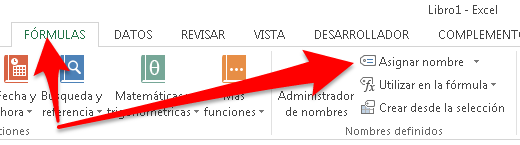

Nombrar una celda es una forma de facilitarte las cosas cuando debes escribir fórmulas complejas y necesitas mayor claridad que el que te dan [las referencias](http://raymundoycaza.com/que-es-la-referencia/) normales en Excel.

Por ejemplo, no es lo mismo escribir:

`=BUSCARV($A$1;$A3:$AC19371;1;0)`

Que, por decir algo, escribir ésto:

`=BUSCARV(CODIGO; BASE_DATOS; 1; 0)`

Hay diferencia ¿no lo crees?

Pues justamente para eso es que sirve el nombrar una celda en Excel. Para clarificar las cosas al momento de escribir fórmulas o utilizar funciones.

Así, pasamos de llamar a la celda $A$1 como `CODIGO` y al rango $A3:$AC19371, sencillamente como `BASE`.

Con esto ya podemos trabajar mucho más fácil en nuestras, ya de por sí, complicadas ‘bases de datos’.

## Nombrar una celda (o rango de celdas)

Para realizar esta parte, basta con seguir estos sencillos pasos:

\[pasos paso="1"\]Selecciona la celda o rango de celdas a la que le quieres colocar un nombre.\[/pasos\]

\[pasos paso="2"\]Utiliza el cuadro de nombre para escribir el nombre que le quieres dar a tu celda o rango.\[/pasos\]

Recuerda que no debe tener espacios y debe comenzar por una letra o un guión bajo “\_”.

\[pasos paso="3"\]Presiona la tecla `Enter` y habrás terminado. \[/pasos\]

¡Así de sencillo!

Ahora cada vez que selecciones esa misma celda o rango, verás que el cuadro de nombre muestra el ‘alias’ que tú le asignaste.

## Un extra para ti.

¿Hay otra forma de hacer esto?

¡Claro que la hay!

Puedes ir a la ficha ‘Fórmulas’ y en el apartado `Nombres definidos` encontrarás el botón `Asignar Nombre` en el cual puedes hacer clic para mostrar la ventana para insertar el nuevo nombre de tu rango.

En este cuadro, puedes especificar:

1. El nombre del rango.
2. El Ámbito (es decir, desde dónde se puede ‘ver’ ese nombre de rango o desde dónde es ‘válido’)
3. Un comentario que puedes indicar para que otros (o incluso tú) puedan saber luego para qué es esa definición que estás haciendo.
4. En el campo `Se refiere a`, debes indicar [la referencia](http://raymundoycaza.com/que-es-la-referencia/) de la celda o el rango que estás nombrando. Si lo has elegido previamente, debería aparecer ya el rango en esta casilla.

## ¿Hay otras formas de hacerlo?

Siempre la hay. Ya sabes, los de Microsoft siempre le ponen más de una forma de hacer las cosas y, si no siempre, casi casi.

De manera que queda en ti jugar con las opciones y descubrirla por tu propia cuenta. Yo acabo de explicarte las dos más sencillas o más utilizadas para que comiences tu exploración.

En una próxima entrada, te mostraré un par de ‘trucos’ para facilitarte las cosas cuando tienes muchas celdas que nombrar.

Por ahora, te deseo un buen fin de semana.

¡Nos vemos!

\[firma\]
