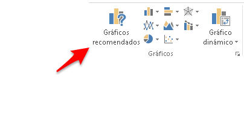

¿Creas ocasionalmente algún gráfico en Excel?

El artículo de hoy va para ti.

Voy a hablarte de los **5 principales errores** que estás cometiendo a la hora de crear un gráfico en Excel, sobre todo si no tienes esa práctica del día a día.

Y no te lo estoy recriminando, no.

Quiero que hagas conciencia sobre estos puntos y te dediques a corregirlos para que mejores tu técnica de creación de gráficos.

De acuerdo, ya hemos tratado sobre este asunto en el artículo [Cómo crear un Gráfico en Excel](http://raymundoycaza.com/como-crear-un-grafico-en-excel/); pero este es un tema que no siempre queda cubierto en un solo artículo.

Y como sabes, un gráfico puede rápidamente convertirse en un dolor de cabeza, si no tienes cuidado o si no te has empapado sobre [los conceptos básicos necesarios para crear un gráfico en Excel](http://raymundoycaza.com/como-crear-un-grafico-en-excel/).

Entonces ¿cuáles son esos errores comunes en la creación de gráficos?

\[pasos paso="1"\]No conoces las  opciones disponibles en tu gráfico.\[/pasos\]

Lo más común es dejar los gráficos tal cual te los da Excel, sin personalizarlos. Te conformas con el gráfico tal cual viene por defecto y no te animas a realizar cambios para dejarlo integrado perfectamente en tu informe.

Generalmente esto se da porque no conoces las [partes que tiene un gráfico](http://raymundoycaza.com/partes-de-un-grafico/), ni la forma en que estas pueden personalizarse. Y es que puedes llegar a realizar gráficos muy distintos a los que has hecho hasta el momento, tal como puedes ver en [este ejemplo](http://raymundoycaza.com/graficar-en-excel-una-manera-distinta/) e inclusive llegar a realizar gráficos como el que te muestro en [este artículo](http://raymundoycaza.com/dibujar-un-barco-en-grafico/).

\[pasos paso="2"\]Estás utilizando el gráfico equivocado.\[/pasos\]

Tan sencillo como suena.

La verdad es que no todo se resuelve con un gráfico de columnas.

No existe un gráfico que sea el adecuado para absolutamente todos los casos. Debes elegir el más adecuado para tu reporte, en función de lo que quieres mostrar y cómo vas a analizarlo.

Vamos. Existen varios tipos de gráficos en Excel y dentro de cada tipo, hay varios subtipos que te dan una combinación bastante amplia entre la cual elegir.

¿Por qué hacer siempre el mismo?

### Bono adicional.

Si te estás preguntando cómo elegir el tipo de gráfico más adecuado, estoy planificando publicar una nota al respecto; pero mientras tanto, puedo aconsejarte que utilices la opción "Gráficos Recomendados" que se encuentra en la sección "Gráficos", dentro de la ficha "Insertar" en Excel 2013.

\[pasos paso="3"\]Estás utilizando muchos datos en tu gráfico.\[/pasos\]

Sí. De estos casos he visto muchos.

Me preguntan por qué no se ve bien su gráfico.

Y al mostrármelo...

Tienen decenas y hasta cientos de series que quieren representar en un gráfico.

Esto no puede ser así. Necesitas resumir primero esos datos y establecer qué quieres mostrar y dónde hacerlo.

Si no piensas antes de empezar a trabajar, terminarás trabajando doble. Créeme.

\[pasos paso="4"\]No explicas tus gráficos.\[/pasos\]

¿Qué?

Pero es que un gráfico debería de explicarse por sí solo. ¿O no?

Bien, en el mejor de los casos así debería de ser; pero lo cierto es que no puedes ser subjetivo cuando trabajes con datos en un informe.

Tienes que realizar un reporte que pueda entenderlo hasta la mente más distraída, que mayormente son los Gerentes que tienen tantos problemas en la cabeza.

Recuerda que puedes insertar gráficos, cuadros de texto y otros elementos para hacer que tu gráfico sea lo más explícito posible, como por ejemplo, [resaltando el máximo y el mínimo](http://raymundoycaza.com/maximo-y-minimo-en-grafico/).

Pero hazlo con criterio. Tampoco exageres insertando demasiados elementos que terminarán siendo distractores.

En cuestión de informes, por lo general se cumple la regla "menos es más". No lo olvides.

\[pasos paso="5"\]Utilizas gráficos cuando no debes hacerlo.\[/pasos\]

Sí. Como lo estás leyendo.

No es cuestión de tirar de un gráfico en cada ocasión que se presente.

A veces, es mejor dispones de un cuadro de resumen, muy bien definido y con la información clave necesaria para sustentar tu presentación.

Hay ocasiones en las que con esto consigues un mayor impacto que si utilizaras gráficos.

Algo de formato, un buen criterio para resumir la información clave de tu negocio y estarás creando un gran cuadro resumen que cumplirá su función perfectamente.

## ¿Crees que existe otro error que falte en esta lista?

Estos son los cinco errores que, de acuerdo a lo que he visto, son de los más frecuentes en la creación de gráficos.

Pero ahora quiero saber tu opinión. ¿Crees que haya otro error que sea tan común como para reflejarlo en esta lista?

Me gustaría escuchar tu voz en los comentarios.

Que tengas una buena semana.

\[firma\]
