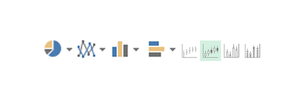

Te han solicitado [realizar un gráfico](https://raymundoycaza.com/automatizacion-con-excel/graficos-en-excel/como-crear-graficos-en-excel/) de ventas con los últimos datos recibidos que completaron el trimestre y lo necesitan en diez minutos.

¿Puedes hacerlo?

¡Claro! No hay problema. Solo debo seleccionar los datos, insertar un gráfico bonito de los que tiene Excel y éste hará todo el trabajo por mi.

¡Qué bien voy a quedar con este reporte!

#### Todo suena muy bonito, pero…

En ningún momento pediste más información acerca de lo que necesitan.

¿Qué quieren mostrar?

¿Cuál es el objetivo del reporte?

¿Hay algo en específico que estemos buscando?

Todas estas preguntas son necesarias para [real](https://raymundoycaza.com/automatizacion-con-excel/graficos-en-excel/como-crear-un-grafico-en-excel/)[izar un gráfico](http://raymundoycaza.com/como-crear-graficos-en-excel/) que, en realidad, sea útil para poder analizarlo y tomar las decisiones correctas sobre la interpretación de los datos que estos gráficos representan.

Y no, no tiene nada de malo hacer estas preguntas. Si tu jefe se niega a responderte preguntas como ésta, que son necesarias para realizar bien tu trabajo… Entonces está saboteándose a sí mismo.

Pero, ¿no se supone que Excel hace todo esto por mi?

No. Si así fuera, entonces ¿para qué contratarte a ti?

Y es entonces que nace la duda en ti y te haces preguntas como la que sigue.

## ¿Realmente importa mucho elegir el gráfico adecuado?

Sí. Importa y mucho.

¿Por qué?

Porque, como te dije antes, un gráfico adecuado te ayuda a tomar decisiones correctas.

¿Recuerdas alguna vez haberte quejado de que te enviaron a hacer gráficos y aparte de eso, reportes en tablas sobre la **misma información**?

Es casi como si desconfiaran de que tu trabajo está bien hecho. ¿Verdad?

Lo que sucede, es que tu gráfico puede estar bien hecho en lo que respecta a la parte técnica; pero…

- ¿Está bien representado?

- ¿Elegiste el gráfico adecuado?

- ¿Las escalas son adecuadas respecto a lo que quieres representar / comparar?

Cualquier error de interpretación puede llevar a tomar una mala decisión y los Gerentes lo saben.

Es por eso que resulta muy importante elegir el gráfico más adecuado para tu informe.

**Imagina** que con un gráfico estás contando una historia sin palabras. Es un relato de figuras y números que debe ser comprendido casi de un solo vistazo.

Un gráfico debe ser capaz de mostrarte y permitirte evaluar alternativas, de mostrar las tendencias que, incluso, ayuden a “predecir” de alguna manera un comportamiento en la producción o las ventas.

**En conclusión**: El gráfico incorrecto puede llevarte a tomar una decisión a ciegas, mientras que un gráfico adecuado, te permite tomar decisiones correctas y rápidamente.

## Eligiendo el tipo de gráfico, según tu objetivo.

Después de todo lo dicho (y si hasta este punto estás de acuerdo conmigo), es evidente que antes de comenzar a trabajar en el gráfico, debemos sentarnos a pensar unos minutos en lo que necesitamos y en cómo lo vamos a realizar.

Pero yo se que te gustaría que te diera unas cuántas pistas acerca de cómo realizar esta tarea previa y a continuación te explico la manera en que yo lo veo.

### El proceso

A pesar de que depende mucho del trabajo que realices, de las exigencias en tu empresa y de muchas otras variables… Creo que esto puede ser resumido en un proceso que representaré de forma gráfica:

  
\[pasos paso="1"\]Conocer el mensaje: ¿Qué quieres “decir”?\[/pasos\]  
Como te dije al principio de esta conversación, necesitas conocer el objetivo de tu informe. Y el objetivo de un informe gráfico, siempre es comunicar un mensaje.

¿Cuál es ese mensaje?

Es lo que tú debes averiguar, porque para cada caso hay un mensaje propio.

Pero vienes aquí por respuestas en lugar de más preguntas, ¿cierto?

Pues bien, sigue leyendo.

Si no conoces el mensaje que debe comunicar tu gráfico, ¿cómo puedes averiguarlo por ti misma o por ti mismo?

Claro, sin tener que entrar a la oficina de tu jefe o tu cliente a preguntárselo justo ahora que está en esa reunión.

Pues ahora te voy a enumerar las **6 razones más comunes por las que se realiza un gráfico** o los mensajes más comunes que debe comunicar un gráfico.

1. Para comparar.

3. Para justificar o detallar las partes de un todo.

5. Para mostrar una tendencia en el tiempo.

7. Para mostrar la distribución.

9. Para encontrar las desviaciones.

11. Para entender las relaciones.

¿Aún te parece muy escueta la explicación?

Ok, vamos a detallar un poco más cada una de estas razones para que nos quede más claro el tema.

#### Comparar datos.

**Significado**: Comparar un conjunto de datos con otro, para verificar sus diferencias y clasificarlos de acuerdo a dichos resultados.

Por ejemplo:

- Las ventas que realizó el vendedor Pedro comparadas con las ventas que realizó la vendedora María.

- Las ventas de tu producto A comparadas con las ventas de tu producto B, en cada trimestre del año.

¿Qué gráficos pueden utilizarse en estos casos?

- Gráfico de líneas.

- Gráfico de torta (gráfico de pastel).

- Gráfico de columnas.

- Gráfico de barras.

- Gráfico de dispersión.

#### Mostrar cómo están distribuidos los datos.

**Significado**: Mostrar los datos clasificados en clases, de acuerdo a tu criterio de clasificación.

Por ejemplo:

- Distribución de pedidos entregados con retraso.

- Distribución de problemas de calidad encontrados en el mes de abril del presente año.

¿Qué gráficos pueden utilizarse en estos casos?

- Gráficos de líneas.

- Gráficos de columnas.

- Gráficos de máximos, mínimos y cierre.

- Gráficos de distribución.

#### Mostrar las partes de un todo.

**Significado**: Quieres detallar cuánto aporta cada parte a un todo y de dónde viene cada aporte. Es decir: Quiénes son los mayores responsables de éstos números.

Por ejemplo:

- Del total del dinero gastado el año pasado, ¿cuánto fue por costos de producción, cuánto por sueldos y salarios, cuánto por servicios? Etc.

- Del total de producto no conforme de este mes ¿cuánto fue del lote A, cuánto del lote B y cuánto del lote C?

¿Qué gráficos pueden utilizarse en estos casos?

- Gráficos de torta (gráfico de pastel).

- Gráficos de columnas.

- Gráficos de barras.

- Resúmenes en Tablas.

#### Mostrar una tendencia en el tiempo.

**Significado**: Mostrar el comportamiento de un dato a medida que transcurre el tiempo. Sus altas y sus bajas.

Por ejemplo:

- Las ventas realizadas cada semana, durante todo el año.

- El número de reclamos recibidos cada mes, durante los últimos cinco años.

¿Qué gráficos pueden utilizarse en estos casos?

- Gráficos de líneas.

- Gráficos de columnas.

- Resúmenes en Tablas.

\[pasos paso="2"\]Organiza y prepara tus datos.\[/pasos\]  
Ya conocemos el mensaje que corresponde a nuestro gráfico. Pero eso no es suficiente.

Incluso si el gráfico es el adecuado, nuestros datos pueden no estar adaptados a dicho gráfico.

Me he topado con muchas consultas acerca del por qué los gráficos se ven “tan mal” y es porque tratan de meter en un único gráfico más de 10, 20, 50, 100 o 1000 series que solo consiguen verse como un montón de fideos que se estrellaron contra una pared.

Para poder realizar tu gráfico, primero necesitas realizar una labor de resumen. Eso es parte del proceso, **resumir**, para luego **sintetizar** con tu gráfico.

Para esta tarea, tienes:

- [Las funciones de Excel.](https://raymundoycaza.com/automatizacion-con-excel/formulas-en-excel/funciones-en-excel/)

- [Las tablas dinámicas.](https://raymundoycaza.com/automatizacion-con-excel/analisis-de-datos-en-excel/tablas-dinamicas-funcionamiento/)

- [Las tablas.](https://raymundoycaza.com/automatizacion-con-excel/curso-de-excel/crear-tablas-en-excel-paso-a-paso/)

- Y las herramientas de limpieza de las que ya te he contado en otra ocasión.

\[pasos paso="3"\]Prepara tu gráfico.\[/pasos\]  
Ahora que ya tienes lista la parte más complicada, viene la parte que más disfrutamos: [Crear nuestro gráfico](https://raymundoycaza.com/automatizacion-con-excel/graficos-en-excel/como-crear-un-grafico-en-excel/). La mayoría de [gráficos convencionales](https://raymundoycaza.com/automatizacion-con-excel/graficos-en-excel/tipos-de-graficos-en-excel/) están disponibles en Excel y puedes insertarlos tal cual hemos conversado en otras ocasiones.

Incluso podrías darte el lujo de crear gráficos “especiales” aprovechándote de la flexibilidad de Excel.  
\[pasos paso="4"\]Dale formato a tu gráfico (los toques finales).\[/pasos\]  
Siempre digo que menos es más, cuando realizas gráficos; pero en ocasiones hace falta agregar ciertos detalles para resaltar un aspecto fundamental del gráfico (como parte del mensaje que éste debe comunicar) y es necesario hacer algunos retoques en el formato e inclusive, agregarle elementos auxiliares, como por ejemplo:

- [Una línea de meta](https://raymundoycaza.com/automatizacion-con-excel/graficos-en-excel/como-crear-una-linea-de-meta-en-tu-grafico-sin-alterar-la-tabla/).

- [Una figura que resalte el máximo y el mínimo (cuando no pueden ser detectados a simple vista)](https://raymundoycaza.com/automatizacion-con-excel/graficos-en-excel/maximo-y-minimo-en-grafico/)

## Recomendaciones finales.

No te limites a lo que yo te he contado. Estas ideas no son ni pretenden ser el dogma de tus trabajos con Excel. Deja que tu creatividad se expanda al momento de realizar los informes para tus reuniones y siempre trabaja utilizando el sentido común. Con eso y tu experiencia, te aseguro que mejorarás en muy poco tiempo.

Las únicas reglas son conocer tu negocio y tus datos, ponerle pasión a lo que haces, tener un verdadero interés en tus clientes (aquellas personas que utilizarán tus informes) y practicar muy a menudo.

Notarás la diferencia.

## ¿Y tú, qué método utilizas para crear tus gráficos?

Ahora quiero que tú me cuentes cuál es tu metodología para crear gráficos en Excel para tus informes. ¿Qué haces primero? ¿Coincides con alguna de las cosas que he mencionado? ¿O tal vez piensas que a mi lista le hace falta alguna cosa.

Te leo en los comentarios.

Que tengas un buen reporting.

¡Nos vemos!

\[firma\]
