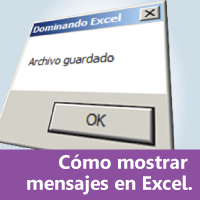
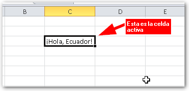
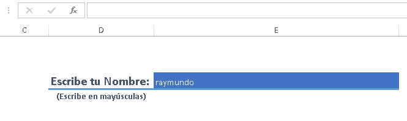
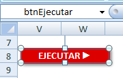

Últimamente, he recibido solicitudes de muchas personas que quieren que yo escriba sobre las [macros](http://raymundoycaza.com/tag/macros-vba/) en Excel, pues quieren comenzar a sacarles todo el provecho posible.

Esto está muy bien. Me gusta que ya te intereses en las macros y por eso hoy te traigo esta entrada en la que te contaré en este listado sobre 10 formas de aprovechar las macros en tu beneficio y el de tu empresa.

¡Comencemos!

## Trabajando con macros en Excel: Da el paso al siguiente nivel.

Bien, ahora voy a enumerarte la lista sin ningún orden de dificultad; pero sí de acuerdo al orden en que normalmente suelen aparecer estas necesidades en tu largo camino con Excel.

En cada elemento de la lista, encontrarás un enlace donde podrás leer sobre el cómo hacerlo en una entrada paso a paso.

\[pasos paso="1"\]Mostrar un mensaje.\[/pasos\]

¿Qué tarea que se realice con las macros podría ocupar el primer lugar en esta lista?

Pues ¡mostrar un mensaje!

Un cuadro de mensaje nos sirve para avisar cuando una tarea se ha completado e inclusive para dar el aviso de que un error ha ocurrido.

Para otras aplicaciones realizadas con macros en Excel, te servirán para que tu programa no se caiga cuando ocurra un error (o mejor dicho, que se caiga, pero con elegancia :P )

Haz clic aquí para ver [Cómo Mostrar un mensaje en Excel con VBA (Macros)](http://raymundoycaza.com/mensaje-en-excel/)

\[pasos paso="2"\]Abrir un archivo, desde Excel.\[/pasos\]

Y más temprano que tarde, se te ocurre que puedes crear una macro que abra un archivo sin salir de Excel, para facilitarte las cosas y ahorrar algo de tiempo. ¡Además de que se vería de lujo!

Pues bien, también se puede realizar con **macros en Excel** y es más sencillo de lo que crees.

Haz clic aquí para ver [Cómo abrir un archivo, con macros en Excel](http://raymundoycaza.com/abrir-un-archivo-con-macros/)

\[pasos paso="3"\]Leer el contenido de la celda activa.\[/pasos\]

Esta es de mis favoritas y de las más solicitadas. De hecho, es una de las primeras cosas que te produce curiosidad cuando comienzas con las macros en Excel.

¿Se puede?

¡Pues vamos! Que si la he puesto aquí es porque sí se puede.

Tomar el valor de la celda activa, es el punto de partida para realizar aplicaciones más complejas en Excel, ya que debes tomar ese contenido y almacenar en una "base de datos" cuando quieres hacer una aplicación de factura, de registro de citas, de cobros, etc.

Haz clic aquí para ver [Cómo obtener el valor de la celda activa, usando macros en Excel.](http://raymundoycaza.com/como-obtener-el-valor-de-la-celda-activa-usando-macros/)

\[pasos paso="4"\]Ajuste de datos: Cómo forzar la escritura en mayúsculas, usando macros en Excel.\[/pasos\]

Ya pasamos la zona de lo puramente "noob". Esta aplicación de las macros es algo sencillo; pero ya nos va mostrando cómo podemos utilizar funciones dentro de nuestras propias funciones y nos deja sorprendidos ante las grandes posibilidades que las macros nos ofrecen.

Poder y flexibilidad. Pronto verás cuán cierto es eso con las macros.

Haz clic aquí para ver [Cómo forzar la escritura en mayúsculas, usando macros en Excel (VBA)](http://raymundoycaza.com/forzar-la-escritura-en-mayusculas-usando-vba/)

\[pasos paso="5"\]Ejecutar una Macro al abrir Excel.\[/pasos\]

Bien, ya tienes varias macros creadas con tus propias manos y todo va de lujo. Pero, ¿qué tal si damos un paso más allá?

¿Y si nuestras macros se activaran automáticamente?

¿Qué tal una macro que revise mis pendientes en un libro de Excel?

El mejor momento para hacerlo, es justo al abrir el libro.

¿Se puede?

¡Vaya que sí!

Haz clic aquí para ver [Cómo Ejecutar una Macro al abrir Excel](http://raymundoycaza.com/macro-al-abrir-excel/)

\[pasos paso="6"\]Escribir en una celda, usando macros en Excel.\[/pasos\]

Si en el paso 3, te pareció muy útil el poder leer el contenido de una celda, entonces el poder escribir en ella te va a encantar.

Como te contaba, ésto sirve para esas aplicaciones en las que tienes que leer datos en una hoja y copiarlos a otra, en donde podrás almacenar todos tus registros, como una base de datos.

Clic aquí para leer [Cómo escribir en una celda, usando Macros (VBA)](http://raymundoycaza.com/como-escribir-en-una-celda-usando-macros-vba/)

\[pasos paso="7"\]¿Un botón flotante... en Excel?\[/pasos\]

Ya pasamos de hacer cosas básicas a realizar un pequeño lujo que en realidad podría servirnos de mucho.

¿No te ha pasado que cuando [insertas un botón para tus macros](http://raymundoycaza.com/como-asignar-una-macro-de-excel-a-un-boton/), éstos se pierden de vista al navegar por la hoja de trabajo?

Pues bien, ahora imagina que el botón se mantiene siempre a la vista, sin importar cuánto te muevas con el cursor.

¿Verdad que suena perfecto?

Pues aquí lo tienes.

Haz clic aquí si quieres ver [Cómo crear un botón flotante en Excel](http://raymundoycaza.com/boton-flotante-en-excel/).

\[pasos paso="8"\]Cerrar Excel, usando una macro.\[/pasos\]

Si ya vimos cómo abrir un archivo usando las macros en Excel, pues ¿qué mejor forma de complementar el tutorial, que aprender a cerrarlo de la misma forma?

Esto es útil para que puedas establecer ciertos mecanismos de seguridad o, sencillamente, para habilitar un botón desde el cual quieras que se cierre Excel cuando el usuario haga clic sobre él.

Haz clic aquí si quieres ver [Cómo cerrar Excel desde una macro (con un clic de ratón)](http://raymundoycaza.com/como-cerrar-excel-desde-una-macro/)

\[pasos paso="9"\]Proteger una hoja de trabajo, usando macros.\[/pasos\]

Ya pasamos de lo básico, lo útil y los lujos, a la seguridad.

Es que tarde o temprano, vamos a toparnos con alguna necesidad de establecer cierto grado de seguridad en Excel; pero en algún momento.

Pero ¿y qué hago cuando debo permitir temporalmente los cambios y luego proteger nuevamente la hoja?

Por ejemplo, si creas una aplicación facturadora y la persona encargada comete un error que debe revertir; pero te interesa que no pueda hacer este tipo de correcciones a su libre criterio.

Algo similar a lo que sucede en los supermercados: La cajera o cajero te deja esperando mientras llama al Supervisor para que ingrese su clave y le autorice la corrección.

Pues con este principio básico, puedes llegar a crear algo parecido. ¡Solo tienes que ponerle ganas!

Haz clic aquí para ver [Cómo Proteger una Hoja de Excel usando Macros](http://raymundoycaza.com/proteger-una-hoja-de-excel-usando-macros/)

\[pasos paso="10"\]Ejecutar una macro automáticamente (por tiempo)\[/pasos\]

Como cereza sobre el pastel, llegamos al sueño de muchos: Que su macro se ejecute automáticamente sin tener que estar pendiente de ejecutarla manualmente a la hora indicada.

¿Se puede? ¿En Excel?

Tal y como lo estás leyendo.

Esta forma de ejecutar las macros, te puede servir para infinidad de aplicaciones, como consultas, labor de limpieza, consulta de datos para seguimiento, monitoreo de mediciones y un largo etc.

Tan solo tienes que seguir las indicaciones tal cual y adaptarlo a tu necesidad concreta.

¡Verás cómo vas a disfrutarlo!

Haz clic aquí para ver [Cómo ejecutar una macro periódicamente (cada cierto tiempo)](http://raymundoycaza.com/ejecutar-una-macro-periodicamente/)

## **Un extra para ti**: Cómo desbloquear tu hoja de trabajo, utilizando las macros en Excel.

¿Te ha pasado que el anterior empleado dejó una planilla de Excel que hacía varios cálculos, pero la hoja está bloqueada con contraseña?

Seguramente has tratado de adivinarla, incluso de contactar a esa persona para poder usar tu tan preciado formato y no tener que hacerlo todo de nuevo.

Sin embargo, existe una solución al alcance de todos. No es necesario invertir dinero en un programa especializado para poder recuperar el control de tu archivo.

Con estos 8 pasos podrás desbloquear tu hoja de trabajo en 5 minutos (o menos)

Haz clic aquí para ver [Cómo Desbloquear tu hoja Excel.](http://raymundoycaza.com/al-fin-puedes-desbloquear/)

## Y eso es todo.

Con este resumen espero que puedas tener a la mano estas entradas que te orientaran sobre lo que se puede lograr con las macros y estoy seguro de que, si juntas todas estas ideas y las combinas con tus propias creaciones, podrás lograr resultados alucinantes en tus proyectos.

No dejes de leer, estudiar, practicar y ayudar a otros. Es la mejor forma de mejorar en tus habilidades con Excel y en lo que sea que hagas.

Si te ha gustado esta entrada, déjame tus comentarios, comparte con tus amigos o sígueme en las redes sociales para que te mantengas al tanto de mis nuevas publicaciones.

¡Nos vemos!

\[firma\]
