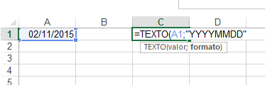
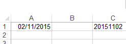
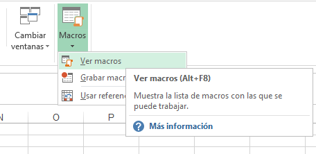
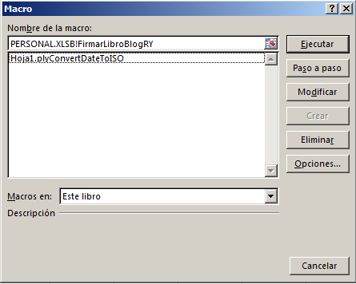
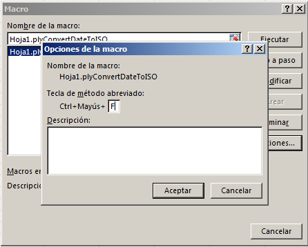

Hace unos días me encontraba en una empresa brindándole mis servicios de asesoría y estaba revisando la forma en que obtenían y transformaban los datos entre sus sistemas y archivos de Excel.

Me di cuenta de que había un paso que estaba quitando demasiado tiempo, para lo sencillo de la operación. Me refiero a convertir una fecha en texto (formato ISO)

Esto es lo contrario a la operación de [convertir un texto a fecha](http://raymundoycaza.com/como-convertir-un-texto-a-fecha/) que te mostré anteriormente. Se supone que debería de ser más sencillo aún.

### Resolviendo el problema con fórmulas

Así que primero le di un par de consejos al encargado del manejo de la información, como el de utilizar la función TEXTO para convertirla desde su [expresión numérica de fecha](http://raymundoycaza.com/que-son-las-fechas-para-excel/) a un texto compatible con el sistema en el que almacenaban los datos finales.

Esto se consigue de la siguiente forma (suponiendo que tu fecha se encuentra en la celda A1):

`=TEXTO(A1;"YYYYMMDD")`

Luego de utilizar esta función tal y como te muestro en la imagen anterior, lo que conseguirás es lo siguiente:

Como ves, fácil y rápido de implementar.

Pero yo aún no estaba satisfecho. Por la cantidad de datos que había que manejar, tenía que facilitar esta tarea mucho más. Automatizarla tanto como sea posible.

## Creando una macro para convertir fecha en texto (formato ISO)

Es así que decidí hacer esta macro que se encargara de convertir la fecha selecionada en un texto formato ISO, compatible con la mayoría de sistemas que almacenan las fechas de esta forma.

En realidad la primera versión que hice, lo que hacía era convertir la celda activa. Sin embargo, tenía que hacer las cosas aún más rápidas.

Así que: ¿por qué no crear un pequeño bucle para que la macro sea capaz de convertir TODAS las celdas en un rango seleccionado?

¡Sí! A mi también me pareció una mejor idea.

Entonces a continuación te dejo el código para que lo implementes tú también en tu trabajo:

Sub plyConvertDateToISO()
'
' plyConvertDateToISO Macro
' Para convertir una fecha en formato ISO.
'
' Keyboard Shortcut: Ctrl+Shift+F
    Dim dtmFecha
    Dim strFechaISO As String
    Dim c
    
    
    For Each c In Selection
        dtmFecha \= c.Value
        strFechaISO \= Format(dtmFecha, "YYYYMMDD")
        c.Value \= strFechaISO
    Next c
    
    
'
End Sub

## La explicación acerca del funcionamiento de la macro

Como ves, lo que hace la macro es recorrer un rango previamente seleccionado (debes asegurarte de seleccionar ÚNICAMENTE fechas o la macro no funcionará como esperas) y en cada celda que encuentre, el trabajo realizado es sencillo:

1. Toma el valor de la celda y lo almacena en una variable.
2. A la variable mencionada, se le aplica la misma función FORMATO, dándole la forma de texto tal cual hicimos al principio, en año, mes y día (YYYYMMDD)
3. A la misma celda, le devolvemos el valor modificado, es decir, la misma fecha pero expresada en forma de texto.

De esta forma, hemos logrado convertir todas las celdas que tenían una fecha en texto de la forma AAAAMMDD (año, mes, día) sin apenas el esfuerzo de hacer un clic de ratón.

### ¿Se puede simplificar todavía más?

¡Y hagámoslo pues! Si ya estoy aquí escribiendo en un feriado, hagámoslo bien.

Si lo que quieres es evitarte el trabajo de ir a buscar la macro para ejecutarla, déjame decirte que puedes asignarle un atajo de teclado para que tu flujo de trabajo sea todavía más ágil.

Para ello lo que tienes que hacer es lo siguiente:

1. Dirígete a la ficha "Vista" y haz clic sobre el botón "Macros" y elige la opción "Ver macros".

1. En la ventana que se muestra, selecciona la macro a la que quieres asignar un atajo de teclado y haces un clic en el botón "Opciones":

1. Se abrirá una nueva ventana, más pequeña, en la que te pedirá que especifiques el atajo que te gustaría utilizar. La tecla "Control" ya está indicada, solo falta especificar el resto de teclas de la combinación. En mi caso, utilizaré "Mayúsculas" y la tecla "F".

¡Y listo!

Ahora, cada ve que ejecutes la combinación de teclas **CTRL + MAYUSC + F**, se ejecutará la macro de conversión de fechas y automáticamente las celdas seleccionadas que tengan una fecha, serán transformadas al formato YYYMMDD.

¡Así de fácil!

### Bono adicional

Y si lo que pretendes es utilizar esta macro como una herramienta de propósito general, es decir, poder utilizarla en cualquier archivo sin tener que meterle la macro, solamente deberás de asegurarte de guardar el código dentro del libro **PERSONAL**.

Empieza desde ahora a cumplir tus propósitos de año nuevo y haz que ese reporte ya no te consuma tanto tiempo. Anímate a usar a Excel como tu ayudante. Notarás la diferencia.

## Suscríbete a mi Newsletter

Puedes suscribirte a la lista de correos para recibir el mini-curso de 10 lecciones **sin costo**. También recibirás una copia de mi E-Book sobre trucos y técnicas de Excel que obsequio a todos mis nuevos suscriptores. **Y adicional a todo esto**, recibirás contenido adicional exclusivo que no comparto en el blog.

Si te interesa lo que has leído, puedes suscribirte [haciendo clic en este enlace](#).

¡Nos vemos!

\[firma\]
