Un cliente es la mejor fuente de aprendizaje y en tu caso, tu propia empresa o tu trabajo debe de ser esa inspiración para nuevas ideas, ya que cada día nacen nuevas pequeñas necesidades que satisfacer.

Imagen de portada, cortesía de Pixabay.

Un ejemplo de esto, es el caso de una empresa en la que vi que tenían la necesidad de crear un sistema de generación de contraseñas para los colaboradores que tenían clave de acceso en una aplicación en línea de control de calidad.

El problema era que, muy frecuentemente (son varios empleados), bloqueaban la contraseña y no podían acceder a la aplicación, por lo que tenían que ir donde el oficinista y solicitar una nueva contraseña.

La nueva clave que recibían no era nada complicada, sencillamente debía cumplir con dos requisitos básicos:

1. Tenía que ser sencilla de leer.
2. No debía de ser fácil de adivinar (nada de números secuenciales)

Pero esta tarea, demandaba unos minutos para "inventarse" una nueva clave que siga los lineamientos que se colocaron y, al final, estaba "comiéndose" una buena parte de tiempo del oficinista (además de que a veces el empleado tenía que esperar a que el oficinista disponga de ese par de minutos para generarle una nueva contraseña)

Así fue que una vez más, tomé a Excel y lo puse al servicio de una causa justa :D

En esta ocasión, me puse a la tarea de crear un sencillo generador de contraseñas que nos ayude con palabras conformadas por letras aleatorias; pero que puedan ser leídas fácilmente por el usuario.

¡Ah! Y **sin usar macros**.

Así pues, ¡empecemos!

## Creando el generador de contraseñas en Excel.

Veamos, ya te había dicho que lo único que se requería de estas contraseñas es que sean fáciles de leer / recordar pero que no se puedan "adivinar".

Ahora, voy a pulir un poco más lo que quiero lograr, para tener claro todo antes de empezar:

1. Que no utilice macros (mantenlo sencillo)
2. Que sea fácil de leer.
    1. La contraseña deberá de ser en el formato: consonante, vocal, consonante, vocal
    2. Al final tendrá un número de cuatro dígitos.
3. Para hacerlo más compatible con las políticas de la mayoría de sistemas, le colocaremos una letra mayúscula al principio.

Al final, lo que pretendo lograr es lo siguiente:

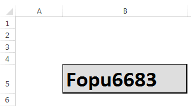

Bien, ya tenemos clara la idea. Es hora de poner manos a la obra.

## Creando una matriz de vocales y consonantes.

Lo que haremos aquí, será crear una tabla de consonantes, mayúsculas y otra de consonantes minúsculas, así:

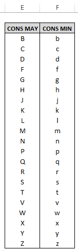

 

Y junto a la tabla anterior, vamos a crear otra pequeña tabla, para las vocales, así:

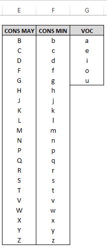

¿Y esto para qué?

Pues para facilitarnos la tarea de crear nuestro generador de contraseñas, respetando las vocales y consonantes, donde corresponde. Ahora te muestro cómo lo podrías hacer.

### Generando la primera letra: Aleatoria y mayúscula.

Para esto, obviamente, vamos a utilizar la tabla de consonantes mayúsculas. Nos apoyaremos de la [función INDICE](http://bit.ly/1csG4zJ).

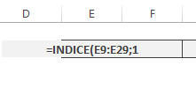

1. Escribo la función INDICE y como primer [argumento](http://bit.ly/1NGWt48) el rango de la tabla donde se encuentran las consonantes mayúsculas. No indico ninguna columna (Excel entiende que tomará la columna 1) y separo con un punto y coma.
2. Ahora indico el número de la fila que quiero tomar, por ejemplo para la primera fila, escribo el número 1.
3. Cierro el último paréntesis.

¿Cuál es el valor devuelto por la función INDICE? Pues la primera fila de la tabla, es decir la primera letra que en este caso es la "B":

Y de esta forma hemos utilizado la función INDICE para elegir una de las letras de la tabla, pero...

Necesitamos que la letra sea elegida de manera aleatoria. ¿Cómo lograrlo?

Pues con otra función de Excel, esta vez la función ALEATORIO.ENTRE

#### Consiguiendo una letra al azar.

¿Y por qué usar esta función y no simplemente ALEATORIO?

Pues porque la función ALEATORIO.ENTRE me permite especificar un principio y un final para los números que espero recibir. Es decir, si quiero un número aleatorio; pero solo entre los que se encuentran en el rango del 2 al 10, podría utilizar la función de esta forma:

ALEATORIO.ENTRE(2;10)

¿Vas adivinando lo que pretendo hacer?

Entonces, para elegir una de las letras consonantes mayúsculas, primero debo saber cuántas son. Si las cuentas verás que son 21 letras. Entonces, ya que están ordenadas, voy a utilizar esto para obtener por medio de la función ALEATORIO.ENTRE un número que se corresponderá con el número ordinal de la letra en el listado.

Vamos a hacerlo que es más fácil que leerlo.

Si escribo lo siguiente:

`=ALEATORIO.ENTRE(1;21)`

Entonces voy a obtener un número entre el 1 y el 21 ¿no es verdad?

Y cada vez que presione la tecla F9, voy a poder ver un nuevo número que se ha generado por esta función.

¿Qué tal si aprovecho esto en la función anterior, es decir, en la función INDICE que te explicaba hace un momento?

Pues para hacerlo, sencillamente reemplazo el número 1 por toda la construcción que hice con la función ALEATORIO.ENTRE y me quedará más o menos así:

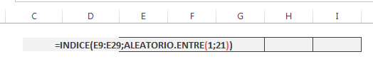

Entonces, verás que ahora, cada vez que presiones la tecla F9 se mostrará una letra aleatoria y siempre será mayúscula.

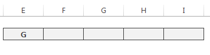

### Consiguiendo la segunda consonante, en minúscula.

¡Perfecto! Hemos conseguido la primera letra. Ahora, solo copia y pega el contenido de esta primera celda en la tercera, así:

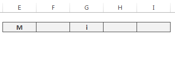

¡Oh, oh! Algo raro ha sucedido aquí.

¡Aparecen vocales!

Eso sucede porque al copiar, se han "desplazado" [las referencias](http://bit.ly/1NGW7dE).

Lo único que tienes que hacer, es mover el rango que ahora está apuntando a la columna de las vocales, hasta la columna de las consonantes mayúsculas. Para hacerlo, tienes que hacer doble clic a la celda, para editar la fórmula en ella y verás que se resalta el rango al que apunta, solo colócate sobre uno de sus bordes, hasta que el cursor se transforme en cuatro flechas y arrástralo hasta la segunda columna, así:

 

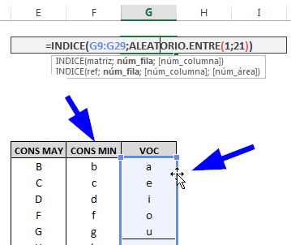

¡Ahora sí! Ya tenemos nuestras dos letras aleatorias consonantes, la primera mayúscula y la segunda minúscula:

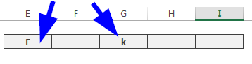

### Generando las vocales aleatorias.

Lo primero que haremos será copiar la fórmula de la primera celda, en la segunda, de esta forma:

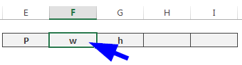

Y seguiremos la misma receta de antes, es decir, moveremos la referencia desde donde está, hasta la columna de las vocales, así:

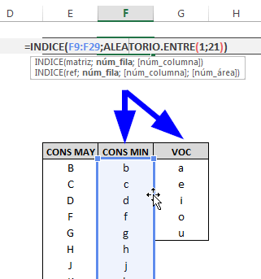

Por supuesto, no debemos olvidarnos de actualizar la fórmula, ya que para el caso de las vocales, no requerimos un número aleatorio entre 1 y 21, si no entre 1 y 5 (ya que las vocales son solo cinco)

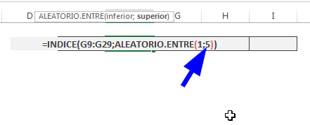

Ahora sí. Ya tenemos funcionando nuestra celda con la primera vocal.

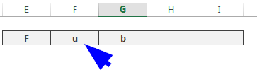

¿Siguiente paso?

¡Exacto!

Copiamos la segunda celda, en la que aparece la vocal y la pegamos en la cuarta celda, de esta manera:

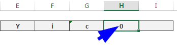

Y, por supuesto, actualizamos la fórmula, moviendo el rango tal y como lo hicimos antes:

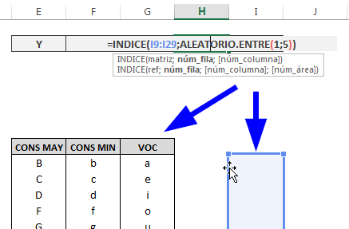

Y, finalmente, vamos a tener algo como esto:

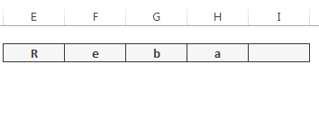

Luce bien, ¿no es verdad?

Ahora, solo nos falta, agregarle la parte numérica al final. Habíamos quedado en que sería un número de cuatro dígitos. Así que haremos lo siguiente:

1. Generaremos un número entre 1 y 9999
2. Le daremos un formato de cuatro dígitos, por si se diera el caso de que obtengamos un número menor que mil.

Entonces, lo primero es la función que nos de el número aleatorio:

`ALEATORIO.ENTRE(1;9999)`

Y luego, le damos el formato a cuatro dígitos significativos, así:

`TEXTO(número;"0000")`

Con lo cual, nos quedaría de esta manera en Excel:

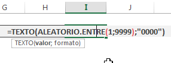

Y una vez ejecutada la fórmula, lo que obtendríamos sería el número aleatorio de cuatro dígitos, tal como lo habíamos previsto.

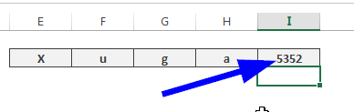

Si en este punto presionas la tecla F9, ya tendrías que ver cómo se van formando palabras sencillas de leer, más su correspondiente código numérico, las cuales te servirán como una contraseña generada por tu propio sistema y que tú misma o tú mismo habrás creado en una sola tarde.

### ¿Los toques finales?

Por último, y solo para darle un toque final, vamos a concatenar todas las celdas que acabamos de crear, en una sola. Además le daremos el formato que más nos guste: colores, tamaño y tipo de letra, etc.

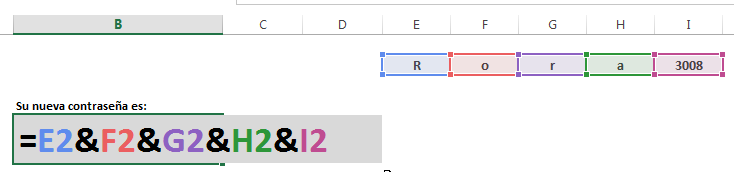

### El resultado final.

Luego de toda esta larga explicación, deberías de tener algo como esto:

¡Precioso!

O... ¿tú qué dices?

### El archivo terminado.

Si te interesa descargar el archivo terminado, puedes hacerlo [con un clic aquí](http://bit.ly/1RDsxEP).

\[caja\_suscripcion\]

¡Nos vemos!

\[firma\]
