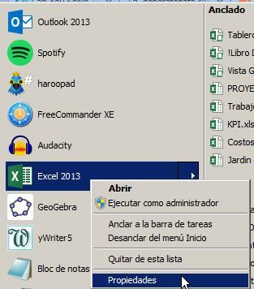
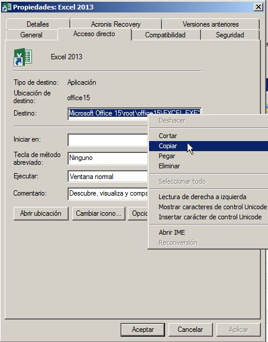
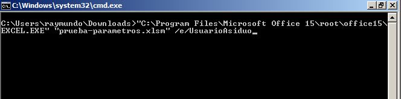
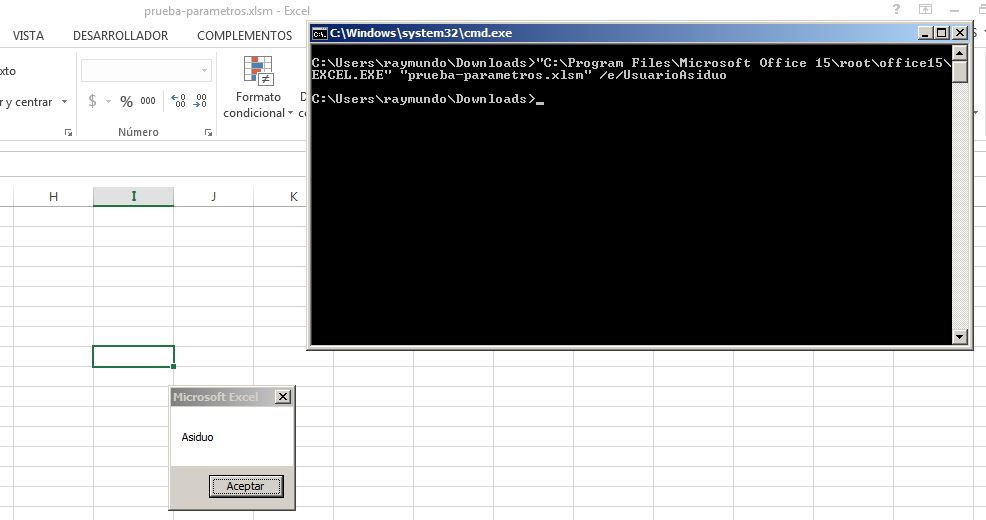

Hace unos días recibí en la caja de comentarios una pregunta de Marisol, la cual apuntaba a encontrar la forma de abrir Excel desde la línea de comandos y además pasarle parámetros o argumentos para las macros.

Bueno, la verdad es que el asunto me pareció interesante. Recuerdo que una vez lo hice, para alguna tarea por ahí que luego terminé reemplazando por los viejos DTS de Microsoft SQL Server, pero eso ya es otra historia.

En esta entrada me permitiré ir directo al grano, porque se trata de algo más avanzado que no le interesará (de momento) a los principiantes en Excel.

## Cómo abrir Excel desde la línea de comandos.

Bien, empecemos por el principio. **¿Cómo abrir Excel desde la línea de comandos?**

Puede parecer un poco peliaguda la pregunta, pero en realidad es muy sencillo. Incluso, lo vamos a simplificar un poco más.

\[pasos paso="1"\]Averiguando dónde se encuentra Excel\[/pasos\]

Así que antes de aventurarnos en la línea de comandos, vamos a averiguar cuál es la ruta completa a nuestro archivo ejecutable de Excel.

Para esto, ve al menú inicio y haz un clic derecho sobre el icono de Excel.

En el menú que se muestra, elige la opción "Propiedades".

Una vez hecho esto, se mostrará un cuadro de propiedades, en el cual vas a copiar la ruta completa del archivo ejecutable de Excel, tal y como te muestro en la imagen siguiente:

Terminada esta parte, ya sabemos dónde está nuetro querido Excel. Ahora, vamos con lo que sigue.

\[pasos paso="2"\]Crear una función que reciba el argumento pasado por línea de comandos\[/pasos\]

Esta parte es más peliaguda, porque tienes que utilizar las API de Windows, pero en realidad no vamos a detenernos aquí. Bastará con que copies esta función tal cual está y no tendrás que preocuparte más ya que su uso será transparente para ti.

Primero, crea un módulo nuevo y en él vas a pegar este código que te dejo aquí:

Option Base 0
Option Explicit
Declare Function GetCommandLine Lib "kernel32" Alias "GetCommandLineW" () As Long
Declare Function lstrlenW Lib "kernel32" (ByVal lpString As Long) As Long
Declare Sub CopyMemory Lib "kernel32" Alias "RtlMoveMemory" (MyDest As Any, MySource As Any, ByVal MySize As Long)
Function CmdToSTr(Cmd As Long) As String
    Dim Buffer() As Byte
    Dim StrLen As Long
    
    If Cmd Then
        StrLen \= lstrlenW(Cmd) \* 2
        
        If StrLen Then
            ReDim Buffer(0 To (StrLen \- 1)) As Byte
            CopyMemory Buffer(0), ByVal Cmd, StrLen
            CmdToSTr \= Buffer
        End If
    End If
End Function

\[pasos paso="3"\]Insertar tu propia función.\[/pasos\]

Pues empezamos todo esto porque tenías una función a la que le querías pasar un argumento por línea de comandos. ¿No es verdad?

Bien, entonces ahora es el momento de insertar esa función.

En mi caso, para mantener el ejemplo original, voy a utilizar la siguiente:

Private Sub Workbook\_Open()
    Dim ComandoCrudo As Long
    Dim ComandoTexto As String
    Dim miArgumento As String
    
    ComandoCrudo \= GetCommandLine
    ComandoTexto \= CmdToSTr(ComandoCrudo)
    
    miArgumento\= Right(ComandoTexto, 6)
    
    MsgBox miArgumento

End Sub

¡Y listo! Nada más que estos tres pasos son suficientes. ¡Ahora a probar tu obra maestra!

## Explicando un poco el código.

Lo primero que vemos es que en la variable "ComandoCrudo" estamos recibiendo el comando enviado a través de la consola, gracias a la función GetCommandLine.

 

Pero pasa y resulta, que esa función te está devolviendo un valor numérico de tipo Long. Así que debemos "transformarlo" a texto normalito para poder utilizar ese parámetro tan escurridizo.

Es así que en la variable "ComandoTexto", estamos almacenando justamente el comando en formato de texto, gracias a la función CmdToSTr(ComandoCrudo) que tenemos en el módulo que creamos al principio. ¿Recuerdas?

La función CmdToSTr, utiliza como argumento la variable "ComandoCrudo" y la transforma a un texto que podremos manipular de acuerdo a nuestras necesidades.

Finalmente, para demostrar que ya lo podemos manipular, en la variable "miArgumento", almacenamos los seis últimos caracteres de "ComandoTexto" para luego mostrarlo en un cuadro de mensaje.

## Probando el código resultante.

¿Recuerdas que al principio de todo esto, averiguamos la ruta de Excel?

Bien, pues no fue en vano. Ahora lo vamos a necesitar.

Abre tu consola o ventana de línea de comandos y escribe la ruta completa de Excel (entre comillas, tal cual la copiaste) y deja un espacio.

Luego del espacio, escribe también entre comillas el nombre de tu archivo, con la extensión incluída.

Y finalmente, para terminar, la parte que más nos interesaba desde el principio. **El argumento**.

Solamente debes de dejar un espacio después del nombre del archivo y colocas el texto siguiente:

/e/**UsuarioAsiduo**

La parte que dice "UsuarioAsiduo", es el argumento que tú le quieres pasar al archivo. Puede ser una fecha, un número, **un nombre de archivo**, un código, etc.

Ahora si le das a la tecla Enter, Excel abrirá el archivo y le pasará el argumento "UsuarioAsiduo".

Pero como nuestra función indicaba que solo mostraría los seis últimos caracteres, entonces:

Solo se muestra la parte que dice "Asiduo".

¡Sencillo!

No me dirás que te pareció complicado, ¿o sí?

## Concluyendo.

Como puedes ver, la función que colocamos en el módulo es la única que hace todo el verdadero trabajo aquí. La función que colocarás dentro de la rutina Workbook\_Open(), solamente manipulará el argumento de acuerdo a tu conveniencia para utilizarlo en el resto de operaciones que realice tu código.

De aquí en adelante, solo debes personalizarlo para que se adapte a tus necesidades.

Con esto, ya puedes agregar un archivo .BAT para ejecutarlo con el programador de tareas, pasarle argumentos dinámicos a tu archivo de Excel y varios etc como tu imaginación pueda crear.

## Ahora te toca a ti.

Si te ha gustado esta entrada y también quieres implementar un archivo de Excel al que se le pueda pasar argumentos, entonces deja tu comentario, suscríbete a la lista de correos y añádete a mis redes sociales. Si te pasas por mi canal de Youtube, podrás ver los últimos vídeos que voy colgando para engordar el repositorio.

 

Eso es todo por ahora. Marisol, espero tu comentario. Ojalá te ayude.

¡Nos vemos!

\[firma\]

Referencias:

- https://social.technet.microsoft.com/Forums/office/en-US/bb9fa94f-a1d4-45cd-9279-b12e7a7e69c0/passing-a-parameter-to-an-excel-file-when-opening-it?forum=excel
