Hace varios días, [@Cristoroca69](https://twitter.com/Cristoroca69) me preguntó en Twitter acerca de la creación de un **catálogo de imágenes en Excel**. La verdad es que en estos días me encuentro bastante ocupado y la respuesta (como muchas otras) se ha hecho esperar un buen tiempo. Pero he decidido darle un solo tirón y aprovechar para crear una entrada para que otras personas puedan aprovechar la respuesta.

<blockquote class="twitter-tweet" data-conversation="none" data-lang="es">
<a href="https://twitter.com/RaymundoYcaza">@RaymundoYcaza</a> Hola porfa ayuda, cmo hago para al poner un nombre con una imagen en una celda al usar otra que sea = a esa, coja la imagen
— Cristo (@Cristoroca69) <a href="https://twitter.com/Cristoroca69/status/728380339819847680">6 de mayo de 2016</a></blockquote>

## **Entendiendo el Problema.**

Lo que Cristo necesitaba era tener una planilla de Excel en la que, figurando los nombres de los equipos de fútbol de su región y con sus respectivos escudos, poder seleccionar los nombres de cada uno en otra hoja y que automáticamente aparecieran sus escudos.

Esto le serviría a él para crear los calendarios deportivos, control de resultados, etc. Y la idea es que no tenga que estar copiando y pegando los escudos cada vez que haya una nueva fecha deportiva.

Inclusive, imagínate si en lugar de equipos de fútbol sea cualquier otra situación en la que la imagen cambiara en algún momento del tiempo.

¿Te imaginas el trabajo que supondría buscar y reemplazar todas esas imágenes pegadas por ahí?​

​Entonces, lo que necesitamos es algo muy parecido a un **catálogo de imágenes en Excel**. Un buscador que en lugar de devolverme un texto, me devuelva una imagen.

¿Será que se puede?

¡Vamos a averiguarlo!​

## **Aplicando la solución.​**

Lo primero que tenemos que hacer es tener muy claro el problema y entender qué es lo que se quiere lograr. Esta parte ya la hemos visto parcialmente en el punto anterior.

Para el ejemplo, solo haré una imagen ya que luego tú podrás repetir el proceso para tantas imágenes como sean necesarias en tu caso.

¿De acuerdo?

Pues bien. ¡Empecemos!​

### Mostrando una imagen dentro de otra imagen... que está en otra hoja.​

Mostrar una imagen.

Dentro de otra imagen.

Que está en otra hoja.

¿Pero qué...?

¿Para qué querríamos hacer eso?

Hay varias formas en las que le podríamos sacar provecho a esta técnica.

Pero en esta ocasión, lo haremos porque queremos tener una imagen de referencia que se encuentre centralizada y queremos "invocarla" desde cualquier otra hoja, cuando sea necesario.

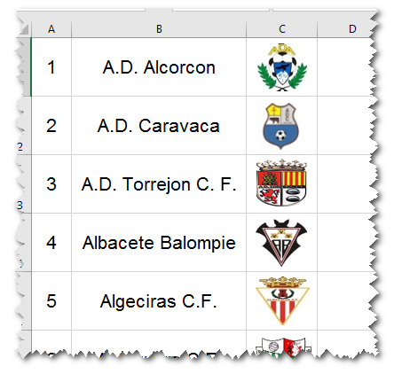

​Recuerda que lo que buscamos es que cuando en otra hoja tengamos un nombre cualquiera, por ejemplo "A.D. Caravaca", junto al mismo aparezca la imagen que le corresponde. Algo similar a como haríamos con la **función** [**BUSCARV**](http://bit.ly/1csG4zJ).

Bien. Ya tienes clara la idea. El siguiente paso es averiguar cómo hacerlo.

\[clickToTweet tweet="Estoy aprendiendo un montón sobre fórmulas y funciones con #ExprimiendoExcel. Tú también puedes hacerlo:" quote="Estoy aprendiendo un montón sobre fórmulas y funciones con ExprimiendoExcel. Tú también puedes hacerlo:"\]

### Creando una referencia entre imágenes.​

Lo primero que necesitaremos será una imagen.

¿Cuál imagen?

Pues cualquiera. ¡La que sea!

Está bien, te ayudaré en esta parte. Vamos a inventarnos una imagen sin salir de Excel.

Lo primero que harás será insertar una auto-forma. Recuerda: ficha "Insertar"​, apartado "Ilustraciones" y buscas en las auto-formas. Un rectángulo será suficiente para empezar.

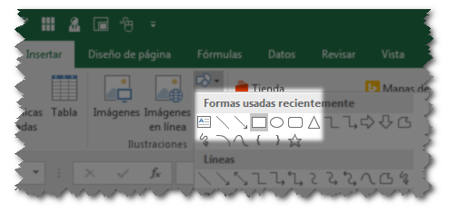

Ahora que ya tienes el rectángulo, vas a convertirlo en una imagen. Solamente cópialo (clic derecho y copiar)

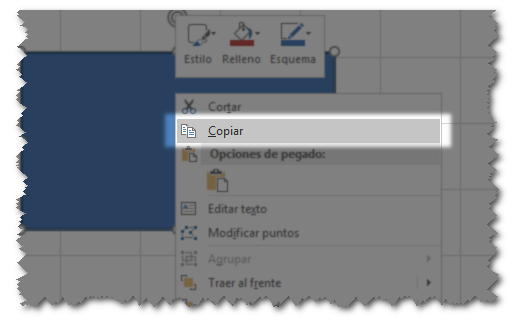

¿Estamos listos?

Bien. Ahora vas a pegarla. ¡Pero espera!

​Deberás pegarla como una imagen. Clic derecho y elige la opción "Pegar como imagen".

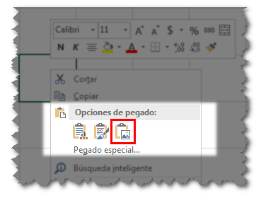

Ahora tienes dos rectángulos similares. Pero el último tiene un nombre que te indica que ya no se trata de una auto-forma, sino de una imagen, como puedes ver en la captura siguiente.

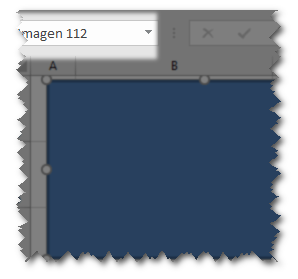

Para terminar la creación de nuestra imagen, lo que harás será eliminar el rectángulo original, es decir, elimina la auto-forma.

Como te mostré en la captura anterior, nuestro nuevo rectángulo tiene un nombre no muy descriptivo: "Imagen 112".​ Así que vamos a cambiarlo por uno más apropiado. Por ejemplo "imagenBusqueda".

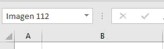

Ahora que ya tiene su nuevo nombre asignado, vamos a mostrar en esta imagen uno de los escudos que tenemos en nuestra hoja de Excel. ¿Recuerdas las imágenes que te mostré al principio?

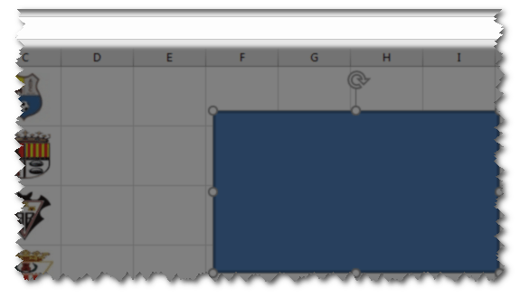

La idea es utilizar nuestra "imagenBusqueda" como si fuera una pantalla en la que mostraremos uno de los escudos de equipos de fútbol que tenemos preparados.

**Todo muy bien, pero primero asegúrate de...**

Antes de continuar, debes asegurarte de que cada una de las imágenes que vamos a mostrar en nuestra 'pantalla', estén contenidas dentro de una celda (podría ser un rango de varias celdas, pero no lo compliquemos por ahora)

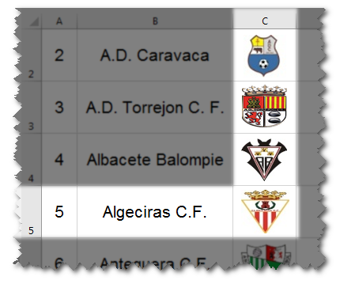

Nota como en la captura de pantalla anterior, cada uno de los escudos está contenido completamente dentro de su celda correspondiente. Recuerda, esto es importante.

**Eligiendo la imagen a mostrar.**

Para el ejemplo, voy a elegir mostrar el escudo de "Algeciras C.F."

Entonces ¿qué tengo que hacer? Debo fijarme en cuál es la referencia a la celda en la que se encuentra el escudo de este equipo.​

Como puedes ver en la imagen, el escudo en cuestión se encuentra en la celda "C5".

Ahora que ya lo tienes todo listo, vamos a seleccionar nuestra "imagenBusqueda" y nos fijaremos en la [barra de fórmulas](http://bit.ly/1NGWnt9).

En la barra de fórmulas lo que haremos será escribir la referencia a la celda que contiene nuestro escudo, es decir, escribimos "=C5" (recuerda, debes tener seleccionada la imagen del rectángulo)

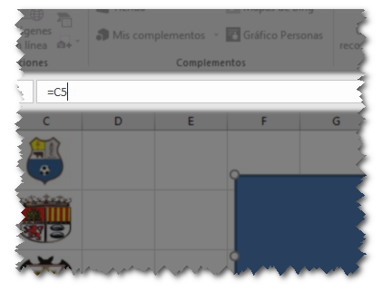

Una vez has escrito esta referencia en la barra de fórmulas, solo presiona la tecla "Enter" o "Intro" y...

¿Te das cuenta de lo que ha sucedido?

La imagen que teníamos se ha reemplazado por​ la imagen que se encuentra en la celda cuya referencia ingresamos en la barra de fórmulas.

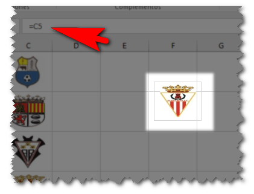

Y si tienes la suficiente curiosidad, vas a jugar con esta referencia, cambiándola por otras ubicaciones para que te des cuenta de cómo es que funciona esto.

Ya se te irán acumulando miles de ideas en tu cabeza para aprovecharte de esta técnica.

De acuerdo, continuemos.​

Ya tienes una pequeña pantalla donde mostrar cualquiera de los escudos; pero no es muy práctico tener que escribir cada vez la referencia, ¿no es verdad?

Por eso vamos a crear un mecanismo que nos permita facilitar el proceso de selección del escudo.​

 

\[clickToTweet tweet="Estoy aprendiendo a crear un catálogo de imágenes con #ExprimiendoExcel. ¡No te lo pierdas! RT" quote="Estoy aprendiendo a crear un catálogo de imágenes con ExprimiendoExcel. ¡No te lo pierdas! ¡Tuitéalo!"\]

### Creando una referencia dinámica.​

En esta parte, vamos a concentrarnos en crear una referencia dinámica. Es decir, una referencia a un rango de celdas que sea capaz de 'agrandarse' o 'achicarse' cada vez que se agregue o se elimine un valor dentro del mismo.

​Como a estas alturas ya estamos en la versión de **Excel 2016** y siendo que desde **Excel 2007** ya [existen las tablas](http://bit.ly/2b3N8qE), entonces no voy a complicarte la vida explicándote [cómo crear un rango dinámico](http://bit.ly/1NGWq8g). En su lugar haremos uso de las tablas.

### Convirtiendo el rango a tabla.

Para hacerlo, es tan sencillo como seleccionar todo el rango en el que se encuentran los datos de los escudos y los nombres de los equipos, seleccionas la ficha "Inicio" y en el apartado "Estilos" eliges la opción "Dar formato como tabla".

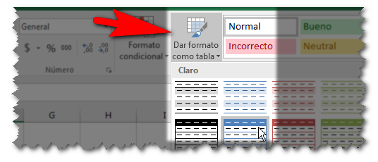

Aquí puedes elegir el estilo que más te guste.​

En mi caso, como mi rango no tiene encabezados, no le he marcado la casilla que indica precisamente esto. ¿Para qué? Pues para que Excel se encargue de crear los encabezados por mi.

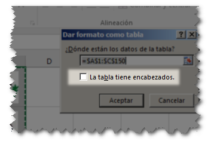

Ahora verás que Excel ha hecho el trabajo por ti en los encabezados, pero esos nombres no me gustan a mi. Probablemente a ti tampoco. Así que se los cambiaremos de esto:

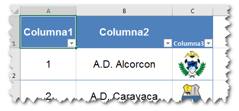

A algo como esto:

Además, la tabla tiene un nombre poco descriptivo. Verás cuál es el nombre de tu tabla si la seleccionas y eliges [la ficha contextual](http://bit.ly/2aRfFOg) "Diseño".

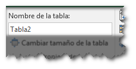

Como puedes ver en la captura, la tabla se llama "Tabla1". Se la cambiaremos por "TablaEquipos".

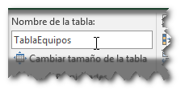

El siguiente paso aquí será crear un 'nombre auxiliar' que utilizaremos más adelante. Iremos a la ficha "Fórmulas" y haremos clic en el botón "Administrador de Nombres".

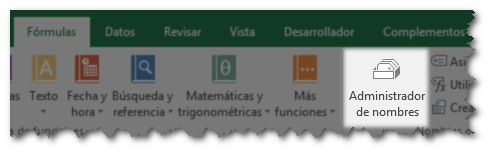

En el cuadro que aparece, hacemos clic sobre el botón "Nuevo...".

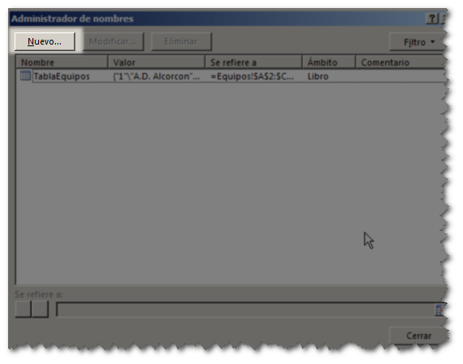

Y en el nuevo cuadro que aparece, escribimos el nombre de nuestro nombre auxiliar. Le llamaremos "nombresEquipos" y en el campo "Se refiere a" vamos a escribir lo siguiente: "=TablaEquipos\[Nombre equipo\]" ya que esta es la **referencia estructurada** a la tabla que acabamos de crear. Clic en "Aceptar".

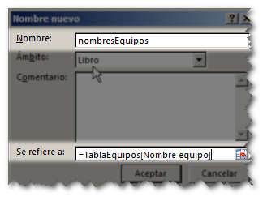

Y con eso hemos terminado esta parte.

¿Y para qué hicimos tantas cosas?

Bueno, eso te lo explico a continuación.​

### Creando una lista desplegable para los nombres de los equipos.

Lo que vamos a hacer es conseguir un [efecto de lista desplegable](http://bit.ly/1NGWeGg) como el que puedes ver en la siguiente captura:

Para conseguirlo vamos a seleccionar una celda cualquiera, en mi caso, he seleccionado la que se encuentra justo al lado de mi 'pantalla', esto es, en la celda F3.

Una vez colocado el cursor en la celda indicada, iremos a la ficha "Datos" y luego seleccionamos la opción "Validación de datos"​:

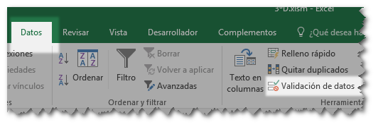

En el cuadro que aparece, seleccionamos desde la lista "Permitir" la opción "Lista":

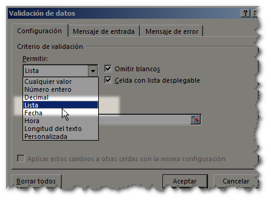

Ahora nos colocaremos en el cuadro "Origen" y presionamos la tecla F3. Veremos que aparece lo siguiente:

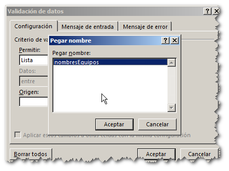

Seleccionamos la opción "nombreEquipos" (la única disponible) que es el nombre auxiliar que habíamos creado hace un momento ¿recuerdas? Pues para esto era que lo necesitábamos.

Entonces, si todo ha marchado bien, ahora solamente debes hacer clic en el botón "Aceptar" y luego nuevamente "Aceptar".

Si has seguido todos los pasos tal cual te los he mostrado, deberías de poder ver una pequeña flecha justo al lado de la celda F3 cada vez que la seleccionas:​

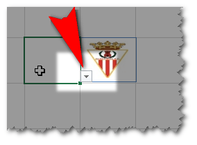

Y si haces clic sobre esa flechita, verás cómo se muestra una lista desplegable con todos los nombres de los equipos tal como nos habíamos propuesto hacerlo.

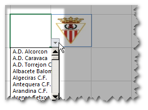

### La función DESREF, la clave de todo el proceso.

​Como ya te explicaba en una publicación anterior, [la función DESREF](http://bit.ly/1NGWq8g) tiene una utilidad muy interesante que la hace versátil y muy útil en determinadas ocasiones. Esta es una de ellas.

​Vamos a crear un nuevo nombre definido en el administrador de nombres:

Esta vez lo llamaremos "imagen" y la fórmula que utilizaremos será la siguiente:

\=DESREF( Equipos!$C$2; COINCIDIR( Equipos!$F$3;nombresEquipos;0 ) -1;0;1;1 )​

En esta fórmula puedes ver que también hago uso de la función COINCIDIR. Puedes [hacer clic en este enlace](http://bit.ly/1csG4zJ) si quieres saber más acerca de ella.

Ahora, básicamente, lo que esta fórmula hace es lo siguiente:

#### Resumiendo:

- A partir de la celda C2 en la hoja "Equipos" (la hoja en la que están los nombres de los equipos") me voy a desplazar x número de celdas.
- ¿Y cómo se cuántas celdas me tengo que desplazar? De eso se encarga la función COINCIDIR. Ya que toma el valor de la celda F3 (la que tiene la lista desplegable) y lo busca en el rango al que apunta "nombresEquipos", es decir, busca en toda la columna de los nombres de los equipos y me devuelve un número, que será la posición del nombre del equipo en el listado.
- Una vez que tengo el número de posición del nombre del equipo, le resto 1, para que el desplazamiento 'cuadre'.
- Finalmente, le digo que no se desplace ninguna columna (para eso es el cero) y le digo que mi rango tiene una columna de ancho y una fila de alto (para eso son los dos últimos números que forman la fórmula.

 

### El paso final.

Se que te comen las ansias por terminar el catálogo de una buena vez. Pero tranquilidad, ya casi culminamos.

​¿Recuerdas que nuestra 'pantalla' tenía asignada una referencia?

Tiene asignada la referencia 'C5'. Es por eso que está mostrando el escudo de Algeciras C.F.

Pues bien, ahora selecciona​ tu "imagenBusqueda" y cambia esa referencia por el nombre que acabamos de crear, esto es, "=imagen" tal y como te muestro en la captura:

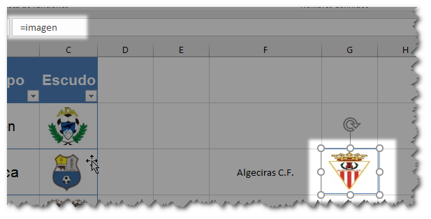

Una vez terminaste de escribir el nombre, presiona la tecla "Enter" o "Intro" y verás cómo comienza la magia:

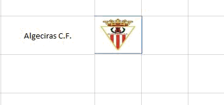

Como ves, nuestro buscador de imágenes por nombre está plenamente operativo y a la espera de tus propios retoques para que finalmente quede completamente a tu gusto.

## **Conclusiones**

Crear un pequeño catálogo de imágenes con su buscador no es una tarea excesivamente compleja, si conoces el uso de la herramienta 'Excel'. Pero puede llevarte horas de investigación y no parecerte algo tan trivial, si no cuentas con los conocimientos básicos de esta gran aplicación.

Con esto queda demostrado una vez más que **con Excel pueden hacerse prototipos de aplicaciones** muy interesantes para nuestro negocio, ​que nos ayuden en el proceso de venta, inventario, controles varios e inclusive puede adaptarse para crear pequeñas aplicaciones de entretenimiento. El límite está en tu imaginación.

Espero que la entrada te sea de mucha ayuda para terminar con esa planilla que tienes en mente.

¡Nos vemos! \[firma\]
