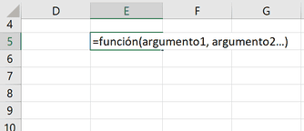
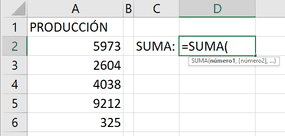
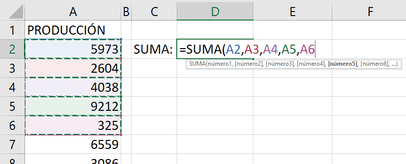
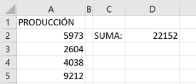

Continuando la serie de Automatización con Excel, hoy quiero hablarte sobre un concepto básico dentro de una de las herramientas más utilizadas en este blog: las funciones en Excel.

Excel es una herramienta muy útil para el análisis y la manipulación de datos. Esto se debe a que una de las características más importantes que ofrece Excel es la capacidad de utilizar funciones para realizar operaciones en los datos. Por eso, en este artículo, voy a explicarte qué son las funciones en Excel y cómo pueden ayudarte en la automatización de tareas.

## Una supercalculadora

Las funciones en Excel son fórmulas predefinidas que realizan cálculos en los datos de una hoja de cálculo. Estas se utilizan para realizar una amplia variedad de operaciones, desde cálculos matemáticos simples hasta análisis de datos complejos. Las funciones son una parte esencial de la automatización en Excel, ya que permiten realizar tareas de manera más rápida y eficiente que si se hicieran manualmente.

Hay una gran cantidad de funciones disponibles en Excel, cada una diseñada para realizar un cálculo específico en los datos. Por ejemplo, la función SUMA se utiliza para sumar una serie de números, [la función PROMEDIO](https://raymundoycaza.com/funcion-promedio-en-excel/2804/) se utiliza para calcular el promedio de una serie de números, y la función BUSCARV se utiliza para buscar un valor en una tabla y devolver un valor relacionado.

## ¿Cómo se usan las funciones?

Para utilizar una función en Excel, debes seleccionar la celda en la que deseas mostrar el resultado de la función. Luego, debes escribir el nombre de la función, seguido de los argumentos que la función necesita para realizar el cálculo. Los argumentos son los datos que la función utiliza para realizar el cálculo, y pueden ser números, texto o referencias a otras celdas.

Por ejemplo, si deseas sumar una serie de números, puedes utilizar la función SUMA. Para hacer esto, selecciona la celda en la que deseas mostrar el resultado de la suma y escribe "=SUMA(" seguido de las celdas que deseas sumar separadas por comas.

Una vez que hayas ingresado los argumentos, cierra el paréntesis, presiona Enter y Excel mostrará el resultado de la suma en la celda seleccionada.

Ya ingresada la función, cada vez que los valores cambién, la suma se actualizará **automáticamente** sin que tú tengas que hacer nada.

Si has estado atento (o atenta) entonces ya te estarás imaginando cómo puedes aprovechar esta característica en tus procesos de negocio. 💡

## Conclusiones sobre las funciones en la Automatización con Excel

En resumen, las funciones son una parte esencial de la automatización en Excel. Las funciones son fórmulas predefinidas que realizan cálculos en los datos de una hoja de cálculo, y se utilizan para realizar una amplia variedad de operaciones.

Para utilizar una función en Excel, debes seleccionar la celda en la que deseas mostrar el resultado de la función y escribir el nombre de la función seguido de los argumentos necesarios.

Si deseas mejorar tus habilidades en la automatización con Excel, es fundamental que aprendas a utilizar las funciones de manera efectiva.

## ¡Y eso es todo!

Espero que encuentres útil esta explicación acerca de las funciones y te sirva para diferenciarlo de las fórmulas. Recuerda que estos dos conceptos son fundamentales para la automatización con Excel.

Nos vemos en la próxima. 🎯
