Si eres como yo, que trabaja con datos en [Excel](https://www.microsoft.com/es/microsoft-365/excel) con frecuencia, sabes lo importante que es poder filtrar y ordenar información de manera rápida y eficiente.La buena noticia es que contamos con una función llamada Autofiltro en Excel, que nos permite hacer precisamente eso.

En este artículo, quiero compartir contigo mi experiencia utilizando la función de Autofiltro en Excel y cómo esta herramienta me ha ayudado a simplificar mi trabajo en la gestión de datos.

Acompáñame para descubrir cómo utilizar la función de Autofiltro para filtrar y ordenar datos en Excel de manera efectiva.

¡Comencemos!

## La función autofiltro en Excel y su importancia en la gestión de datos

Si alguna vez te has visto en la necesidad de buscar datos específicos en una tabla de Excel, entonces **la función de Autofiltro** es para ti.

Esta herramienta te permite filtrar y ordenar tus datos de manera rápida y sencilla, lo que te ahorrará tiempo y te permitirá enfocarte en el análisis y la interpretación de la información relevante para tu trabajo.

Con la función de Autofiltro puedes seleccionar, por ejemplo, las filas de una tabla que contengan determinado valor en una columna, o bien, ordenar los datos por orden alfabético o numérico en una columna específica.

Si trabajas con tablas de datos, sabes lo tedioso que puede ser buscar una información específica manualmente.

Con Autofiltro, puedes filtrar tus datos por criterios específicos, como fechas, nombres, números, entre otros, lo que te permitirá visualizar únicamente la información que necesitas en ese momento.

Además, la función de Autofiltro te permite ordenar tus datos por orden ascendente o descendente, de tal forma que puedas tener una vista más clara de la información que estás manejando.

## Cómo activar la función de autofiltro en Excel

- Haz clic en cualquier celda dentro de la tabla de datos.

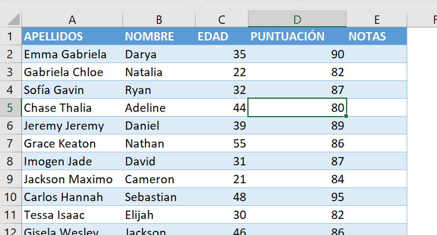

- Dirígete a la pestaña "Datos" en la barra de herramientas de Excel.

- Haz clic en el botón "Filtro" en la sección "Ordenar y filtrar".

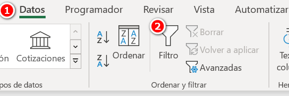

- Verás que aparecerán unas flechas pequeñas en la fila superior de la tabla de datos. Esto indica que la función de Autofiltro ha sido activada.

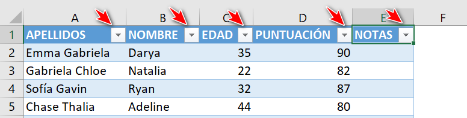

- Para filtrar los datos, haz clic en la flecha correspondiente a la columna que deseas filtrar y selecciona los criterios que deseas aplicar.

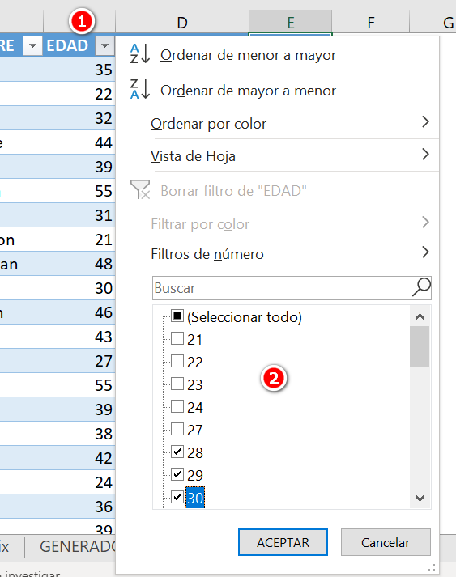

Para ordenar los datos, haz clic en la flecha correspondiente a la columna que deseas ordenar y selecciona "Ordenar de A a Z" o "Ordenar de Z a A", según tus necesidades.

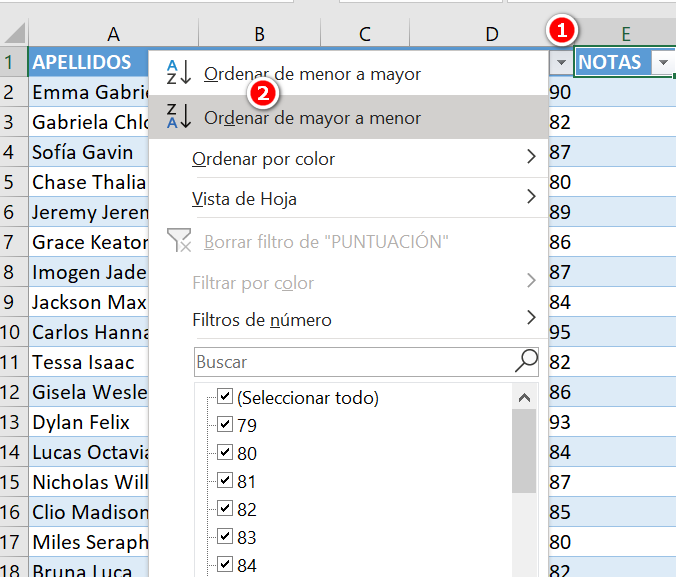

¡Y listo! Con estos sencillos pasos ya tendrás activada la función de Autofiltro en Excel y podrás empezar a filtrar y ordenar tus datos de manera efectiva.

## Cómo filtrar datos con la función de autofiltro

1️⃣ Para filtrar los datos, haz clic en la flecha correspondiente a la columna que deseas filtrar. Por ejemplo, si deseas filtrar los datos de una columna llamada "Puntuación", haz clic en la flecha de dicha columna.

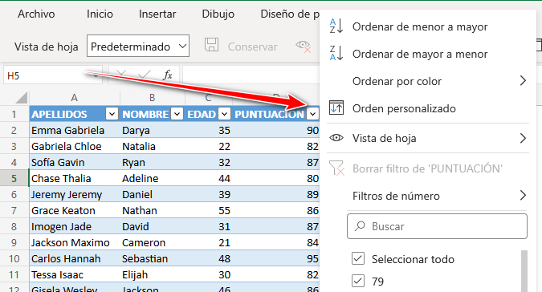

Filtrando una tabla de ejemplo por la columna “Puntuación”

2️⃣ Verás que aparece un menú desplegable con los valores únicos que aparecen en la columna. Para filtrar, quita la marca en “Seleccionar todo” y selecciona los valores que deseas filtrar y haz clic en "Aceptar".

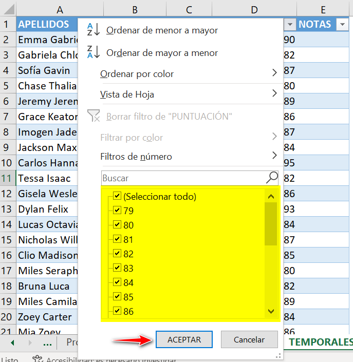

Filtrando una tabla de ejemplo por la columna “Puntuación”

3️⃣ Verás que la tabla de datos se actualiza y solo muestra las filas que cumplen con los criterios de filtrado.

Filtrando una tabla de ejemplo por la columna “Puntuación”. Seleccionando los registros que tienen valores: 94, 95, y 96

¡Y eso es todo!

Con estos sencillos pasos podrás filtrar tus datos de manera efectiva utilizando **la función de Autofiltro en Excel**.

Recuerda que puedes aplicar el filtro a varias columnas al mismo tiempo y que siempre puedes desactivar la función de Autofiltro haciendo clic en el botón "Filtro" nuevamente.

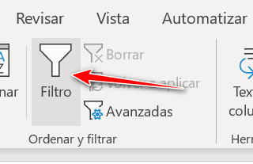

## Ejemplos de filtrado por criterios específicos

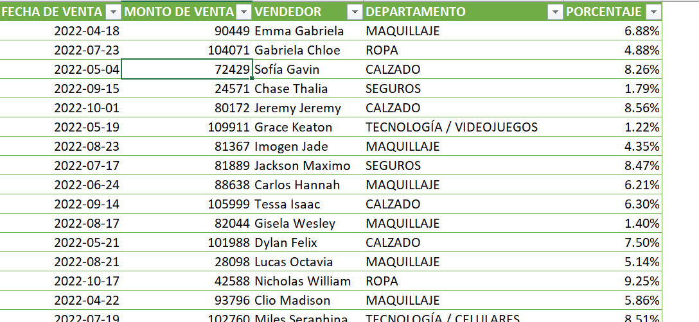

**Filtrar por fecha**: Supongamos que tienes una tabla de ventas de una tienda y deseas ver solo las ventas realizadas en un mes específico. Para ello, haz clic en la flecha de la columna "Fecha de venta", selecciona la opción "Filtros de Fechas" y elige el mes que deseas filtrar. Excel filtrará la tabla y solo mostrará las ventas realizadas en el mes seleccionado.

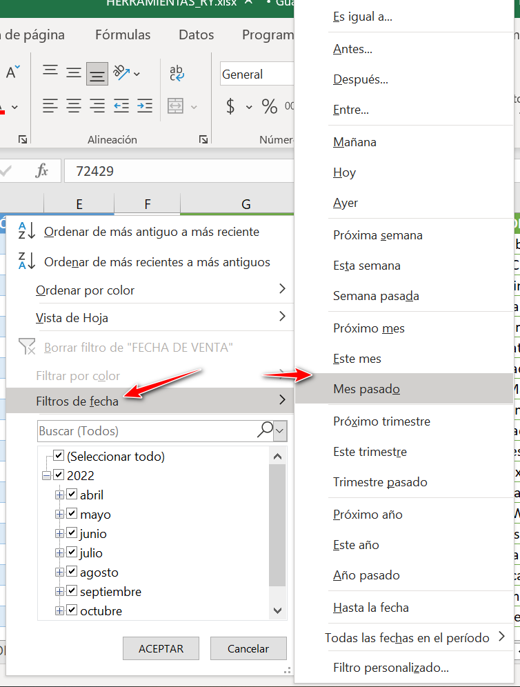

**Filtrar por palabra clav**e: Imagina que tienes una tabla de empleados y deseas ver solo a aquellos que trabajan en un departamento específico. Para ello, haz clic en la flecha de la columna "Departamento", escribe el nombre del departamento que deseas filtrar en el cuadro de búsqueda y haz clic en "Aceptar". Excel filtrará la tabla y solo mostrará los empleados que trabajan en ese departamento.

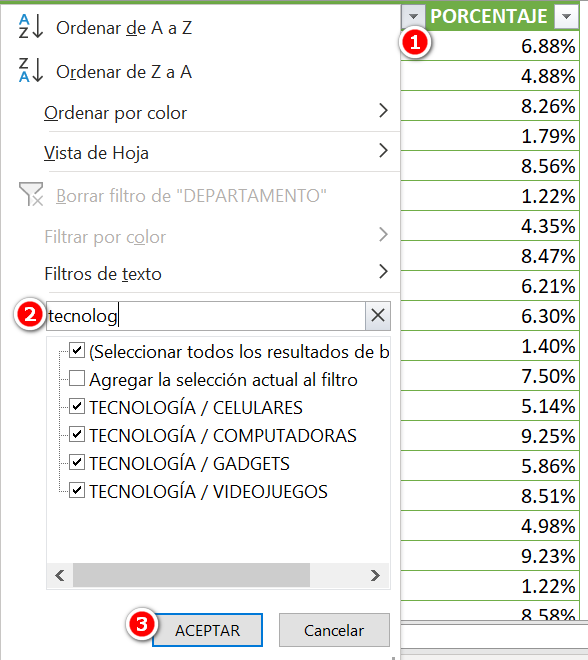

**Filtrar por rango de valores**: Supongamos que tienes una tabla de productos y deseas ver solo aquellos que se encuentran dentro de un rango de precios específico. Para ello, haz clic en la flecha de la columna "Monto de venta", selecciona la opción "Filtros de números" y elige la opción "Entre…".

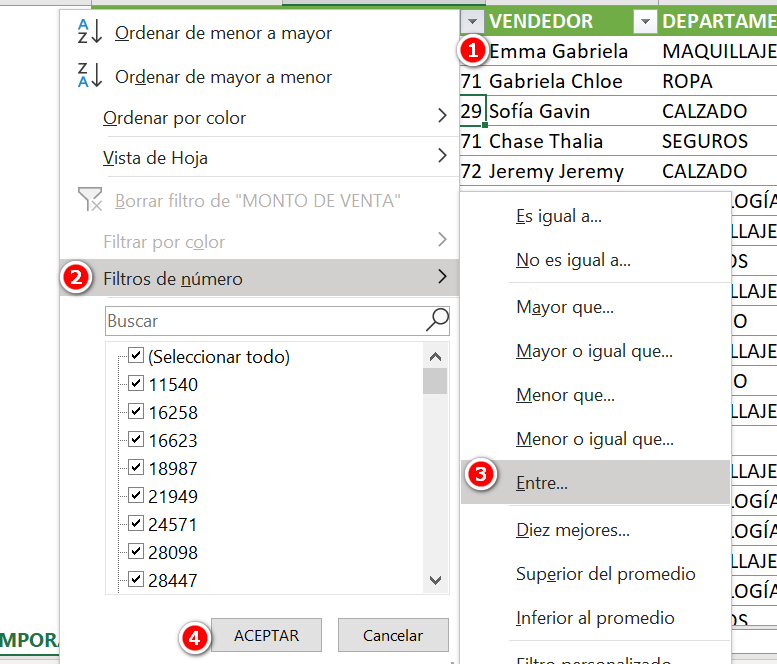

Luego, ingresa el rango de precios que deseas filtrar y haz clic en "Aceptar".

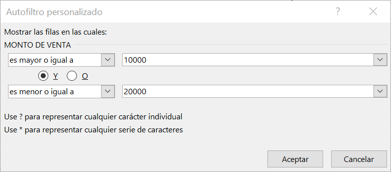

Excel filtrará la tabla y solo mostrará los productos que se encuentran dentro del rango de precios especificado.

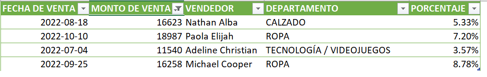

## Cómo ordenar datos con la función de autofiltro

Ordenar datos con la función de Autofiltro en Excel es muy sencillo y puede ahorrarte mucho tiempo y esfuerzo a la hora de trabajar con grandes cantidades de información. Aquí te explico los pasos a seguir para ordenar tus datos utilizando esta función:

- Selecciona la tabla de datos que deseas ordenar: Haz clic en cualquier celda dentro de la tablaque deseas ordenar.

- Activa la función de Autofiltro: Dirígete a la pestaña "Inicio" en la cinta de opciones de Excel y haz clic en el botón "Filtro". Aparecerán en la parte superior de cada columna de la tabla las pequeñas flechas que ya vimos anteriormente.

- Haz clic en la flecha de la columna que deseas ordenar: Se desplegará un menú con varias opciones. Selecciona una opción entre "Ordenar de la A a la Z" y "Ordenar de la Z a la A" para ordenar alfabéticamente, o entre las opciones "Ordenar de mayor a menor" y "Ordenar de menor a mayor" para ordenar por valores numéricos.

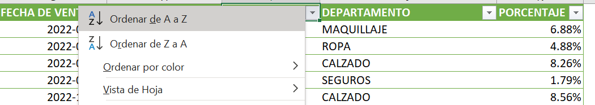

Ordenamiento de columna con valores alfanuméricos

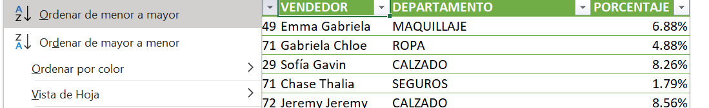

Ordenamiento de columna con valores numéricos

- Repite el proceso para otras columnas: Si deseas ordenar por varias columnas al mismo tiempo, simplemente haz clic en la flecha de la siguiente columna que deseas ordenar y selecciona la opción “Orden Personalizado”.

Orden personalizado. Podría no mostrarse en este menú, según tu versión de Excel

- Desactiva la función de Autofiltro: Una vez que hayas terminado de ordenar tus datos, dirígete nuevamente a la pestaña "Inicio" y haz clic en el botón "Filtro" para desactivar la función de Autofiltro.

Es importante destacar que la función de Autofiltro también te permite filtrar los datos que deseas ordenar, lo que te permitirá obtener resultados aún más específicos. Simplemente selecciona la opción "Filtrar" en la flecha de la columna correspondiente y escribe los criterios que deseas aplicar.

**Recuerda** que puedes ordenar por varias columnas al mismo tiempo, simplemente seleccionando la opción "Orden personalizado" en la flecha de la columna correspondiente. Esta opción puede no estar visible en el menú que aparece en la flecha de filtro, según tu versión de Excel.  Aún así, puedes acceder a esta funcionalidad, haciendo clic en el botón “Ordenar” que se encuentra junto al botón “Filtro”.

## Ejemplos de ordenamiento por diferentes campos

**Ordenar por departamento y sueldo**: Imagina que tienes una tabla de empleados que contiene su nombre, sueldo y departamento. Si deseas ordenar la tabla primero por departamento y luego por sueldo para ver los empleados de un mismo departamento ordenados por sueldo, selecciona la opción "Ordenar" en el apartado “Ordenar y filtrar” de la ficha “Datos” (junto al botón “Filtro”).

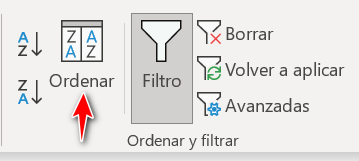

Luego selecciona "Agregar nivel" y selecciona la columna "Sueldo". Ahora Excel ordenará la tabla de datos primero por departamento y luego por sueldo.

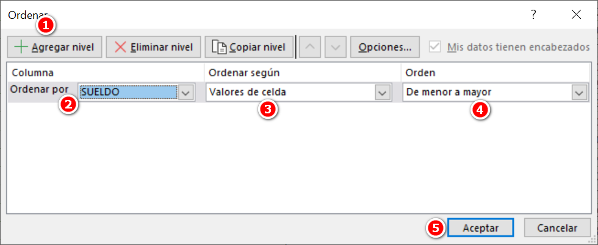

**Ordenar por categoría y precio**: Supongamos que tienes una tabla de productos que contiene el nombre de cada producto, su precio y su categoría.

Si deseas ordenar la tabla primero por categoría y luego por precio para ver los productos de una misma categoría ordenados por precio, selecciona la opción "Ordenar" como vimos en el ejemplo anterior, luego selecciona "Agregar nivel" y selecciona la columna "Categoria".

Nuevamente selecciona “Agregar nivel” y selecciona la columna “Precio”. Ahora Excel ordenará la tabla de datos primero por categoría y luego por precio.

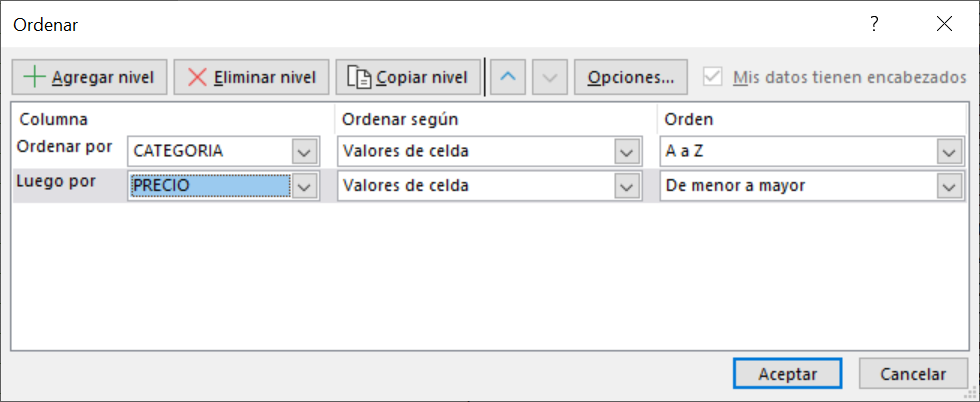

**Ordenar por fecha y cliente**: Supongamos que tienes una tabla de ventas que contiene la fecha de cada venta, el total vendido y el nombre del cliente. Si deseas ordenar la tabla primero por fecha y luego por cliente para ver las ventas ordenadas por fecha y por cliente en caso de haber varias ventas en un mismo día, selecciona la opción "Ordenar" de la misma forma en que lo hemos hecho hasta ahora.

Luego selecciona "Agregar nivel" y selecciona la columna "Fecha".

Nuevamente “Agregar nivel” y selecciona la columna “Cliente”.

Ahora Excel ordenará la tabla de datos primero por fecha y luego por cliente.

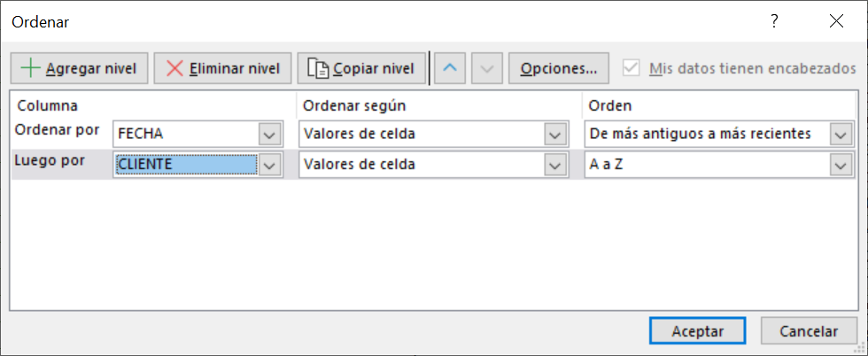

## Conclusiones

En este artículo he abordado el tema de cómo utilizar la función de Autofiltro para filtrar y ordenar datos en Excel. A lo largo del texto, te he presentado los siguientes puntos:

- La introducción a la función de Autofiltro y su importancia en la gestión de datos en Excel.

- El paso a paso para activar la función de Autofiltro en Excel.

- Una explicación detallada sobre cómo filtrar datos utilizando la función de Autofiltro, incluyendo ejemplos de filtrado por criterios específicos.

- Una explicación sobre cómo ordenar datos con la función de Autofiltro, junto con ejemplos de ordenamiento por diferentes campos y por múltiples campos a la vez.

## Importancia de la función de Autofiltro en la gestión de datos en Excel

La función de Autofiltro es una herramienta esencial en la gestión de datos en Excel, ya que permite filtrar y ordenar grandes conjuntos de información de manera rápida y precisa. Al utilizar esta función, los usuarios pueden enfocarse en datos específicos y omitir información que no es relevante para sus objetivos, lo que facilita la toma de decisiones informadas.

Además, el uso de la función de Autofiltro puede ahorrar tiempo valioso al evitar la necesidad de buscar manualmente información en grandes conjuntos de datos. Al ordenar y filtrar datos con esta función, los usuarios pueden obtener resultados precisos y detallados en cuestión de segundos, en lugar de tener que buscar información individualmente en una hoja de cálculo.

## Posibles aplicaciones prácticas de la función de Autofiltro en diferentes contextos

La función de Autofiltro tiene una amplia variedad de aplicaciones prácticas en diferentes contextos. Algunas de ellas son:

1. Análisis de ventas: En un contexto de ventas, la función de Autofiltro puede utilizarse para analizar los datos de ventas de un período específico o de un producto en particular. Los usuarios pueden filtrar los datos para ver sólo las ventas que cumplen con ciertos criterios, como la ubicación, el producto, el mes, etc.

3. Gestión de proyectos: Esta unción puede utilizarse para analizar los datos de progreso de un proyecto. Los usuarios pueden filtrar los datos para ver sólo las tareas completadas, las tareas pendientes o las tareas en progreso.

5. Análisis de encuestas: La función de Autofiltro puede utilizarse para analizar los datos de una encuesta. Los usuarios pueden filtrar los datos para ver sólo las respuestas de los encuestados que cumplen con ciertos criterios, como la edad, la ubicación geográfica, la profesión, etc.

7. Gestión de inventarios: Aquí la función de Autofiltro puede utilizarse para analizar los datos de un inventario. Los usuarios pueden filtrar los datos para ver sólo los productos que cumplen con ciertos criterios, como el tipo, la marca, el precio, etc.

9. Análisis de presupuestos: La función de Autofiltro puede utilizarse para analizar los gastos de una empresa en un período determinado. Los usuarios pueden filtrar los datos para ver sólo los gastos que cumplen con ciertos criterios, como el departamento, el tipo de gasto, el mes, etc.

## ¡Y eso es todo!

Como puedes ver, la función de Autofiltro es una herramienta clave en la gestión de datos en Excel y su uso adecuado puede mejorar significativamente la eficiencia y precisión del trabajo con datos.

Si tienes interés en aprender cómo puedes automatizar tus procesos de negocio, [no dejes de pasar por el blog](https://raymundoycaza.com/blog-automatizacion/).

Nos vemos en la siguiente.
