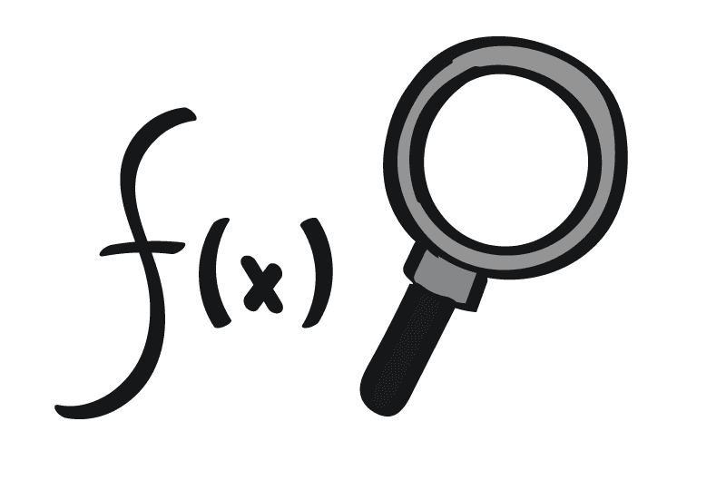

Si estás leyendo esto, es porque estás interesado o interesada en mejorar tu productividad y sacar el máximo provecho de Excel.

En este artículo te explicaré todo lo que necesitas saber sobre la [automatización con Excel](/blog/automatizacion-con-excel/) y cómo puede ayudarte a ahorrar tiempo y esfuerzo en tus tareas diarias.

Si eres nuevo en el mundo de la automatización y no sabes por dónde empezar, ¡no te preocupes!

Te explicaré todo de manera clara y sencilla, sin términos técnicos complicados.

Prepárate para descubrir cómo la automatización con Excel puede transformar tu forma de trabajar y mejorar tu productividad de manera significativa.

¡Empecemos!

## Domina Excel, paso a paso

Desde que comencé este blog, allá por el año 2012, he tratado de escribir de manera que todos los que lean estas publicaciones puedan seguir un hilo más o menos claro. Y, aunque este no es un curso realmente (como la mayoría de los "cursos" que hay por ahí), lo cierto es que aquí te dejo mi "tutorial extendido" para principiantes que para evitar confusiones lo llamaremos **curso de Excel**. ¿Te parece?

> Accede a mi [**curso "Domina Excel, paso a paso"**](/blog/automatizacion-con-excel/curso-de-excel/) que estará en constante actualización.

## La importancia de la productividad en el trabajo

¿Te has preguntado por qué algunos días sientes que has hecho mucho, mientras que otros días te quedas con la sensación de no haber avanzado nada?

La respuesta puede estar en tu nivel de productividad.

La productividad es un factor clave para **cualquier tipo de trabajo**, y es especialmente importante para los emprendedores y pequeños empresarios que buscan maximizar su tiempo y recursos.

En palabras simples, la productividad es la medida de cuánto se logra hacer en una cantidad de tiempo determinada.

Por esta razón **es importante para ti**, ya que puedes lograr más objetivos en menos tiempo y conseguir más clientes o vender más productos, lo que es muy importante para hacer crecer tu negocio.

La automatización con Excel es una herramienta valiosa para mejorar la productividad, ya que permite realizar tareas repetitivas de forma más eficiente y con menos errores.

## ¿Qué es Excel y cómo se relaciona con la productividad?

[Excel es un programa que ayuda a organizar información](https://www.youtube.com/watch?v=phy-h61Xnlg) y presentarla en forma de tabla y gráficos.



Su principal función es hacer cálculos y, por supuesto, **ahorrar tiempo al automatizar procesos repetitivos**.

Por esta razón, a este tipo de herramientas se les denomina "Hojas de Cálculo". 

> Revisa mi publicación [¿Qué es Excel?](/blog/automatizacion-con-excel/que-es-excel/)

Si ya tienes claro lo que es Excel, tal vez sería conveniente que sepas cuáles son sus componentes básicos: [La celda, la hoja y el libro](/blog/automatizacion-con-excel/la-celda-la-hoja-y-el-libro/)

Tomarte el tiempo de entender las bases de Excel, puede ahorrarte mucho tiempo a la larga y aprenderás a utilizarlo correctamente.

Además, si usas Excel correctamente, puedes aumentar tu productividad y **hacer más cosas en menos tiempo**.

Por eso, es importante aprender a usar Excel y aprovecharlo para nuestro trabajo diario.

## ¿Qué es la automatización con Excel?

La automatización con Excel es la forma en la que puedes enseñar a Excel a realizar tareas repetitivas por ti.

Es como si le dieras instrucciones a Excel para que haga ciertas cosas en lugar de tener que hacerlo tú mismo una y otra vez.

De esta manera, puedes ahorrar mucho tiempo y aumentar tu eficiencia en el trabajo.

La automatización con Excel se puede aplicar a muchas tareas, como la introducción de datos, la generación de reportes y la organización de información, entre otras.

En pocas palabras: **la automatización con Excel** es una forma inteligente de usar Excel para **mejorar tu productividad en el trabajo**.

## ¿Cuáles son las ventajas de la automatización con Excel?

Como ya te había mencionado, una de las ventajas que tiene la automatización usando Excel, es que te permite ahorrar tiempo al automatizar tareas repetitivas.

En lugar de hacer la misma tarea manualmente una y otra vez, puedes crear una macro que lo haga por ti en cuestión de segundos.

Y esto supone el beneficio más atractivo de todos: Te libera para que te dediques a hacer lo que realmente genera valor, lo que sabes hacer mejor.

Otra ventaja es que la automatización puede **reducir errores** y aumentar la precisión.

Cuando se trabaja con grandes cantidades de datos, es fácil cometer errores. La automatización ayuda a minimizar esos errores y garantizar que los datos sean precisos.

Además, la automatización con Excel puede ayudarte a analizar datos de manera más eficiente, lo que te permitirá **tomar decisiones más informadas** y estratégicas.

Si me pides explicar las ventajas en una sola frase, te diría que la automatización con Excel puede ayudarte a ser más eficiente, liberar tu tiempo y reducir errores.

## Herramientas y recursos para la automatización con Excel

Ahora que ya sabes lo que es la automatización con Excel y cuáles son sus principales ventajas, te presentaré algunas herramientas y recursos que te serán muy útiles para la automatización con Excel.

Estas herramientas que vienen incluidas en Excel, te ayudarán a ser más eficiente en tus tareas y ahorrar tiempo valioso.

### Funciones y fórmulas: La primera línea en la automatización con Excel

[Las funciones](/blog/automatizacion-con-excel/funciones-en-excel/) y fórmulas son herramientas poderosas en Excel que pueden ayudarte a automatizar tareas repetitivas y ahorrarte tiempo.

Pero no confundas estos términos: [fórmulas y funciones no son lo mismo](/blog/automatizacion-con-excel/formula-de-excel/) (no exactamente).

Algunas funciones comunes son SUMA, [PROMEDIO](/blog/automatizacion-con-excel/funcion-promedio-en-excel/) y CONTAR, que te permiten realizar cálculos rápidos y precisos en grandes conjuntos de datos.


=SUMA(A1,A2)


Un ejemplo sencillo de la función SUMA sería, por decir algo:

Esto sumaría el valor que tienes en las celdas A1 y A2

Y también podrías tener este ejemplo, igual de sencillo, pero mucho más útil:


=SUMA(A1:A25000)


Esto sumaría el valor que tienes en 25,000 celdas: desde la A1 hasta la A25000. ¡Así de fácil!

¿Recuerdas que la idea es ahorrarte todo el tiempo posible?

Las fórmulas, por otro lado, pueden ser más complejas y personalizables.

Si bien es cierto, encontrarás fórmulas tan sencillas como:


=A1 + A2


También podrías encontrarte fórmulas que no son tan sencillas, como sería el caso de:


=SUMA(
    SI(
        ESNUMERO(
            A1:A10
        ),
        SI(
            ESNUMERO(
                B1:B10
            ),
            SI(
                A1:A10 > 5,
                SI(
                    B1:B10 < 10,
                    ( A1:A10 + B1:B10 ) / 2,
                    ""
                ),
                ""
            )
        )
    )
)  


Tú no te preocupes.

Las fórmulas pueden ser tan sencillas o tan complejas como tú lo requieras.

Ve paso a paso.

Lo que quiero que recuerdes es que al aprender a utilizar estas funciones y fórmulas, podrás automatizar tareas y **mejorar tu productividad en Excel**.

#### Funciones y fórmulas útiles para la automatización

En esta sección, te presentaré ejemplos prácticos de cómo aplicar fórmulas y funciones en Excel para resolver problemas de tu rutina diaria en el trabajo.

Con estos ejemplos, podrás tener una mejor comprensión acerca de cómo puedes mejorar tu productividad y ahorrar tiempo en tareas repetitivas y tediosas.

Verás que con un poco de conocimiento de Excel, podrás simplificar muchos procesos y obtener resultados precisos en poco tiempo. ¡Sigue leyendo!

##### Lo más básico para comprender las fórmulas y funciones

[¿Qué es una fórmula en Excel?](/blog/automatizacion-con-excel/que-es-una-formula-en-excel/)

[7 elementos básicos de una fórmula, que tú debes conocer](/blog/automatizacion-con-excel/elementos-basicos-de-una-formula/)

[7 Principios básicos para trabajar con fórmulas en Excel](/blog/automatizacion-con-excel/formulas-en-excel/)

[¿Qué son las funciones?](/blog/automatizacion-con-excel/funciones-en-excel/)

[¿ Qué son los argumentos en Excel ?](/blog/automatizacion-con-excel/argumentos-en-excel/)

##### Funciones de Excel explicadas (y con algún ejemplo)

[Las Funciones de Búsqueda en Excel: BUSCARV, INDICE y COINCIDIR](/blog/automatizacion-con-excel/funciones-de-busqueda-en-excel)

[La función NUM.DE.SEMANA](/blog/automatizacion-con-excel/funcion-num.de.semana/)

[La Función TRANSPONER](/blog/automatizacion-con-excel/funcion-transponer/)

[La función DERECHA](/blog/automatizacion-con-excel/funcion-derecha/)

[La función CAR](/blog/automatizacion-con-excel/funcion-car/)

[La función CONCATENAR](/blog/automatizacion-con-excel/funcion-concatenar/)

[La función MED () en Excel ¿Cómo se usa?](/blog/automatizacion-con-excel/la-funcion-med/)

[La función REPETIR](/blog/automatizacion-con-excel/la-funcion-repetir/)

[La función REPETIR en Excel: ¿Cómo usarla?](/blog/automatizacion-con-excel/funcion-repetir/)

[La función COINCIDIR – Diccionario de Funciones](/blog/automatizacion-con-excel/funcion-coincidir/)

[Entendiendo la función DESREF](/blog/automatizacion-con-excel/funcion-desref/)

[Función COCIENTE](/blog/automatizacion-con-excel/funcion-cociente/)

[Función HALLAR](/blog/automatizacion-con-excel/funcion-hallar/)

[La función MINUSC](/blog/automatizacion-con-excel/funcion-minusc/)

[La función NOMPROPIO en Excel](/blog/automatizacion-con-excel/funcion-nompropio/)

[La Función MAYUSC en Excel](/blog/automatizacion-con-excel/funcion-mayusc/)

[La función RESIDUO en Excel](/blog/automatizacion-con-excel/funcion-residuo)

[La función HOY en Excel: obtener la fecha actual](/blog/automatizacion-con-excel/funcion-hoy/)

[La función ESPACIOS: eliminar espacios en Excel](#)

[La función CARACTER en Excel ¿Qué hace y para qué sirve?](/blog/automatizacion-con-excel/funcion-caracter-en-excel/)

[La función SUMAR.SI](/blog/automatizacion-con-excel/funcion-sumar.si/)

[Función SI: ¿Para qué sirve y cómo funciona?](/blog/automatizacion-con-excel/sumar.si/)

[Función SI anidada: Condiciones más complejas](/blog/automatizacion-con-excel/ejemplo-funcion-si-anidada/)

##### Implementando lo aprendido: 
> Cómo resolver ciertas situaciones utilizando fórmulas y funciones en Excel

Ahora te mostraré cómo aplicar lo aprendido en casos más concretos, para que puedas aprovechar al máximo tus habilidades en esta herramienta y mejorar tu productividad.

Te mostraré ejemplos concretos para que puedas poner en práctica el uso de fórmulas y funciones para solucionar problemas que enfrentas en tu día a día.

¡Acompáñame en este viaje de aprendizaje y descubre cómo Excel puede hacerte la vida más fácil!

[Aprende cómo realizar una Autosuma con Varios Rangos y Multiselección](/blog/automatizacion-con-excel/autosuma-con-varios-rangos/)

[Descubre cómo forzar la escritura en mayúsculas, usando fórmulas](/blog/automatizacion-con-excel/forzar-mayusculas-con-formulas/)

[Crea tu propio generador de contraseñas en Excel, utilizando funciones nativas](/blog/automatizacion-con-excel/generador-de-contraseñas-en-excel/)

[Cómo generar números aleatorios con decimales y dentro de un intervalo, en Excel](/blog/automatizacion-con-excel/generar-numeros-aleatorios-decimales/)

[Haz uso de las fórmulas para convertir números Decimales a Horas y Minutos en Excel](/blog/automatizacion-con-excel/convertir-decimales-a-horas-y-minutos/)

[Conoce cómo puedes rellenar un texto o cómo forzar una longitud fija en Excel](/blog/automatizacion-con-excel/la-funcion-repetir/)

[Explorando la función SI anidada: Ejemplo de uso en la vida real](/blog/automatizacion-con-excel/explicando-funcion-si-anidada/)

[Cómo generar datos aleatorios (y que sumen exactamente 100%)](/blog/automatizacion-con-excel/generar-datos-aleatorios/)

[Cómo concatenar un rango sin usar macros (video)](/blog/automatizacion-con-excel/concatenar-un-rango-sin-usar-macros/)

[Calcular el IVA incluido y el porcentaje de una cantidad](/blog/automatizacion-con-excel/calcular-el-iva-incluido/)

[¿Cómo calcular el tercio de un rango de fechas?](/blog/automatizacion-con-excel/tercio-de-un-rango-de-fechas/)

[Cómo auto-numerar registros en Excel](/blog/automatizacion-con-excel/auto-numerar-registros-en-excel)

[Extraer el año, mes o día de una fecha en Excel](/blog/automatizacion-con-excel/fecha-en-excel/)

[Sumar Fechas en Excel (y restar también)](/blog/automatizacion-con-excel/sumar-fechas-en-excel/)

[Generar datos de prueba en Excel](/blog/automatizacion-con-excel/generar-datos-de-prueba-en-excel/)
