Si trabajas con datos en Excel, la búsqueda puede ser una tarea tediosa y repetitiva.

Pero no te preocupes, porque existen algunas funciones que pueden facilitar esta labor.

En este artículo te presento las tres funciones (más una) más útiles para la búsqueda de datos en Excel.

Con estas funciones podrás encontrar rápidamente información específica en grandes conjuntos de datos y ahorrar un tiempo valioso en tu trabajo diario.

Aprende cómo utilizar estas herramientas y convierte la búsqueda de datos en una tarea sencilla y eficiente.

## Las funciones para la búsqueda de datos

Como te decía, en este artículo te presento cuatro funciones fundamentales de Excel para la búsqueda de datos en tus hojas de cálculo: BUSCARV, FILTRO, INDICE y COINCIDIR.

Con estas funciones, podrás encontrar rápidamente la información que necesitas, **ahorrando tiempo y aumentando la eficiencia de tu trabajo** en la automatización de procesos de negocio específicos.

Ten en cuenta que cada una de estas funciones tiene características y usos particulares que te permitirán manipular grandes conjuntos de datos con facilidad, proporcionándote resultados precisos y confiables.

Aprender a utilizar estas funciones te permitirá tener un mayor control sobre tus datos y tomar decisiones más informadas en tu negocio.

### Función BUSCARV: Búsqueda eficiente de datos en Excel

La función BUSCARV en Excel es una de las funciones más utilizadas en la búsqueda de datos. Con esta función, puedes buscar un valor específico en una tabla o rango de celdas y devolver un valor correspondiente de la misma fila.

En otras palabras, puedes buscar un valor en una tabla y obtener información relacionada a ese valor.

Algo así como buscar en un listado telefónico: buscas el nombre y luego ves cuál es su número de teléfono.

Esta función es muy útil para la gestión de datos en Excel y para encontrar información específica en grandes conjuntos de datos.

#### Ejemplos de uso de la función BUSCARV

##### Buscar el sueldo de un empleado específico

Si tenemos una tabla con los nombres de empleados y sus respectivos sueldos, podemos utilizar BUSCARV para buscar el sueldo de un empleado específico.

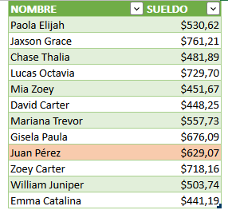

Por ejemplo, si queremos saber el sueldo de "Juan Pérez", podemos usar la función BUSCARV para buscarlo por su nombre en la tabla y devolver el valor correspondiente.

**Atención**: Es indispensable que la columna donde está el valor por el que vamos a buscar, en este caso, la columna de nombre, se encuentre en primer lugar o **no funcionará la búsqueda**. Esta es una limitación de BUSCARV.

Esta función recibe unos valores que son necesarios para trabajar.

Estos valores son denominados como parámetros y son los siguientes:

- Valor Buscado (en este caso, buscamos a Juan Pérez)

- Matriz (donde se va a buscar, en este caso la Tabla6)

- Columna (donde está el valor que deseamos que nos devuelva, en este caso, la columna número 2)

- Ordenado (generalmente, le indicamos un 0 aquí)

Esto es más sencillo de lo que parece. Aplicaremos lo visto hasta el momento y te quedará más claro.

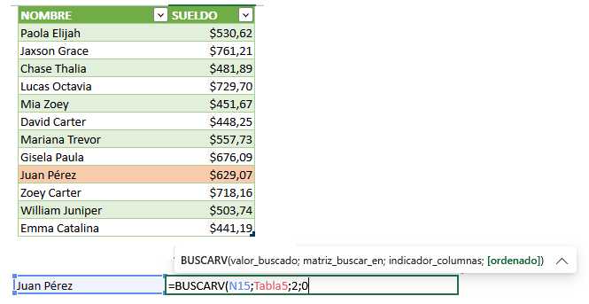

Como ves, en el primer parámetro solicitado indicamos la celda Q14, que es la celda donde está el nombre del empleado que buscamos.

En el segundo parámetro escribimos Tabla5, ya que es el nombre de la tabla en la que tenemos los datos.

En el tercer parámetro escribimos 2, ya que en la columna dos está el sueldo y es el valor que buscamos.

En el cuarto parámetro escribimos 0, para forzar una coincidencia exacta.

**Atención**: En la mayoría de los casos solo necesitarás escribir el 0 en el cuarto parámetro; pero si tienes curiosidad de saber el porqué escribimos un cero, podrás verlo en esta otra entrada.

Si has escrito bien las referencias y los separadores, entonces ya podrás ver el resultado de la búsqueda.

Una vez que ya has escrito esta función, ya podrás cambiar el nombre del empleado y aparecerá el valor del sueldo automáticamente:

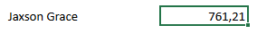

##### Buscar el precio de un producto

Si tenemos una lista de productos y sus precios, podemos utilizar BUSCARV para buscar el precio de un producto en particular.

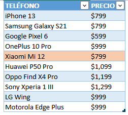

Por ejemplo, si queremos saber el precio de "Xiaomi Mi 12", podemos utilizar BUSCARV para buscar en la tabla y devolver el valor correspondiente.

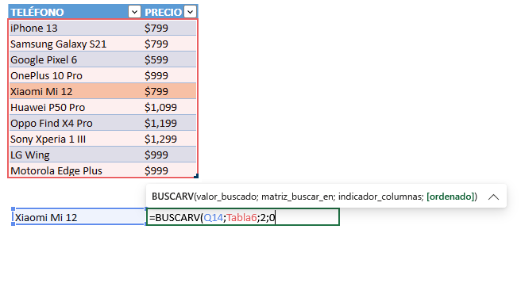

En la celda Q14 escribimos el nombre del producto que buscamos.

En la celda R14 (junto a la celda anterior) escribimos la función BUSCARV y le proporcionamos los parámetros que solicita:

Indicamos el rango o la tabla en la que necesitamos buscar, en este caso la Tabla16.

Indicamos que el valor que necesitamos averiguar es el de la columna 2.

Le decimos que realice una búsqueda exacta, escribiendo un cero.

**Recuerda**: Cada parámetro debe ir separado por punto y coma ";". Si tienes configurado Excel de manera diferente, entonces podría ser una coma ",". Practica y prueba.

Si todo ha salido bien, cierra paréntesis y presiona enter. Ahora podrás ver el resultado de la búsqueda.

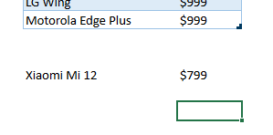

¡Ajá! También podríamos buscarlo por código.

Ya vas viendo las posibilidades. ¿No es verdad?

##### Buscar el monto de ventas por vendedor

Si tenemos una tabla con las ventas realizadas por un equipo de vendedores en diferentes regiones, podemos utilizar BUSCARV para buscar las ventas realizadas por un vendedor en particular en una región específica.

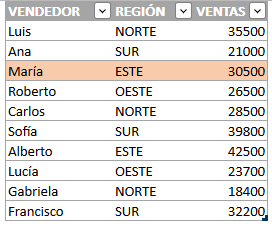

Por ejemplo, si queremos saber las ventas realizadas por "María", podemos utilizar BUSCARV para buscar en la tabla y devolver el valor correspondiente.

En este ejemplo, te toca a ti ingresar la función.

Guíate de los dos ejemplos anteriores y anímate a practicar.

#### Consejos adicionales para la búsqueda de datos en Excel con BUSCARV

1. Si vas a utilizar el valor 1 en el último parámetro, asegúrate de que la información en la tabla de búsqueda esté ordenada correctamente, ya que BUSCARV buscará el valor en la primer columna y si está mal ordenada, podrías obtener un resultado incorrecto.

3. Utiliza una [referencia absoluta](https://raymundoycaza.com/referencias-absolutas-y-relativas/5440/) para la tabla de búsqueda y el valor de búsqueda, esto te permitirá copiar y pegar la fórmula en diferentes celdas sin que las referencias cambien.

5. Si el valor de búsqueda no se encuentra en la tabla, la función BUSCARV devolverá un error #N/A, así que considera agregar una función SI.ERROR a la fórmula para mostrar un mensaje personalizado cuando esto suceda.

7. Puedes combinar la función BUSCARV con otras funciones, como SUM o PROMEDIO, para realizar cálculos más complejos y obtener resultados más útiles.

Recuerda que la práctica es la mejor forma de aprender, así que experimenta con diferentes escenarios y utiliza la función BUSCARV para ahorrar tiempo y aumentar tu eficiencia en la búsqueda de datos en Excel.

### La función FILTRAR

Si estás buscando una manera efectiva de reducir la cantidad de datos en una tabla, la [función "FILTRAR" de Excel](https://support.microsoft.com/es-es/office/funci%C3%B3n-filtrar-f4f7cb66-82eb-4767-8f7c-4877ad80c759) puede ser la solución que necesitas.

Esta herramienta te permite seleccionar solo los datos específicos que te interesan, lo que significa que puedes trabajar de manera más eficiente sin tener que revisar largas listas de datos innecesarios.

¿Quieres buscar todos los productos con un precio superior a $50?

¿O tal vez necesitas encontrar todas las ventas realizadas por un vendedor específico?

FILTRAR puede ayudarte a hacerlo en cuestión de segundos.

En pocas palabras, "FILTRAR" es una función de búsqueda de datos en Excel que te permite enfocarte en los datos importantes y ahorrar tiempo en el proceso.

#### Ejemplos de uso de la función FILTRAR

A continuación, te presento algunos ejemplos de cómo puedes utilizar esta poderosa función para filtrar datos en una hoja de cálculo y obtener solamente los resultados que necesitas.

##### **Filtrar datos por rango de fechas**

Supongamos que tienes una lista de ventas en una hoja de cálculo de Excel y deseas filtrar los datos de ventas realizadas en un rango de fechas específico.

Con la función "Filtrar", puedes seleccionar la columna de fechas y establecer el rango deseado, luego se mostrarán únicamente los datos correspondientes a las ventas realizadas en ese período de tiempo.

Primero escribiremos la celda que usaremos como filtro y le pondremos un título adecuado.

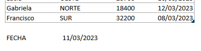

En la celda U13 escribimos una fecha de referencia para usarla como filtro para nuestro rango.

Ahora, un poco más abajo, escribiremos la función FILTRAR:

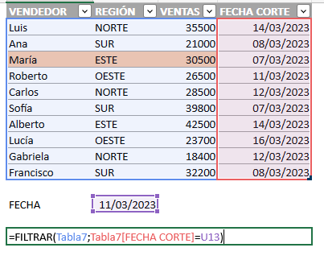

Como ya te habrás dado cuenta, la función FILTRAR también tiene parámetros y te los enumero a continuación:

- Rango a filtrar: Es el rango de celdas o tabla donde vamos a aplicar el filtro. En este caso lo haremos sobre la Tabla7

- Rango filtro: Es el rango de celdas o columna de tabla que usaremos para realizar el filtro. En este caso filtraremos por la columna fecha, así que escribimos la referencia estructurada para la columna FECHA CORTE.
    - Aún no termina el asunto con este parámetro. Ahora tienes que compararlo con la celda U13 que es donde escribimos la fecha de referencia.
    
    - Para el ejemplo escribiremos =U13 porque deseamos que nos filtre todas las filas que tengan una fecha de corte igual a 11/03/2023

Cerramos paréntesis y presionamos "enter" para aceptar la fórmula.

Si todo ha salido bien, tendrás un bonito rango filtrado como este:

Por supuesto, hay que darle algo de formato para que se vea mejor.

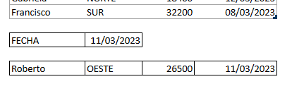

Pero, ¿qué pasa si queremos filtrar por un rango de fechas?

Por ejemplo, queremos TODAS las filas que tengan una fecha MENOR que la indicada.

Simplemente, en nuestra función reemplazamos el igual por el símbolo MENOR QUE "<".

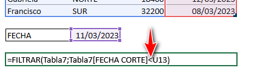

Al hacer este pequeño cambio, habremos logrado el objetivo: filtrar el rango por todas las fechas MENORES al 11/03/2023

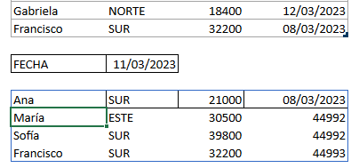

Ahora tú podrás ir dándote ideas sobre cómo le podrias sacar provecho a esta función en tu trabajo.

##### Filtrar datos por categorías

Si tienes una gran cantidad de datos en una hoja de cálculo y deseas ver solo los datos relacionados con una categoría específica, la función "Filtrar" te permitirá hacer esto de forma rápida y sencilla.

Por ejemplo, puedes filtrar los datos de una columna que contenga diferentes tipos de productos, para visualizar únicamente los datos correspondientes al producto que te interesa.

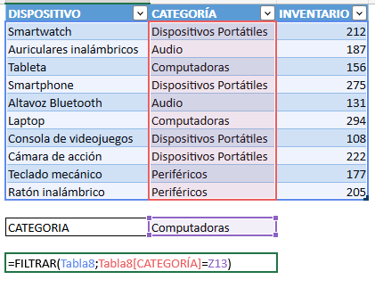

Repetimos el proceso anterior: Creamos una celda donde escribiremos la categoría a buscar, insertamos la función FILTRAR, le alimentamos los dos parámetros que solicita y listo.

Has filtrado una tabla que podría tener 10, 100 o 1000000 de filas a unas pocas que son de tu interés, con mucha facilidad.

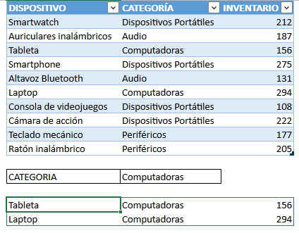

##### Filtrar datos por valores numéricos

Si tienes una hoja de cálculo con datos numéricos, la función "Filtrar" puede ayudarte a encontrar información específica.

Por ejemplo, puedes filtrar una lista de ventas para ver solo las ventas que superen cierta cantidad, o para ver las ventas que se encuentren dentro de un rango específico de valores.

La función FILTRAR no permite de manera sencilla utilizar múltiples criterios para filtrar datos.

Sin embargo, hay un truco práctico para superar esta limitación.

Se puede emplear la fórmula que se muestra a continuación para lograrlo:

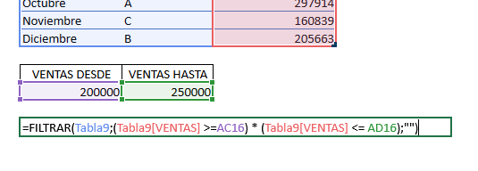

Con el asterisco puedes separar los dos criterios y lograrás que se filtren los registros que tengan la columna de fecha con valores que sean mayores (o iguales) a la primera referencia **Y** que además sean menores (o iguales) a la segunda referencia.

Para el ejemplo que estamos utilizando, se mostrarán los registros cuyas ventas sean mayor o igual a 200000 y menor o igual a 250000.

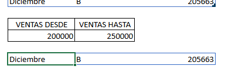

De esta forma, podrás analizar los datos con mayor facilidad y rapidez.

#### Consejos adicionales para usar la función FILTRAR

1. Aprende a utilizar la fórmula FILTRAR en conjunto con otras funciones avanzadas de Excel, como las tablas dinámicas y las macros. Combinar estas herramientas te permitirá automatizar aún más tus procesos y ahorrar tiempo en tus tareas diarias.

3. Si necesitas aplicar la fórmula FILTRAR en múltiples hojas de cálculo, considera utilizar la función "Consolidar" para combinar tus datos en una sola hoja de cálculo. Luego puedes aplicar la fórmula FILTRAR a los datos consolidados y obtener los resultados que necesitas.

### Cómo combinar ÍNDICE y COINCIDIR en Excel para encontrar datos de manera efectiva.

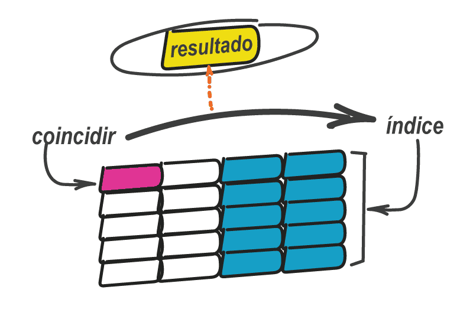

Si eres un usuario habitual de Excel, es probable que hayas oído hablar de la función ÍNDICE y de la función COINCIDIR.

Ambas son muy útiles para buscar datos en grandes hojas de cálculo, pero ¿sabías que combinándolas puedes obtener resultados aún más efectivos?

En esta sección te mostraré cómo combinar ambas funciones para encontrar datos de manera más eficiente y ahorrar tiempo en tus tareas diarias en Excel.

¡Sigue leyendo!

#### Ejemplo de uso combinado de las funciones INDICE y COINCIDIR

##### Buscar un valor específico en una tabla

Supongamos que tenemos una tabla con información de ventas de diferentes productos y queremos buscar el total de unidades vendidas de un producto en particular.

Podemos usar la función COINCIDIR para encontrar la fila correspondiente y luego la función ÍNDICE para obtener el valor de la columna de totales de unidades vendidas.

Vamos por partes. Primero encontremos en qué fila está la MacBook Air:

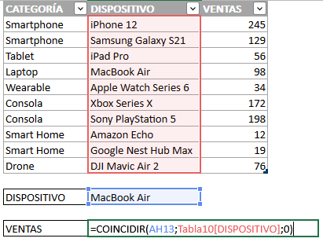

Como ves la función COINCIDIR utiliza tres parámetros:

- La celda donde está el valor que buscamos.

- El rango o columna donde queremos buscar.

- El tipo de coincidencia. Igual que antes, usaremos el cero para coincidencia exacta.

Al ingresar todos los parámetros que solicita la función, veremos que nos devuelve un 4.

¿Por qué?

Porque el dispositivo que buscamos se encuentra en la fila número 4.

Ahora dejemos un momento la función COINCIDIR y veamos la parte de la función INDICE.

Para no confundirte, escribiré aparte la función INDICE.

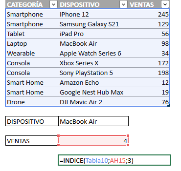

Como ves aquí utilizo también tres parámetros:

- El rango donde necesito buscar.

- La fila donde está el valor que deseo traer.

- La columna donde está el valor que deseo traer.

El rango donde necesito buscar esta vez sería toda la Tabla10.

¿Y la fila en la que se encuentra el valor que deseo traer?

¡Pues es el valor que hayamos antes con la función COINCIDIR!

Por eso referencio a la celda donde está ese valor.

Finalmente, le escribo un 3 porque el valor que quiero (unidades vendidas) está en la tercera columna.

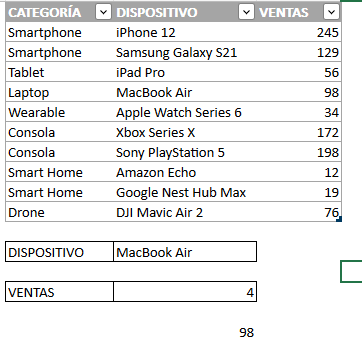

Como ves, ahora me ha devuelto 98 que es el número de unidades vendidas de la MacBook

Ahora juntémoslo todo.

Una vez que has comprendido cómo trabaja cada función por separado, vamos a unificarlas en una sola fórmula combinada para sacarle el provecho que se debe.

Únicamente voy a copiar reemplazar la referencia a la celda AH15 por la función COINCIDIR que escribimos anteriormente, con todos sus parámetros:

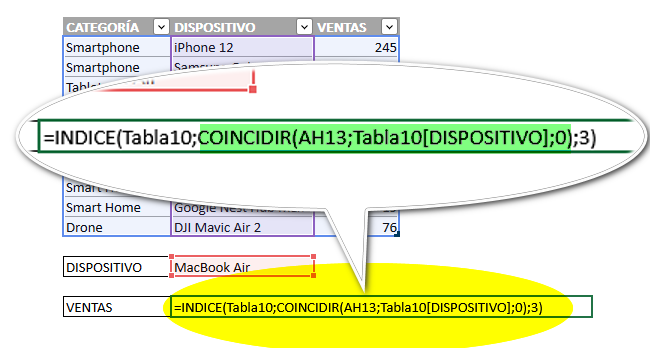

En color verde está resaltada la función COINCIDIR que ocupa el lugar en el que ants estaba la referencia AH15

Ahora ya podemos ver el resultado en una sola celda, debido a que combinamos las funciones INDICE y COINCIDIR.

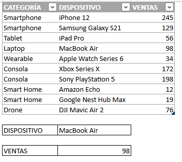

##### Consejos para aplicar ÍNDICE y COINCIDIR combinados

1. Asegúrate de que las referencias en las fórmulas sean correctas: Al utilizar las funciones ÍNDICE y COINCIDIR, es fundamental que las referencias que se utilicen en la fórmula sean precisas para obtener los resultados deseados. Si las referencias son incorrectas, es posible que se obtengan resultados inesperados.

3. Utiliza el tipo de coincidencia adecuado: La función COINCIDIR tiene tres tipos de coincidencia diferentes que se pueden utilizar: exacto, aproximado y el tipo de búsqueda personalizado. Es importante elegir el tipo de coincidencia correcto según la información que se está buscando.

5. Combina las funciones ÍNDICE y COINCIDIR con otras fórmulas: Las funciones ÍNDICE y COINCIDIR son muy útiles por sí solas, pero también se pueden combinar con otras fórmulas para obtener resultados aún más precisos. Por ejemplo, se pueden utilizar para crear tablas dinámicas o gráficos.

### Conclusiones

Ahora que ya conoces las tres funciones esenciales (más una) para buscar datos en Excel, podrás trabajar de manera más eficiente y ahorrar tiempo valioso en la gestión de tus proyectos empresariales.

¡Excelente!

La función BUSCARV te permite encontrar datos específicos en una tabla, mientras que la función COINCIDIR te ayuda a buscar datos en columnas o filas.

Por último, la combinación de las funciones ÍNDICE y COINCIDIR te permite buscar datos en varias hojas de trabajo.

Estas herramientas son fundamentales para la gestión de proyectos empresariales y te permitirán trabajar de manera más eficiente y productiva.

¡Pruébalas hoy mismo y descubre todo lo que puedes lograr con ellas!

Nos vemos.
