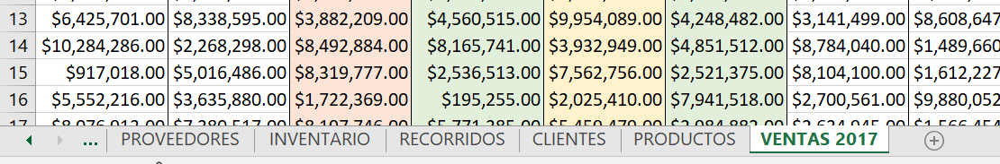
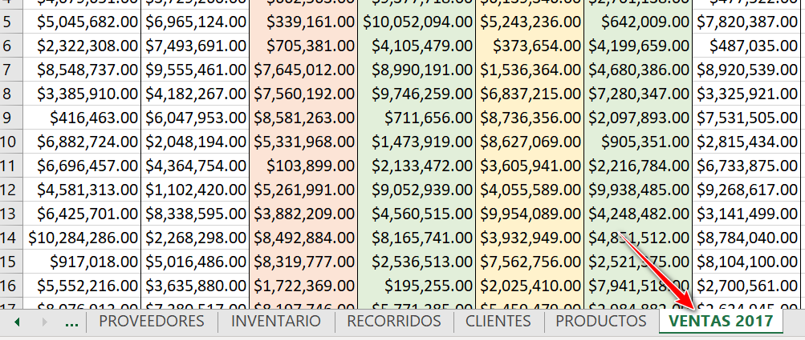
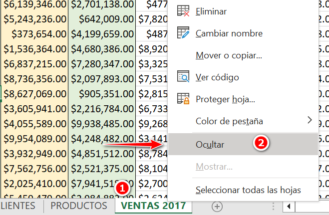
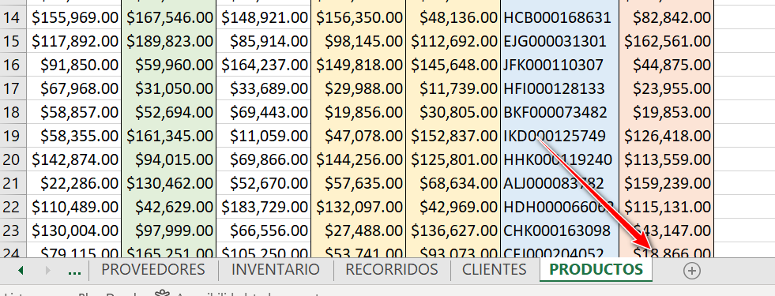
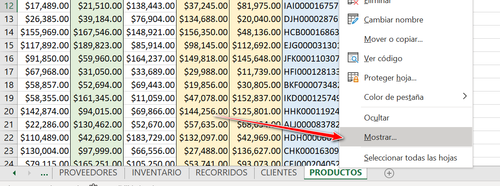
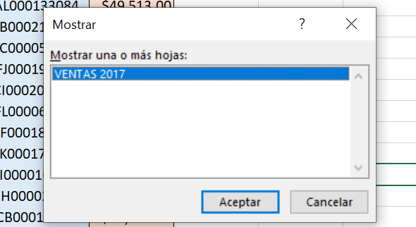

¿Sabías que puedes ocultar tus hojas de Excel para evitar errores y proteger tu información?

En este artículo te voy a mostrar cómo hacerlo de forma fácil y rápida.

Así podrás mejorar tus procesos de negocio con Excel y automatizar tus tareas sin complicaciones.

¡Sigue leyendo y descubre este truco de Excel que te va a sorprender!

## ¿Qué es una hoja de Excel y para qué sirve?

[Una hoja de Excel es una parte de un libro de Excel donde puedes introducir datos, fórmulas, gráficos y otros elementos](https://raymundoycaza.com/celda-hoja-libro/35/).

Un libro de Excel puede tener varias hojas, que se pueden ver en la parte inferior de la ventana.

Puedes cambiar el nombre de las hojas, moverlas, copiarlas o eliminarlas según tus necesidades.

Las hojas de Excel son muy útiles para organizar tu información y trabajar con diferentes tipos de datos.

Por ejemplo, puedes tener una hoja con los datos de tus clientes, otra con los productos que vendes, otra con las facturas que emites y otra con los informes que generas.

## ¿Por qué ocultar una hoja de Excel?

A veces puede ser conveniente ocultar una hoja de Excel por varios motivos:

- Para evitar que otras personas vean o modifiquen tus datos sensibles o confidenciales.

- Para simplificar la presentación de tu libro de Excel y mostrar solo las hojas que necesitas.

- Para evitar errores o confusiones al trabajar con fórmulas o referencias a otras hojas.

- Para optimizar el rendimiento de tu libro de Excel y reducir el tamaño del archivo.

## ¿Cómo ocultar una hoja de Excel?

Ocultar una hoja de Excel es muy fácil. Solo tienes que seguir estos pasos:

1\. Selecciona la hoja que quieres ocultar haciendo clic en su nombre en la parte inferior de la ventana.

2\. Haz clic con el botón derecho del ratón sobre el nombre de la hoja y elige la opción Ocultar en el menú que aparece.

3\. ¡Listo! La hoja quedará oculta y no se verá en la ventana ni en la barra de hojas.

Pero...

¿Y si quiero mostrar nuevamente la hoja?

¡Ahora te lo cuento!

## ¿Cómo mostrar una hoja de Excel oculta?

Si quieres volver a ver una hoja de Excel que has ocultado, tienes que hacer lo siguiente:

1\. Haz clic con el botón derecho del ratón sobre cualquier nombre de hoja en la parte inferior de la ventana y elige la opción Mostrar en el menú que aparece.

2\. Se abrirá un cuadro de diálogo con las hojas ocultas del libro. Selecciona la hoja que deseas mostrar y haz clic en Aceptar.

3\. La hoja se mostrará de nuevo en la ventana y en la barra de hojas.

## ¿Qué ventajas tiene ocultar una hoja de Excel?

Ocultar una hoja de Excel tiene varias ventajas para mejorar tus procesos de negocio con Excel y automatizar tus tareas:

- Proteges tu información y evitas que sea vista o modificada por personas no autorizadas.

- Simplificas tu libro de Excel y facilitas su uso y comprensión.

- Evitas errores o confusiones al trabajar con fórmulas o referencias a otras hojas.

- Optimizas el rendimiento de tu libro de Excel y reduces el tamaño del archivo.

## Referencias adicionales

Por si te estás preguntando dónde hay más información sobre este tema, aquí te dejo un par de referencias:

[https://support.microsoft.com/es-es/office/ocultar-o-mostrar-hojas-de-c%C3%A1lculo-69f2701a-21f5-4186-87d7-341a8cf53344](https://support.microsoft.com/es-es/office/ocultar-o-mostrar-hojas-de-c%C3%A1lculo-69f2701a-21f5-4186-87d7-341a8cf53344)

[https://exceltotal.com/ocultar-una-hoja-de-excel/](https://exceltotal.com/ocultar-una-hoja-de-excel/)

Walkenbach, J. (2010). Excel 2010 Bible. Wiley Publishing. Capítulo 5: Proteger su trabajo, páginas 103-112. 

## Reflexiones finales

Ocultar una hoja de Excel es un truco muy sencillo pero muy útil para ayudarte a mejorar tus procesos de negocio con Excel y automatizar tus tareas.

Te permite proteger tu información, simplificar tu libro, evitar errores y optimizar el rendimiento.

Solo tienes que seguir unos pocos pasos para ocultar o mostrar las hojas que quieras.

¿Qué estás esperando para probarlo?

¡Te sorprenderá lo fácil que es!
