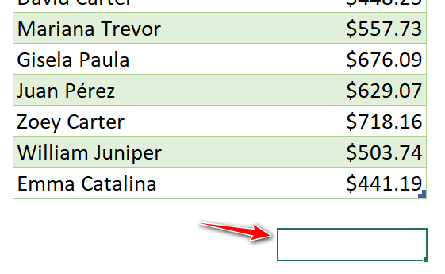
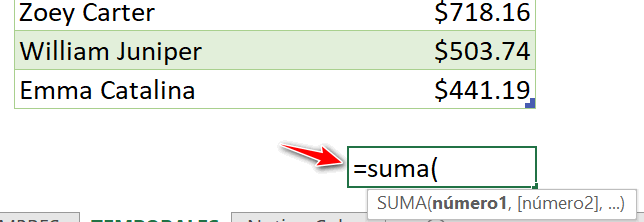
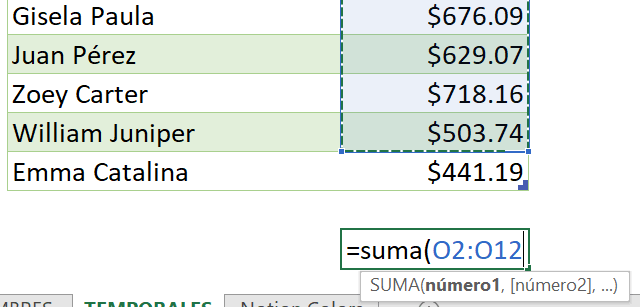
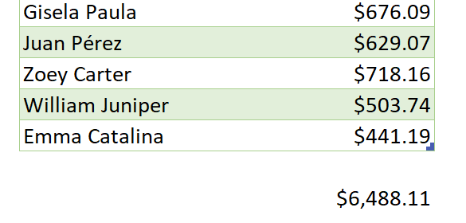
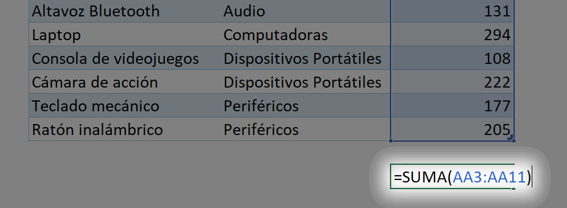
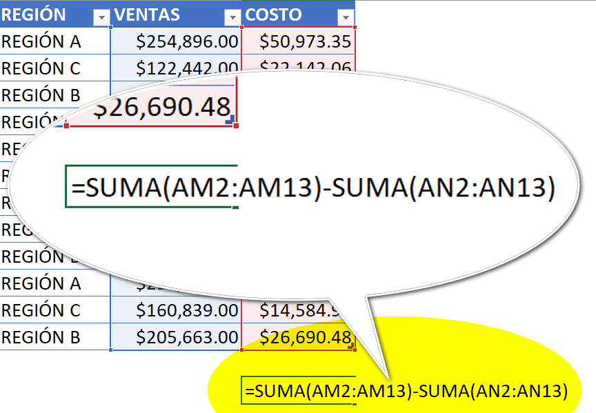
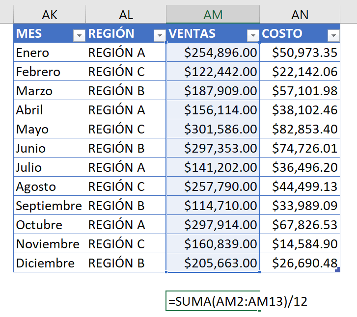

  
¿Sabías que la función SUMA en Excel es una de las herramientas más poderosas para automatizar procesos empresariales y mejorar la eficiencia y productividad de tu negocio?

En este artículo te explicaré qué es la función SUMA, por qué es importante para la automatización de procesos de negocio, cómo utilizarla en Excel para automatizar tareas y verás por ti mismo, o por ti misma, cuáles son los beneficios de hacerlo.

¡Sigue leyendo y descubre cómo esta función puede ayudarte a optimizar tu negocio!

## ¿Qué es la función SUMA en Excel?

Es una función matemática que suma valores.

Puede sumar valores individuales, referencias o rangos de celda o una combinación de las tres.

Por ejemplo:

\=SUMA (A2:A10) 

Suma los valores de las celdas dentro del rango A2:A10.

\=SUMA (A2:A10, C2:C10) 

Suma los valores del rango A2:A10, así como las celdas que están en el rango C2:C10.

La función SUMA es una de las funciones más básicas y sencillas de Excel, pero también una de las más versátiles y útiles para automatizar procesos empresariales.

## ¿Por qué la función SUMA es importante para la automatización de procesos de negocio?

La automatización de procesos de negocio consiste en utilizar herramientas tecnológicas para realizar tareas repetitivas, rutinarias o complejas de forma rápida, precisa y eficiente, sin necesidad de mayor intervención humana.

Esta técnica permite ahorrar tiempo, recursos y costos, mejorar la calidad de los resultados, reducir errores y riesgos, lo que lleva a un aumento de la satisfacción de los clientes y empleados, para finalmente potenciar el crecimiento y la competitividad del negocio.

Por esta razón la función SUMA en Excel es una herramienta clave para la automatización de procesos empresariales, ya que permite realizar cálculos matemáticos simples o complejos usándola en solitario o como parte de una fórmula más elaborada.

La función SUMA puede aplicarse a diferentes tipos de necesidades, como ventas, ingresos, gastos, inventarios, presupuestos, impuestos, comisiones, etc.

Además, como te mencioné anteriormente, también puede combinarse con otras funciones u operadores para obtener los resultados que deseas en escenarios más complejos.

## Cómo utilizar la función SUMA en Excel para automatizar procesos de negocio

  
Para utilizar esta función, solo tienes que seguir estos pasos:

Ingresa los datos numéricos que quieres sumar en las celdas correspondientes. Puedes ingresarlos manualmente o importarlos desde otras fuentes, según sea tu caso.

Selecciona la celda donde quieres que se muestre el resultado de la suma.

Escribe el signo igual (=) seguido de la palabra SUMA y abre un paréntesis.

Selecciona los valores que quieres sumar o ingresa sus referencias o rangos de celda separados por comas. Puedes seleccionar **hasta 255 valores diferentes**.

**Nota**: Cuando menciono el límite de 255 valores diferentes, me refiero a las celdas o rangos separados por una coma (o punto y coma). 

Si seleccionas un solo rango con 10,000 celdas, la función SUMA lo procesará sin problemas. 

Así mismo, puedes seleccionar 2, 3, 4 y hasta 255 rangos con cientos de celdas.

¡Imagínate todo lo que puedes sumar!

Cierra el paréntesis y presiona Enter.

Verás el resultado de la suma en la celda seleccionada.

## Ejemplos prácticos utilizando la función SUMA en Excel

  
Veamos algunos ejemplos prácticos de cómo puedes utilizar la función SUMA en Excel para automatizar procesos empresariales:

### Ejemplo 1

Para calcular el total de ventas mensuales de tu negocio, puedes sumar las unidades vendidas que tienes registradas en un rango de celdas.

Por ejemplo:

### Ejemplo 2

Para calcular el margen bruto de tu negocio, puedes restar el costo total de los bienes vendidos al total de ventas.

Para **restar** con la función SUMA solo tienes que poner un signo menos (-) delante del valor que quieres restar.

Por ejemplo, si quieres sumar el total de ventas y restarle la suma del total de costos, podrías hacer algo como esto:

### Ejemplo 3

Para calcular el promedio de ventas mensuales de tu negocio, puedes dividir el total de ventas anuales entre 12.

Para dividir con la función SUMA solo tienes que poner un signo entre (/) entre el valor resultante de la suma y el número 12 (o el número que quieres usar como divisor).

## ¿Qué aprendimos?

En este artículo aprendimos que la función SUMA en Excel es muy sencilla de usar y muy intuitiva.

Es una de las funciones más básicas y útiles que podemos utilizar para automatizar procesos empresariales y mejorar la eficiencia y productividad de nuestro negocio. Además de la función SUMA aprendimos que:

- Se puede sumar valores numéricos en rangos de dos o varias celdas.

- Se puede combinar con operadores matemáticos ( \*, +, /, ^) para resolver cálculos más avanzados.

- Puede ser utilizada en una gran parte de tus necesidades de automatización.

- NO puede usar más de 255 argumentos (celdas o rangos de celdas separados por una ',' o ';') pero tranquilidad. ¡Es más que suficiente!

La función SUMA en Excel nos permite ahorrar tiempo y evitar errores al realizar cálculos simples o complejos que involucren sumas. Además, nos facilita el análisis de datos y la toma de decisiones basadas en información precisa y actualizada.

## No te quedes ahí, ponte en marcha.

Si quieres aprender más sobre la función SUMA en Excel y otras funciones que te ayudarán a automatizar procesos empresariales, te recomiendo que leas el libro "Excel para negocios" de Juan Sebastián Celis Maya, donde encontrarás explicaciones detalladas y ejemplos prácticos de cómo utilizar Excel para optimizar tu negocio.

También te dejo enlaces a los siguientes sitios web, donde podrás encontrar más información y tutoriales sobre la función SUMA en Excel y otras funciones relacionadas:

- [https://www.aulaclic.es/excel-2016/t\_3\_1.htm](https://www.aulaclic.es/excel-2016/t_3_1.htm)

- [https://www.crehana.com/blog/negocios/funcion-suma-en-excel/](https://www.crehana.com/blog/negocios/funcion-suma-en-excel/)

- [https://support.microsoft.com/es-es/office/suma-funci%C3%B3n-suma-043e1c7d-7726-4e80-8f32-07b23e057f89](https://support.microsoft.com/es-es/office/suma-funci%C3%B3n-suma-043e1c7d-7726-4e80-8f32-07b23e057f89)

Espero que este artículo te haya sido útil y que te animes a aplicar la función SUMA para que empieces a automatizar tus procesos de negocio y mejorar la eficiencia y productividad en tu trabajo.

Si tienes alguna duda o comentario, déjame saber en la sección de abajo.

¡Nos vemos! 🐌
