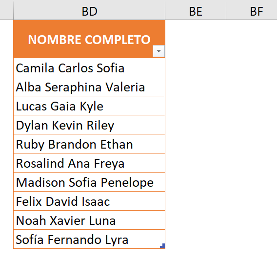
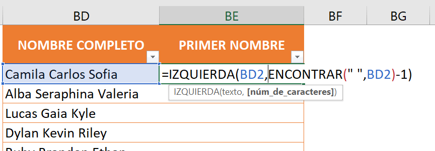
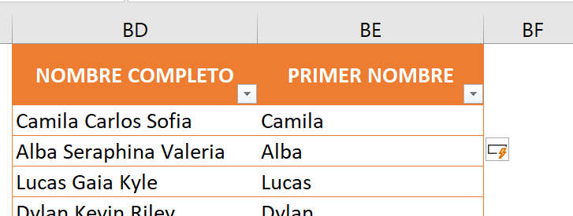
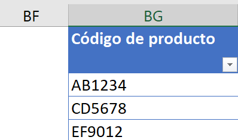
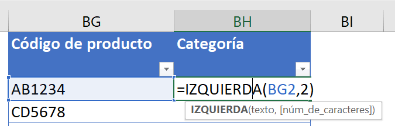
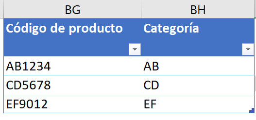

¿Quieres aprender a usar la función izquierda en Excel para [automatizar y optimizar tus procesos de negocio](https://raymundoycaza.com/automatizacion-productividad-con-excel/9614/)?

Entonces este artículo es para ti.

Te explicaré qué es la función izquierda, cómo utilizarla, y cómo puede ayudarte a ahorrar tiempo y reducir costos en tu negocio.

Además, te daré un par de consejos y trucos para sacarle el máximo provecho.

¡Sigue leyendo!

## ¿Qué es la función izquierda en Excel?

Es una función de texto que te permite extraer una cantidad determinada de caracteres desde el lado izquierdo de una cadena de texto.

Por ejemplo, si tienes una celda con el texto "Hola mundo", puedes usar la función izquierda para obtener solo los primeros cuatro caracteres, es decir, "Hola".

La función izquierda es muy útil cuando quieres separar o extraer información de un texto que tiene un formato o una estructura fija.

Por ejemplo, si tienes una lista de nombres completos y quieres obtener solo los nombres, puedes usar la función izquierda para extraer los caracteres que están antes del primer espacio.

## ¿Cómo utilizar la función izquierda en Excel?

Para utilizar la función izquierda en Excel, debes seguir la siguiente sintaxis y argumentos:

\=IZQUIERDA(texto,núm\_de\_caracteres)

Donde:

- Texto: Es el texto del que quieres extraer los caracteres desde el lado izquierdo. Puede ser una celda que contenga texto o una cadena de texto entre comillas.

- Núm\_de\_caracteres: Es el número de caracteres que quieres extraer desde el lado izquierdo del texto. Debe ser un número entero **positivo**.

Entonces, para el ejemplo que te había dado anteriormente, en el que queríamos extraer los primeros 4 carateres de la cadena de texto "Hola mundo", podríamos realizarlo de la siguiente forma:

\=IZQUIERDA("Hola mundo", 4)

Esto nos daría como resultado "Hola", ya que esta palabra está formada por los 4 caracteres de la izquierda del texto.

## Ejemplos prácticos

Ahora que ya tenemos una idea de cómo funciona, te mostaré un par de ejemplos prácticos de cómo utilizar la función izquierda en Excel.

### Ejemplo 1: Extraer el primer nombre de cada persona en un listado

Supongamos que tenemos una hoja de cálculo con los siguientes datos:

En este caso, queremos extraer **los nombres** de las personas que están en la columna BD y ponerlos en la columna BE.

Para ello, usamos la función izquierda combinada con la función encontrar, que en este caso nos servirá para determinar la posición del primer espacio en el texto.

Así, le decimos a Excel que nos devuelva los caracteres que están desde el inicio del texto hasta el espacio menos uno. El resultado sería:

### Ejemplo 2: Extraer las letras de un código de letras y números

Imaginemos que tenemos la siguiente tabla:

En este caso, tenemos una lista de códigos de producto que tienen un formato fijo: dos letras seguidas de cuatro números.

Queremos extraer las dos primeras letras que indican la categoría del producto y ponerlas en la columna BH.

Para ello, usamos la función izquierda con el argumento núm\_de\_caracteres igual a 2.

El resultado que obtendremos, es el siguiente:

## ¿Cómo la función izquierda en Excel puede ayudar a automatizar tus procesos empresariales?

Esta función puede ayudarte a automatizar y mejorar la eficiencia de tus procesos empresariales al permitirte extraer información relevante de un conjunto de datos. Por ejemplo, puedes usarla para:

- Separar nombres y apellidos de una lista de clientes o empleados.

- Extraer códigos postales, prefijos telefónicos o números de identificación de una base de datos.

- Obtener las iniciales o las siglas de un nombre o una organización.

- Filtrar o clasificar datos según un criterio con base en sus primeros caracteres.

Y tantas aplicaciones como tu imaginación lo permita.

Como ves, la función IZQUIERDA es muy útil para ciertas tareas que te podrían tomar varias horas, si las haces manualmente.

Y cuando implementas un argumento de longitud variable, se vuelve más interesante.

## ¿Qué aprendimos hoy?

- La función izquierda en Excel es una función de texto que permite extraer una cantidad determinada de caracteres desde el lado izquierdo de una cadena de texto.

- Para utilizar la función izquierda en Excel, se debe seguir la siguiente sintaxis y argumentos: =IZQUIERDA(texto,núm\_de\_caracteres).

- La función izquierda es muy útil para separar o extraer información de un texto que tiene un formato o una estructura fija.

- Algunos ejemplos prácticos de cómo utilizar la función izquierda incluyen extraer el primer nombre de cada persona en un listado o extraer las letras de un código de letras y números.

- La función izquierda en Excel puede ayudar a automatizar y mejorar la eficiencia de procesos empresariales al permitir extraer información relevante de un conjunto de datos y filtrar o clasificar datos según un criterio con base en sus primeros caracteres.

## Pasa a la acción

No te quedes con la teoría, pasa directamente a la acción y aprende más sobre [cómo puedes automatizar tus procesos de negocio con Excel](https://raymundoycaza.com/automatizacion-productividad-con-excel/9614/). Notarás la diferencia.

¡Nos vemos!

🐌
