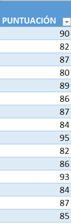
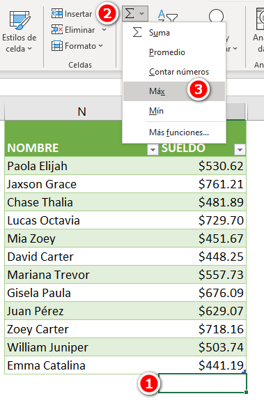
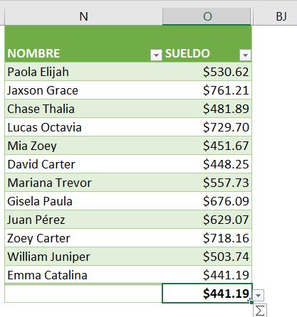
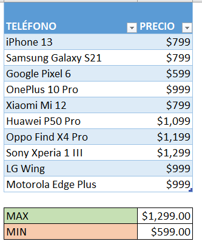
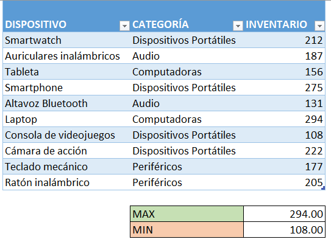
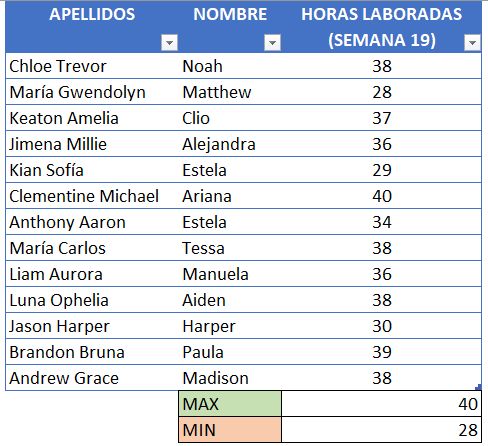

Durante la elaboración de tus reportes de [Excel](https://raymundoycaza.com/automatizacion-productividad-con-excel/9614/) es muy común que necesites encontrar valores máximos y mínimos para destacar máximos o mínimos relativos en un conjunto de datos. 

Microsoft Excel cuenta con dos funciones cuyo propósito es precisamente sí encontrar el máximo y el mínimo en un grupo de datos determinado. 

En este artículo voy a mostrarte cómo se utilizan estas dos funciones y cómo puedes aprovecharlas para automatizar estos dos cálculos en tu hoja de trabajo. Además, si los combinas con otras funciones de Excel podrás multiplicar por 10 el poder de tus planillas de Excel para llevar tu eficiencia al siguiente nivel. 

## ¿Qué es la función MAX y MIN en Excel?

Como ya te habrás dado cuenta La función MAX, hace referencia a "máximo" lo que naturalmente significa que esta función tiene como propósito encontrar el valor más grande dentro de un conjunto de números o un rango de celdas.

Por otra parte, la función MIN hace referencia a mínimo y significa que esta función tiene como propósito encontrar el valor más pequeño dentro de un conjunto de números o rango de celdas.

## Cómo utilizar la función MAX.

Empecemos por la opción "a golpe de clic". Para usar la función MAX al final de un conjunto de números colócate en la celda donde quieres que aparezca el valor máximo (1) y dirígete a la ficha inicio en el apartado edición y haz clic en el botón de autosuma (2) se mostrarán varias opciones y solo debes elegir la opción "Max" (3).

Automáticamente Excel insertará la función MAX tomando como rango el conjunto de celdas que tiene números arriba (o a la izquierda) de la celda seleccionada.

Si en cambio quieres utilizar la función MAX de la manera convencional simplemente escribe:

\=MAX(

Y selecciona el rango de celdas dónde está el conjunto de números del que deseas averiguar su valor máximo.

\=MAX(O2:O13)

Finalmente cierra paréntesis y presiona "entrar". Verás cómo Excel te muestra automáticamente el valor máximo dentro de ese conjunto de datos, al igual que si lo hubieras hecho con el botón de autosuma.

## Cómo utilizar la función MIN.

De la misma forma, podemos utilizar la función MIN a través del botón de autosuma o utilizando la manera convencional escribiendo:

\=MIN(

Y seleccionas el rango del que deseas averiguar el valor mínimo.

\=MIN(O2:O13)

Al cerrar paréntesis y presionar "entrar ", Excel te mostrará el valor mínimo dentro del rango que le has indicado.

Cómo ves, utilizar la función MAX y MIN en Excel es muy sencillo e intuitivo ya que no requieren más que un solo argumento, esto es, el rango de datos con el que se desea trabajar.

Ahora, para asegurarnos de que tenemos claro cómo utilizar estas funciones y cuáles son sus posibles ventajas te mostraré un par de ejemplos prácticos de cómo se usan estas funciones.

## Ejemplos prácticos de uso de las funciones MAX y MIN en tus procesos de negocio.

Estos son solo algunos ejemplos prácticos y simples de cómo puedes utilizar las funciones MAX y MIN en tus procesos de negocio, para automatizar ciertas tareas y mejorar tu eficiencia y productividad.

Recuerda que estas son solo algunas de las formas en las que se puede sacarles provecho a estas funciones y tú debes asegurarte de adaptarlas a tus necesidades, para poder obtener los mejores resultados.

### Análisis de ventas

Si eres dueño de un negocio y quieres conocer cuál es el producto que más se vende en tu tienda, puedes utilizar la función MAX para encontrar el valor máximo de las ventas. De igual manera, puedes utilizar la función MIN para encontrar el producto que menos se vende.

### Control de inventario

Si quieres conocer cuántos productos tienes en inventario, puedes utilizar la función MAX para encontrar la cantidad máxima de productos en inventario. También puedes utilizar la función MIN para encontrar la cantidad mínima de productos en inventario.

### Gestión de personal

Si estás a cargo de la planificación de personal en tu empresa, puedes utilizar la función MAX para determinar el número de horas laboradas entre los colaboradores, para planear cómo cubrir los turnos de trabajo. De igual manera, puedes utilizar la función MIN para determinar el número mínimo de horas laboradas.

### Evaluación de datos

Si tienes una hoja de cálculo con datos de ventas de diferentes años y quieres encontrar las ventas más altas y las más bajas, puedes utilizar la función MAX y MIN respectivamente.

## Consejos y recomendaciones para optimizar el uso de la función MAX y MIN en Excel.

Para terminar, te dejo algunos consejos a tener en cuenta cuando trabajes con estas funciones en tus planillas de cálculo:

1. Asegúrate de que los argumentos de la función estén correctamente escritos y ubicados en el rango correcto. MAX y MIN pueden tomar hasta 255 argumentos, por lo que es importante verificar que estén en orden y escritos de forma correcta.

3. Utiliza estas funciones junto con otras funciones de Excel para hacer cálculos más avanzados. Por ejemplo, puedes usar la función MAX o MIN para encontrar el valor máximo o mínimo de un conjunto de datos, y luego combinarlo con la función SI para realizar un cálculo condicional.

5. Utiliza las herramientas de formato condicional de Excel para resaltar automáticamente los valores máximos y mínimos en una hoja de cálculo. Puedes utilizar el formato condicional para resaltar los valores de mayor o menor valor en un rango de celdas específico.

7. Si estás trabajando con grandes conjuntos de datos, considera utilizar las funciones MAX.SI.CONJUNTO y MIN.SI.CONJUNTO. Estas funciones te permiten encontrar el valor máximo o mínimo de un rango de datos en función de múltiples criterios de selección.

9. Si estás trabajando con fechas en Excel, utiliza las funciones MAX y MIN para encontrar la fecha más reciente o antigua. Puedes combinar estas funciones con la función HOY para realizar cálculos en función de la fecha actual.

11. Si necesitas encontrar tanto el valor máximo como el mínimo, puedes utilizar ambas funciones en una sola fórmula.

13. Asegúrate de que los valores estén formateados correctamente como números. Si los valores no están formateados correctamente, Excel podría no reconocerlos como números y los tratará como texto.

## ¿Qué aprendimos hoy?

Hoy aprendimos cómo utilizar la función MAX y MIN en Excel para encontrar el valor máximo y mínimo de un conjunto de datos determinado. Aprendimos que la función MAX busca el valor más grande dentro de un conjunto de números o rango de celdas, mientras que la función MIN busca el valor más pequeño.

También aprendimos cómo utilizar estas funciones en Excel, tanto a través del botón de autosuma como de la manera convencional. Aprendimos que estas funciones requieren un solo argumento, que es el rango de datos con el que se desea trabajar.

Además, aprendimos algunos ejemplos prácticos de cómo se pueden utilizar estas funciones en los procesos de negocio, como en el análisis de ventas, control de inventario, gestión de personal, evaluación de datos y seguimiento de progreso.

Por último, vimos algunos consejos y recomendaciones para optimizar el uso de MAX y MIN en Excel, como verificar que los argumentos estén correctamente escritos y utilizar estas funciones junto con otras funciones de Excel para hacer cálculos más avanzados.

### Referencias adicionales sobre la función MAX y MIN en Excel (enlaces externos)

Si quieres leer más sobre estas dos funciones (o si deseas otros puntos de vista), entonces aquí te dejo un par de enlaces para que sigas leyendo:

- [Funciones Mín y Máx (Min, Max) - Microsoft](https://support.microsoft.com/es-es/office/funciones-m%C3%ADn-y-m%C3%A1x-min-max-6636b171-56b9-434d-adfd-e1b2a5317b58)

- [MÍN y MÁX - Custom Guide](https://www.customguide.com/es/excel/min-y-max)

## No te olvides de pasar a la acción.

Mi parte está hecha y, como siempre te digo, el resto depende de ti.

No te quedes ahí, pon en práctica lo aprendido y permite que las ideas vengan a tu mente a través de la implementación de cada una de estas pequeñas lecciones. Pronto notarás la diferencia.

¡Nos vemos! 🐌
