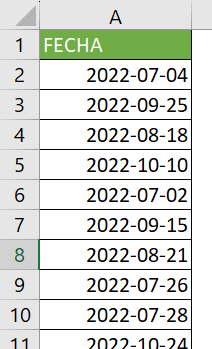
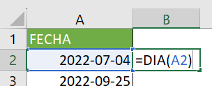
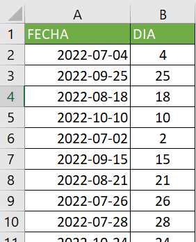
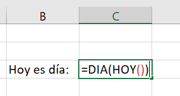
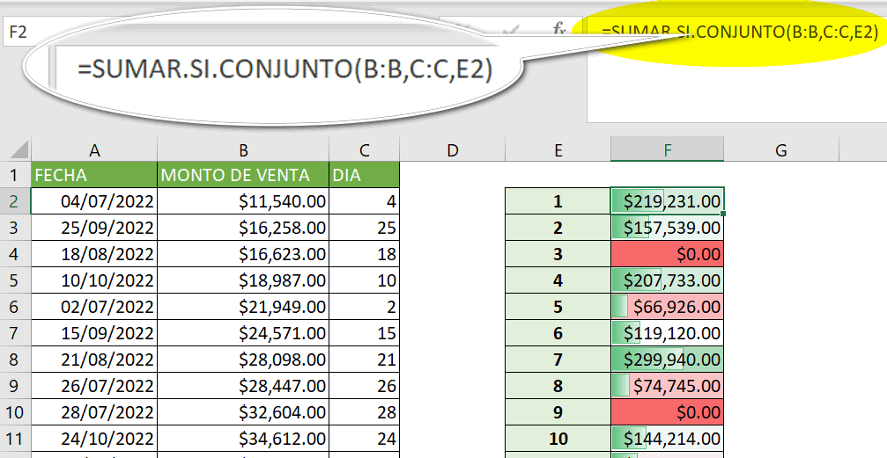
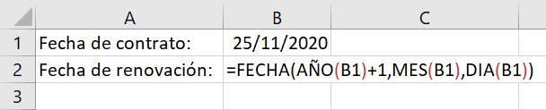
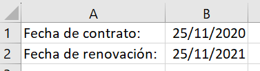

Seguramente has pensado que es muy sencillo saber el día de una fecha solo con observarla, pero ¿qué sucede cuando tienes decenas, o cientos, o miles de fechas que analizar?

La función día viene al rescate en estos casos, permitiéndote automatizar la extracción del día a partir de una fecha dada.

Sigue leyendo porque en este artículo voy a explicarte qué es la función día, cómo se usa y te mostraré un par de ejemplos de cómo se implementa en la vida real.

## ¿Qué es La función día en Excel?

La función DIA pertenece al grupo de funciones de fecha y hora y sirve para obtener el número de día a partir de una fecha dada, el mismo que será un número entero entre 1 y 31 (obviamente, este rango corresponde a los números de días que puede tener un mes)

## Cómo utilizar la función día.

La función DIA es una de esas funciones muy sencillas de utilizar, porque solo requiere un argumento que será la fecha o la celda en la que se encuentre la fecha que deseas analizar.

Para utilizarla solo debes escribir:

\=DIA(

Y a continuación escribes la referencia a la celda donde se encuentra la fecha que deseas analizar o simplemente seleccionas con el ratón la celda deseada.

\=DIA(A1)

Sierras paréntesis y presionas la tecla “entrar”. Si no has cometido ningún error Excel te mostrará automáticamente el número del día al que corresponde la fecha dada.

Sencillo, ¿cierto?

Ahora veamos un par de ejemplos de uso de la función día en Excel para que veas cómo se implementa en un caso de la vida diaria.

## Ejemplos de uso de la función día en Excel.

Como siempre, te recuerdo que estos ejemplos son casos simples y genéricos que sirven de referencia para explicarte de mejor manera cómo se puede usar esta función. De ti depende adaptarlo a tus necesidades específicas para sacarle todo el provecho posible.

### Obtener el día a partir de cada una de las fechas en un rango

Imaginemos que tenemos una lista de fechas en la columna A, desde la celda A2 en adelante.

Si queremos obtener una lista de los días correspondientes a cada fecha, podemos usar la función DÍA en una celda adyacente, por ejemplo, en la columna B. Podemos ingresar la siguiente fórmula en la celda B2:

\=DIA(A2)

Y luego copiar la fórmula hacia abajo, para ver cómo Excel extrae el día a cada una de las fechas.

### Extraer el día de la fecha actual

Si queremos extraer el día de la fecha actual, automáticamente en una celda, podemos usar la función DÍA junto con la función HOY.

La función HOY devuelve la fecha actual del sistema, y la función DÍA extrae el día de esta fecha.

Podemos ingresar la siguiente fórmula en una celda:

\=DIA(HOY())

### Seguimiento de ventas

Puedes utilizar la función DÍA para analizar los datos de ventas y determinar cuáles son los días del mes que generan más ventas.

Para ello, debes utilizar la función DÍA junto con otras funciones como SUMAR.SI.CONJUNTO.

### Seguimiento de fechas de vencimiento

Puedes utilizar la función DÍA junto con las funciones AÑO, MES y FECHA para hacer seguimiento a las fechas de vencimiento de los contratos o deudas.

Por ejemplo, puedes crear una hoja de cálculo donde ingreses las fechas de vencimiento de los pagos de tus clientes, a partir de la fecha de contratación del servicio.

La idea es obtener exactamente la fecha de inicio del contrato solo que, en el siguiente año, en lugar de simplemente agregarle 365 días.

Para lograrlo, solo debes descomponer la fecha actual con las funciones AÑO, MES y DIA, para reconstruirla después con la función FECHA.

\=FECHA(AÑO(B1)+1,MES(B1),DIA(B1))

Nota cómo al año le sumamos 1, para que la fecha que reconstruya la fórmula sea del próximo año.

Y el resultado sería una fecha del próximo año, exactamente en la misma fecha en la que se inició el contrato.

## Consejos y trucos para aprovechar al máximo la función día.

En esta sección te dejo unos cuántos trucos y consejos para que puedas aprovechar al máximo la función día en Excel y realices tus cálculos con fechas de manera más eficiente.

1. Utiliza referencias a celdas: en lugar de escribir manualmente la fecha en la fórmula de la función DIA, es recomendable que utilices referencias a celdas. Esto hace que sea más fácil de actualizar o modificar la fecha, en caso de que sea necesario.

- Usa la función FECHA: si tienes la fecha dividida en tres celdas diferentes (día, mes, año), puedes combinarlos utilizando la función FECHA.

- Utiliza la función DIA en conjunto con otras funciones: la función DIA puede ser utilizada en conjunto con otras funciones de Excel, como SUMA y PROMEDIO, para realizar cálculos más complejos.

## ¿Qué aprendimos hoy?

Hoy aprendimos sobre la función DÍA en Excel, la cual pertenece al grupo de funciones de fecha y hora y sirve para obtener el número de día a partir de una fecha dada. Esta función puede ser muy útil para automatizar la extracción del día de una gran cantidad de fechas.

Aprendimos que, para utilizar esta función en Excel, sólo se requiere un argumento que será la fecha o la celda en la que se encuentre la fecha que se desea analizar. Además, vimos algunos ejemplos de cómo se puede utilizar la función DÍA en la vida real, como analizar los datos de ventas o hacer un seguimiento de las fechas de vencimiento.

También se compartieron algunos consejos y trucos para aprovechar al máximo la función DÍA en Excel, como utilizar referencias a celdas, reconstruir la fecha utilizando la función FECHA y utilizar las funciones AÑO, MES y DIA para descomponer una fecha específica.

Si quieres seguir leyendo sobre la función DIA en Excel, aquí te dejo un par de enlaces:

- [https://support.microsoft.com/es-es/office/dia-funci%C3%B3n-dia-8a7d1cbb-6c7d-4ba1-8aea-25c134d03101](https://support.microsoft.com/es-es/office/dia-funci%C3%B3n-dia-8a7d1cbb-6c7d-4ba1-8aea-25c134d03101)

- [https://exceltotal.com/la-funcion-dia-en-excel/](https://exceltotal.com/la-funcion-dia-en-excel/)

## Pasa a la acción.

Como siempre te digo no te quedes ahí, pon en práctica lo que has aprendido hoy y Ponte desafíos más complejos. Trata de aplicar lo que has aprendido en este artículo en la solución de cada problema que puedas y verás como el conocimiento se va afianzando cada vez más.

Convierte Excel en él solucionador de problemas que tu empresa necesita y déjale las tareas más repetitivas a él, permitiéndote a ti concentrarte en las tareas que aportan mayor valor.

Notarás la diferencia.

¡Nos vemos! 🐌
