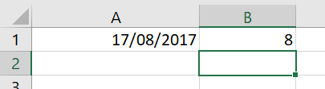
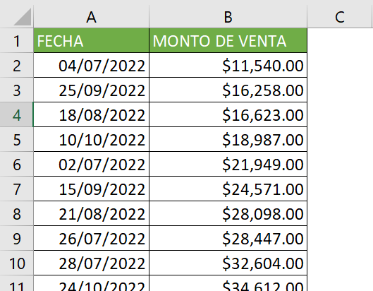
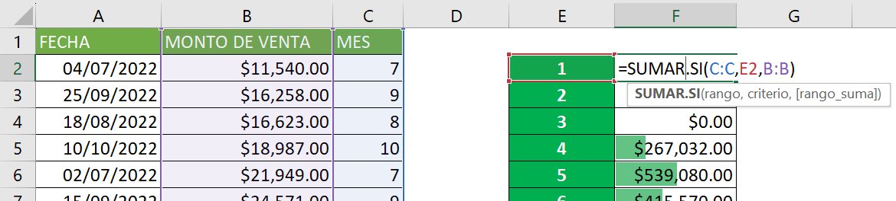
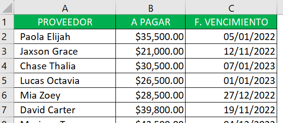
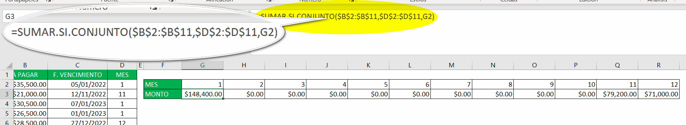

La función mes en Excel pertenece al grupo de funciones de fecha y hora y, al igual que la función día, permite extraer fácilmente parte de una fecha, en este caso, permite extraer el mes.

Si estabas buscando una manera de determinar el mes a partir de una fecha, entonces la función MES, es lo que necesitas.

## Cómo utilizar la función MES en Excel

Como te estaba contando, la función mes en Excel nos permite obtener el número de mes de una fecha dada.

Cuando usemos esta función nos devolverá un número entero que siempre estará entre 1 y 12, lo que es obvio ya que representa a uno de los 12 meses del año.

Te decía que esta función es igual de sencilla de usar que la función día en Excel, ya que solo recibe un argumento, el cual es la referencia a la celda donde se encuentra la fecha de la que queremos extraer el mes.

Así, para utilizar la función mes, solo debemos escribir lo siguiente:

\=MES(

A continuación, escribimos la referencia a la celda donde se encuentra la fecha que deseamos analizar.

Por ejemplo, A1.

\=MES(A1)

Cuando cerramos paréntesis y presionamos la tecla entrar, Excel devolverá el número del mes correspondiente a la fecha dada. En este caso devuelve 8, ya que la fecha es 17 de agosto de 2017.

Ahora veamos un par de ejemplos en los que se puede utilizar la función mes en nuestro día a día laboral:

## Ejemplos de uso de la función MES en Excel

### Calcular ventas mensuales

Supongamos que tenemos una hoja de cálculo donde registramos las ventas diarias de una tienda.

Queremos saber cuánto se vendió en cada mes para poder analizar la evolución de las ventas.

Para hacer esto, podemos utilizar la función MES para extraer el número de mes de la fecha de venta y luego utilizar la función SUMAR.SI para sumar las ventas correspondientes a cada mes.

Clic para agrandar la imagen

### Planificación de pagos mensuales

Imaginemos que estamos planificando el presupuesto mensual de una empresa y necesitamos conocer el monto de los pagos a proveedores que se deben hacer cada mes.

En este caso, podemos utilizar la función MES para extraer el número de mes de la fecha de vencimiento de las facturas y luego utilizar la función SUMAR.SI.CONJUNTO para sumar los montos correspondientes a cada mes.

Clic para agrandar la imagen

De esta manera, podemos tener una visión clara de los pagos que debemos hacer en cada mes y planificar el presupuesto del negocio de manera más eficiente.

## ¿Qué aprendimos hoy?

Aprendimos que la función MES en Excel es una herramienta muy útil para extraer el número de mes de una fecha y facilitar la manipulación de datos en hojas de cálculo.

Esta función es similar en su uso a la función DÍA y sólo requiere la referencia de la celda que contiene la fecha que deseamos analizar. La función nos devuelve un número entero que representa el mes y siempre estará entre 1 y 12.

Además, se presentaron dos ejemplos de uso en el ámbito laboral: el cálculo de ventas mensuales y la planificación de pagos mensuales.

Ambos ejemplos ilustran cómo la función MES puede ser utilizada en conjunto con otras funciones de Excel, como SUMAR.SI y SUMAR.SI.CONJUNTO, para simplificar la manipulación de grandes cantidades de datos y facilitar la toma de decisiones.

Como has podido ver, la función MES en Excel es una herramienta muy útil que permite trabajar de manera más eficiente y organizada con datos que contienen fechas, ya que facilita su clasificación y análisis.

## Pasa a la acción

Ya sabes lo que sigue, tienes que pasar a la acción. Haciendo se aprende más que solo viendo.

Pon en práctica este pequeño fragmento de conocimiento, utilizándolo en tus tareas cotidianas y verás cómo, poco a poco, tus procesos se Irán haciendo cada vez más ágiles y precisos.

¡Nos vemos!

🐌
