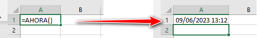

Como ya sabes, en este blog le damos especial importancia a la automatización de los procesos de negocio. Es por esa razón que cualquier ventaja que podamos aprovechar para eliminar eficientemente actividades mecánicas y sin valor inmediatamente entran en nuestro radar.

La función AHORA es una de esas ventajas que coma con una pequeña aportación, puede realmente ayudarnos con un ahorro importante de tiempo si sabemos sacarle provecho.

## ¿Qué es la función AHORA en Excel?

La función AHORA es una de las funciones de fecha y hora de Excel y coma como su nombre lo indica, sirve para obtener la fecha y la hora actuales.

Es importante que tengas claro que esta función se actualiza cada vez que abres tu archivo de Excel.

## ¿Como se utiliza la función AHORA?

Esta función es de uso muy sencillo debido a que no requiere argumentos solo debes escribir AHORA seguido de los paréntesis «()».

\=AHORA()

Esto te devolverá la fecha con la obra actuales, es decir, la fecha y hora que Excel calculó al momento de ejecutarse la función.

Por favor ten en cuenta que esta función no actualiza automáticamente, segundo a segundo, la hora que muestra en pantalla. La única forma de actualizar la hora utilizando esta función es forzando la actualización, ya sea abriendo el libro, presionando la tecla F9 o actualizando alguno de los valores en las celdas de la hoja.

## Ejemplos de uso.

Puedes utilizar la función ahora para tener la fecha y hora a la vista con un formato que incluya colores, fuentes y tamaño completamente personalizados, cada vez que abras tu archivo de Excel.

También puedes utilizar la función ahora para mostrar alertas en tu agenda realizada en Excel. Por ejemplo con esta sencilla fórmula podrías mostrar una alerta que te indica que una reunión está cerca de iniciar, a partir de la fecha y hora en la que lo agenda este y la fecha y hora actuales (que, por supuesto, podrás calcular utilizando la función ahora). En este ejemplo asumiremos que la fecha ahora agendada se encuentran en la celda A1:

\=SI(A1-AHORA() <(1/24),"Reunión en menos de una hora", "")

También podrías hacer uso de la función ahora para mostrar la fecha y hora en la que una captura de pantalla o incluso una impresión fue realizada.

Y la utilidad de la función ahora aún no se termina. Podrías utilizarla para mostrar únicamente la fecha actual, la hora actual, calcular el número de días hasta una fecha determinada mostrar únicamente la hora o el minuto o el segundo actual y hasta podrías aprovecharte de esta herramienta para generar tus propios códigos generados a partir de la fecha y hora actuales junto con otros parámetros.

##  ¿Como puedo evitar que la función ahora se actualiza automáticamente?

Como te había dicho el propósito de la función ahora es, precisamente, mantenerte al tanto de la fecha y hora actualizados coma por lo que no existe una forma cómoda de hacer que sea estática.

 Podríamos usar un par de trucos para tratar de lograr esto, pero para mantenerlo sencillo te aconsejo que simplemente copies la celda y pegues por valor. De esta manera conseguirás que la fecha y hora se queden como un texto estático y no cambien nunca más de manera automática.

Otra forma en la que podrías conseguir la fecha actual de manera estática sin hacer uso de la función ahora, sería utilizando el atajo de teclado control más coma «Ctrl ,» para obtener la fecha actual.

Y si deseas incluir la hora actual, puedes agregar el atajo de teclado control más dos puntos «Ctrl :».

## ¿Qué aprendimos hoy?

Para recapitular, hoy aprendimos que la función ahora en Excel nos permite obtener la fecha y la hora actuales Y que su uso es tan sencillo como escribir “=AHORA()” en cualquier celda. Además, aprendimos que:

- Se actualiza cada vez que abrimos el archivo de Excel.

- Esta función no se actualiza automáticamente segundo a segundo en la pantalla, sino que para actualizar la hora es necesario que se abra el libro, que se presione la tecla F9 o que se actualicen los valores de las celdas en la hoja.

- También vimos que esta función tiene diversas aplicaciones prácticas: mostrar la fecha y hora en formatos personalizados, generar alertas basadas en fechas y horas programadas, generar códigos personalizados, registrar la fecha y hora de capturas de pantalla o impresiones, entre otros posibles usos.

- Si deseamos mantener la función ahora como un valor estático, podemos copiar la celda y pegarla como valor para evitar cambios automáticos.

- Finalmente, aprendimos que podemos obtener la fecha actual estática directamente, sin utilizar esta función, a partir del atajo de teclado "Ctrl + ," y, si deseamos incluir la hora actual, podemos utilizar "Ctrl + :".

## Pasa a la acción

Como has visto, la función ahora puede ser tremendamente útil si sabemos sacarle provecho. No te quedes con esta pequeña pieza de conocimiento, recuerda que las grandes soluciones están hechas de pequeñas ideas simples, aprende a sacarle provecho a la [automatización con Excel](https://raymundoycaza.com/automatizacion-productividad-con-excel/9614/). Así que agrega esta función a tu caja de herramientas y ponla en práctica ahora mismo, verás que una vez que aprendas a combinarla con otras funciones podrá generar fórmulas interesantes que solucionen problemas cotidianos en tu día a día laboral.

¡Nos vemos! 🐌
