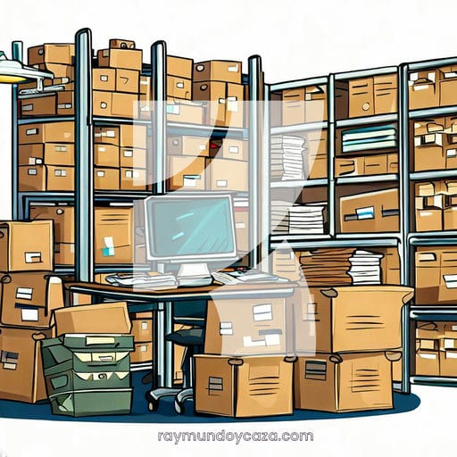

¿Te encuentras realizando las mismas **tareas** una y otra vez en tu **hoja de cálculo**?

¿Deseas **ahorrar tiempo** y esfuerzo en actividades tediosas y **repetitivas**?

La **automatización de tareas** mediante **macros en Excel** es la solución que estás buscando.

Déjame mostrarte cómo pueden transformar tu día a día laboral con estos **ejemplos de macros en Excel**.

## Qué son las macros en Excel

Son secuencias de instrucciones que **automatizan tareas repetitivas**, como ingresar datos, generar informes o formatear hojas de cálculo.

ActiveCell.Value = "Aprobado"

Escribe en la celda activa el texto “Aprobado”.

Imagina todo el tiempo que podrías ahorrar al eliminar esas tareas tediosas y concentrarte en lo que realmente importa.

## Cuáles son los beneficios de utilizar macros en las PYMEs

Las pequeñas y medianas empresas se pueden beneficiar de las macros en varias formas. Te permiten **reducir errores**, ahorrar tiempo, aumentar la precisión de los datos y **mejorar la calidad de tus informes**.

¡Imagina cómo eso podría impulsar el crecimiento de tu negocio!

## Ejemplos de macros en Excel en la práctica

Ya que esta es una introducción básica al mundo de las macros, te dejaré ejemplos muy simplificados con el objetivo de que sean más sencillos de comprender para principiantes.

Veamos algunos ejemplos que seguro que te suenan familiar:

### ¿Te has encontrado copiando y pegando datos una y otra vez?

Con una macro, puedes **automatizar ese proceso** y hacerlo con un solo clic.

Sub CopiarDatos()
    Dim ws As Worksheet
    
    ' Establecer la hoja de trabajo
    Set ws = ThisWorkbook.Sheets("Nombre de la Hoja")
    
    ' Copiar los datos del rango A2:C2 al rango H2:J2
    ws.Range("A2:C2").Copy Destination:=ws.Range("H2:J2")
End Sub

### ¿Necesitas generar informes diarios?

Una macro puede **extraer los datos** relevantes y **crear el informe** en segundos.

### ¿Quieres **crear gráficos dinámicos** que se actualicen automáticamente?

Con una macro, puedes definir el **rango de datos**, el tipo de **gráfico** y el formato que prefieras, también puedes actualizar las tablas dinámicas de esos reportes.

Sub ActualizarTablasDinamicas()
    Dim ws As Worksheet
    Dim pt1 As PivotTable
    Dim pt2 As PivotTable
    
    ' Establecer la hoja de trabajo
    Set ws = ThisWorkbook.Sheets("Nombre de la Hoja")
    
    ' Establecer las tablas dinámicas
    Set pt1 = ws.PivotTables("TablaDinamica1")
    Set pt2 = ws.PivotTables("TablaDinamica2")
    
    ' Actualizar las tablas dinámicas
    pt1.RefreshTable
    pt2.RefreshTable
End Sub

Luego, solo tienes que ejecutar la macro cada vez que quieras actualizar el gráfico.

¡Así de fácil y rápido!

Estos son solo tres ejemplos de macros en Excel, ¡las posibilidades son infinitas!

## Cómo crear y ejecutar macros en Excel

Ahora, ¿cómo puedes **crear tus propias macros**?

Excel lo hace fácil.

Solo necesitas **grabar una serie de pasos** y asignarles un botón o una **combinación de teclas**.

Mira [cómo grabar una macro en Excel](https://raymundoycaza.com/como-grabar-macros/3759/), paso a paso.

Luego, con un simple clic, podrás ejecutar la macro y dejar que haga el trabajo por ti.

¡Es así de sencillo!

## Consejos para aprovechar al máximo las macros

Si recién te inicias en el mundo de las macros, estos son mis **consejos** para que le saques el máximo provecho:

Primero, **identifica las tareas que más te consumen tiempo y energía**.

Luego, crea macros específicas para **automatizar esas tareas**.

Recuerda también mantener tus macros organizadas y documentadas para facilitar su **mantenimiento**.

## Situaciones en las que las macros en Excel son muy útiles

### Ejemplo 1: Automatización de informes financieros

Imagínate pasar horas cada mes consolidando datos y formateando informes financieros para tu negocio.

¡Pero espera!

Con una **macro en Excel**, puedes automatizar este proceso y ahorrar un tiempo valioso.

En este ejemplo, utilizaremos una macro para **automatizar la generación de informes financieros** mensuales.

Primero, grabaremos una macro que realiza las siguientes tareas:

1. Extrae los datos financieros de las diferentes hojas de cálculo.

3. Calcula automáticamente los totales y los porcentajes.

5. Formatea los números y las tablas para que sean más fáciles de leer.

7. Crea gráficos y visualizaciones para una mejor presentación de los datos.

Una vez grabada la macro, podemos asignarle un botón en la barra de herramientas para que se ejecute con un solo clic.

Ahora, cada vez que necesitemos **generar un informe financiero**, simplemente hacemos clic en el botón y la macro se encarga de todo el trabajo pesado.

Con esta automatización, ya no tienes que preocuparte por los errores manuales ni por la tediosa tarea de formatear los informes.

Además, la macro garantiza la consistencia y precisión de los datos, lo que es crucial para la toma de decisiones financieras.

### Ejemplo 2: Gestión automatizada de inventario

Si te encuentras lidiando con el constante **seguimiento y actualización de tu inventario**, una macro en Excel puede ser la solución ideal para simplificar y agilizar este proceso.

Imagina tener que ingresar manualmente cada artículo, actualizar las cantidades disponibles, calcular los costos y **generar informes periódicos**.

Con una macro, todo esto puede ser automatizado para que puedas enfocarte en **hacer crecer tu negocio**.

En este ejemplo, crearemos una macro que automatiza la gestión de inventario. Con solo unos pocos clics, la macro realizará lo siguiente:

1. Importará automáticamente los datos de tu inventario desde una hoja de cálculo o una base de datos externa.

3. Actualizará las cantidades disponibles y los precios de forma automática, eliminando la necesidad de ingresar los datos manualmente.

5. Generará alertas cuando los niveles de inventario sean bajos, lo que te permitirá realizar pedidos de reposición de manera oportuna.

7. Creará informes actualizados con estadísticas sobre las ventas, los artículos más vendidos y los productos de bajo rendimiento.

Con esta automatización, podrás llevar un seguimiento preciso y eficiente de tu inventario, evitando errores y optimizando tus procesos. Además, al recibir alertas y contar con informes actualizados, podrás tomar decisiones más informadas y estratégicas para tu negocio.

La gestión automatizada de inventario mediante una macro en Excel te brinda la tranquilidad de tener un control completo sobre tus existencias y te permite enfocarte en otras áreas clave de tu negocio.

¡No pierdas más tiempo en tareas manuales y libera todo el potencial de tu negocio con la automatización de Excel!

### Ejemplo 3: Automatización de tareas repetitivas

En este ejemplo, exploraremos cómo puedes utilizar una macro para automatizar esas tareas que consumen tu tiempo y energía.

Imagina que cada mañana debes copiar y pegar datos de diferentes hojas de Excel, aplicar formatos, calcular fórmulas y generar informes.

Con una macro, podrás reducir drásticamente el tiempo empleado y evitar posibles errores humanos.

Supongamos que tienes una hoja de cálculo con datos de ventas mensuales y deseas generar automáticamente un resumen mensual con los totales de ventas, promedios y gráficos. Aquí es donde entra en juego la macro.

Al crear una macro, podrás:

1. Seleccionar automáticamente los datos relevantes de cada mes y copiarlos a una hoja de resumen.

3. Calcular los totales de ventas y promedios de forma automática, sin necesidad de realizar cálculos manualmente.

5. Formatear la hoja de resumen de acuerdo con tus preferencias, aplicando estilos y diseños personalizados.

7. Generar gráficos visuales que muestren claramente las tendencias y comparaciones de ventas.

Con esta automatización, podrás ejecutar la macro con un solo clic y obtener instantáneamente el resumen mensual completo. Ahorrarás tiempo, minimizarás errores y podrás dedicar tu energía a análisis más profundos y estratégicos.

La automatización de tareas repetitivas en Excel mediante macros te libera de las tareas monótonas y te permite enfocarte en lo que realmente importa: hacer crecer tu negocio. No subestimes el poder de las macros en la optimización de tus actividades diarias. ¡Sácale el máximo provecho a Excel y lleva tu negocio al siguiente nivel de eficiencia y productividad!

### Ejemplo 4: Generación automática de facturas

¿Te encuentras gastando tiempo y esfuerzo en la creación manual de facturas para tu negocio? Con las macros en Excel, puedes automatizar este proceso y generar facturas de forma rápida y precisa.

Imaginemos que tienes un negocio en el que debes emitir numerosas facturas a tus clientes cada mes. Con una macro, puedes simplificar y agilizar este proceso. Veamos cómo funciona.

Al crear una macro para la generación automática de facturas, podrás:

- Configurar una plantilla de factura: Diseña una plantilla personalizada con tu logotipo, información de contacto y detalles de facturación.

- Automatizar el llenado de datos: Utiliza la macro para extraer automáticamente la información necesaria, como el nombre del cliente, dirección, número de factura y detalles de los productos o servicios.

- Calcular el total y los impuestos: La macro puede realizar cálculos automáticamente, sumando los importes de los productos o servicios y aplicando los impuestos correspondientes.

- Generar facturas individuales: Con solo unos clics, podrás generar facturas individuales para cada cliente, guardándolas en formato PDF o imprimiéndolas directamente.

- Actualizar registros y seguimiento: Además de crear facturas, puedes utilizar la macro para actualizar registros de ventas, generar informes y realizar un seguimiento de los pagos recibidos.

Al automatizar la generación de facturas con una macro en Excel, ahorrarás tiempo significativo y reducirás los errores humanos. Además, brindarás un servicio más eficiente a tus clientes al entregarles facturas precisas y profesionales.

No importa si tu **negocio es pequeño o mediano**, las macros en Excel pueden ayudarte a simplificar tus procesos y optimizar tu flujo de trabajo. Aprovecha esta herramienta poderosa y lleva tu negocio al siguiente nivel de eficiencia y productividad.

¡Dile adiós a las tediosas tareas de **facturación** y enfócate en hacer crecer tu negocio!

## Recursos adicionales y herramientas útiles

Además de los ejemplos prácticos de macros en Excel que hemos explorado hasta ahora, existen recursos y herramientas adicionales que pueden ser de gran ayuda en tu viaje hacia la automatización de procesos en tu negocio.

Estos recursos te brindarán más conocimientos, facilitarán tu trabajo y te permitirán aprovechar al máximo las macros en Excel.

A continuación, te presento algunas opciones que puedes considerar:

### Herramientas y complementos recomendados

Existen varias herramientas y complementos disponibles en línea que te permiten mejorar y ampliar las capacidades de Excel en términos de automatización.

Algunos de los más populares son **Power Query**, **Power Pivot** y **Power Automate**.

Estas herramientas te permiten manipular y analizar datos de manera más eficiente, así como automatizar tareas complejas en Excel.

### Tutoriales y guías paso a paso para crear macros en Excel

Para dominar el arte de **crear macros en Excel**, es fundamental contar con recursos educativos confiables.

Afortunadamente, existen numerosos tutoriales y guías paso a paso en línea que te ayudarán a comprender los conceptos básicos y avanzados de las macros.

Estos recursos te proporcionarán instrucciones claras y ejemplos prácticos para que puedas aprender de manera autodidacta.

### Comunidades y foros en línea

Unirte a comunidades en línea y participar en foros especializados te brindará la oportunidad de interactuar con otros **profesionales y entusiastas de Excel**.

Estos espacios son ideales para hacer preguntas, compartir experiencias, **obtener consejos** y descubrir nuevas ideas sobre **cómo utilizar macros en Excel para mejorar tu negocio**.

Algunos foros populares incluyen [Reddit](https://www.reddit.com/r/excel/) y los foros de [Microsoft Excel](https://social.technet.microsoft.com/Forums/es-ES/home?forum=exceles).

### Libros y publicaciones especializadas

Si prefieres una fuente de conocimiento más completa y detallada, considera la posibilidad de adquirir libros o publicaciones especializadas sobre macros en Excel y automatización de procesos.

Estos recursos suelen ofrecer una cobertura exhaustiva del tema, con explicaciones detalladas, ejemplos prácticos y consejos de expertos.

Asegúrate de buscar las últimas ediciones para estar al día con las últimas funciones y características de Excel.

## ¿Qué aprendimos hoy?

En este artículo, hemos explorado cómo las macros en Excel pueden ser una herramienta poderosa para automatizar tareas repetitivas y mejorar la eficiencia en tu negocio. Estos son los puntos clave que hemos aprendido:

- Las macros en Excel son secuencias de instrucciones que automatizan tareas repetitivas en hojas de cálculo, como ingresar datos, generar informes o formatear datos.

- Las pequeñas y medianas empresas pueden beneficiarse de las macros al reducir errores, ahorrar tiempo, aumentar la precisión de los datos y mejorar la calidad de los informes.

- Ejemplos prácticos de macros en Excel incluyen automatizar el copiado y pegado de datos, generar informes, crear gráficos dinámicos y mucho más.

- Para crear y ejecutar macros en Excel, puedes utilizar la función de grabación de macros, que registra una serie de pasos y les asigna un botón o una combinación de teclas para su ejecución.

- Al aprovechar al máximo las macros, es importante identificar las tareas que consumen más tiempo y energía, crear macros específicas para automatizar esas tareas y mantener tus macros organizadas y documentadas.

- Hemos explorado ejemplos prácticos de macros en Excel, como la automatización de informes financieros, la gestión automatizada de inventario, la automatización de tareas repetitivas y la generación automática de facturas.

- Además de los ejemplos, hemos mencionado algunos recursos adicionales y herramientas útiles, como Power Query, Power Pivot y Power Automate, tutoriales y guías en línea, comunidades y foros en línea, y libros y publicaciones especializadas.

Al aplicar las macros en Excel, podrás ahorrar tiempo, reducir errores y enfocarte en actividades más estratégicas para hacer crecer tu negocio.

## Pasa a la acción

Recuerda que la clave para aprovechar al máximo las macros en Excel es la práctica constante y la exploración de nuevas posibilidades. Estos ejemplos de macros en Excel son un punto de inicio.

A medida que adquieras más experiencia y conocimientos, descubrirás cómo aplicar las macros de manera creativa y eficiente en tu negocio.

No dudes en explorar estos recursos adicionales y herramientas útiles para llevar tus habilidades de automatización al siguiente nivel.

¡Nos vemos! 🐌
