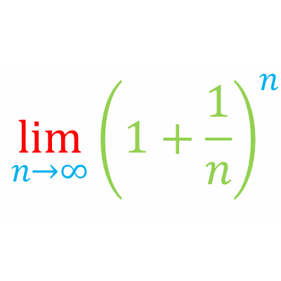
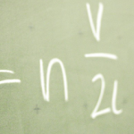
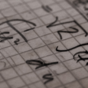
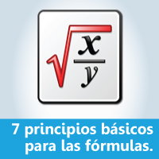
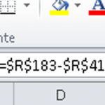

¿Has trabajado con las fórmulas en Excel usando el modo de prueba y error?

¿Tu primer contacto con una fórmula fue aquella que te dejó aquel compañero que ya no está en la empresa?

Si estás leyendo esto es muy probable que quieras mejorar en el uso de fórmulas de Excel.

¡Pues has llegado al lugar indicado!

Prepárate para desatar el potencial de esta increíble herramienta de Excel y llevar tus **habilidades de automatización** al siguiente nivel.

## ¿Qué son las fórmulas en Excel?

Las fórmulas de Excel son el corazón y alma de la automatización en esta poderosa **hoja de cálculo**.

Son pequeñas instrucciones “mágicas” que puedes darle a una hoja de cálculo (como Excel) para que haga cálculos automáticamente.

Estas instrucciones pueden ser tan simples como operadores aritméticos, de comparación, de concatenación o de referencia:

- Tipos de operadores de las fórmulas de Excel

También existen otro tipo de instrucciones que puedes darle a Excel y que pueden realizar tareas más complejas. Estas son las [funciones de Excel](/blog/automatizacion-con-excel/funciones-en-excel/).

#### [Introducción a la automatización con Excel: ¿Qué son las funciones?](/blog/automatizacion-con-excel/funciones-en-excel/)

Las funciones en Excel son esenciales para la automatización y se usan para una variedad de operaciones.

Las funciones de Excel se diferencian de los operadores porque son capaces de realizar tareas más complejas, es decir, pueden realizar una serie de tareas que ya están programadas para Resolver problemas que son más complejos.

Además, las funciones de Excel, utilizan [argumentos](/blog/automatizacion-con-excel/argumentos-en-excel/) que debes pasarles para que realicen las operaciones sobre ellos.

#### [¿ Qué son los argumentos en Excel ?](/blog/automatizacion-con-excel/argumentos-en-excel/)

¿Aún no te he explicado qué son los argumentos en Excel?

Así podrías usar una función como [SUMA](/blog/automatizacion-con-excel/funcion-suma-en-excel/) para sumar 1000 números o una función como [PROMEDIO](/blog/automatizacion-con-excel/funcion-promedio-en-excel/) para obtener el promedio de 100,000 números. Estos números se los pasas como argumento a la función.

Algo así como:

\=SUMAR(A1:A1000)

Donde el argumento es el rango A1:A1000 y es el conjunto de datos que la función SUMA te devolverá sumados.

Incluso puedes resolver problemas más complejos como análisis de varianza, desviación estándar, trabajos con matrices, Etcétera.

Algo así como cuando le pides a tu amigo genio que te ayude con una tarea de matemáticas o finanzas.

Pero claro, en lugar de tu amigo se lo pides a [Excel](/blog/automatizacion-con-excel/).

## ¿Por dónde puedo comenzar con las fórmulas en Excel?

Si quieres empezar de cero con las fórmulas puedes comenzar por reforzar tu definición sobre lo [que es una fórmula en Excel](/blog/automatizacion-con-excel/que-es-una-formula-en-excel/).

#### [¿ Qué es una fórmula en Excel ?](/blog/automatizacion-con-excel/que-es-una-formula-en-excel/)

¿Quieres comenzar con Excel? Empecemos por el principio. Vamos a definir lo que es una fórmula en Excel.

Una vez que ya tienes clara la definición de lo que es una fórmula De Excel, tal vez sea conveniente que reafirmes lo que has aprendido hasta el momento analizando las pequeñas [diferencias entre una fórmula de Excel y una función de Excel](/blog/automatizacion-con-excel/formula-de-excel/).

#### [¿Cuál es la diferencia entre una Fórmula de Excel y una Función de Excel?](/blog/automatizacion-con-excel/formula-de-excel/)

Si aún no tienes clara la diferencia y confundes fórmulas y funciones, aquí te muestro la diferencia entre fórmulas de Excel y funciones de Excel

Si has llegado hasta aquí, ahora es el momento de que descubras cuáles son los 7 elementos básicos de una fórmula que tú debes conocer.

#### [7 elementos básicos de una fórmula, que tú debes conocer](/blog/automatizacion-con-excel/elementos-basicos-de-una-formula/)

Si eres nuevo en el uso de fórmulas en Excel, no te puedes perder estos principios sobre los cuales se basa todo el manejo de las mismas. Una lista que deberías tener a la mano para referencia rápida 😉

Espera, antes de continuar te recomiendo que tengas en cuenta estos 7 principios básicos para trabajar con fórmulas en Excel que deberías saber si en realidad quieres avanzar a paso firme en tu camino hacia el dominio de Excel.

#### [7 Principios básicos para trabajar con fórmulas en Excel](/blog/automatizacion-con-excel/formulas-en-excel/)

Si eres nuevo en el uso de fórmulas en Excel, no te puedes perder estos principios sobre los cuales se basa todo el manejo de las mismas. Una lista que deberías tener a la mano para referencia rápida 😉

> ❓ ¿Sabías que puedes [utilizar operaciones matemáticas simples sobre tus datos, sin utilizar fórmulas?](/blog/automatizacion-con-excel/operaciones-matematicas/), antes de continuar tu lectura.

**¿Y cuáles serían las fórmulas con las que yo debería comenzar?**

Hasta este punto (si te has leído los artículos que te he recomendado) ya has realizado algunas pruebas de fórmulas sencillas, como sumar o multiplicar números. Incluso dividir o elevar a una potencia.

Luego de esto el siguiente paso, es utilizar estas mismas fórmulas sencillas, pero ya no en números o letras directamente sino utilizando las referencias de celdas en Excel.

#### [¿Qué son las referencias en Excel?](/blog/automatizacion-con-excel/referencia-en-excel/)

Antes de comenzar con las fórmulas, es necesario que aprendas qué es una referencia.

Una vez que hayas trabajado tus primeras fórmulas utilizando referencias, es muy importante que aprendas las diferencias entre las referencias absolutas y relativas. Te aseguro que si sabes esto vas a evitarte muchos Dolores de cabeza en el futuro.

#### [Referencias absolutas y relativas](/blog/automatizacion-con-excel/referencias-absolutas-y-relativas/)

Una referencia en Excel identifica a una celda (o [rango de celdas](/blog/automatizacion-con-excel/rango-en-excel/)) dentro de una hoja de trabajo y le hace saber a Excel en dónde buscar los valores que se quieren utilizar en una fórmula.

## Manejando las fechas en Excel

Uno de los principales tipos de datos que manejarás con Excel son las fechas pero, ¿sabías que para Excel las fechas no son lo que parece? [Aquí te lo cuento todo](/blog/automatizacion-con-excel/que-son-las-fechas/).

Y si ya quieres comenzar a utilizar tus primeras funciones, yo te recomendaría comenzar por las más sencillas y a la vez más utilizadas por los principiantes:

- [SUMA](/blog/automatizacion-con-excel/funcion-suma-en-excel/)

- [PROMEDIO](/blog/automatizacion-con-excel/funcion-promedio-en-excel/)

- [HOY](/blog/automatizacion-con-excel/funcion-hoy/)

- [AHORA](/blog/automatizacion-con-excel/funcion-ahora/)

- [SUMAR.SI](/blog/automatizacion-con-excel/funcion-sumar.si/)

> ¿Sabías que puedes [encontrar las celdas que **no tienen fórmula**](/blog/automatizacion-con-excel/celdas-que-no-tienen-formula/) de manera fácil y rápida? 

## Funciones lógicas

[Función SI](/blog/automatizacion-con-excel/la-funcion-si/)

## Funciones de texto

[Función CONCATENAR](/blog/automatizacion-con-excel/concatenar-en-excel/)

[Función IZQUIERDA](/blog/automatizacion-con-excel/funcion-izquierda-en-excel/)

[Función ESPACIOS](/blog/automatizacion-con-excel/eliminar-espacios-en-excel/)

## Funciones financieras

## Funciones de fecha y hora

[Función AÑO](/blog/automatizacion-con-excel/funcion-ano-en-excel/)

[Función DIA](/blog/automatizacion-con-excel/funcion-dia-en-excel/)

[Función MES](/blog/automatizacion-con-excel/funcion-mes-en-excel/)

## Funciones de búsqueda y referencia

[Función COINCIDIR](/blog/automatizacion-con-excel/la-funcion-coincidir/)

## Funciones matemáticas y trigonométricas

[Función REDONDEAR](/blog/automatizacion-con-excel/funcion-redondear/)

[Función ABS](/blog/automatizacion-con-excel/funcion-abs/)

[Función PRODUCTO](/blog/automatizacion-con-excel/funcion-producto-en-excel/)

[Función MAX / Función MIN](/blog/automatizacion-con-excel/funcion-max-y-min-en-excel/)

## ¿Qué puedo hacer con las fórmulas de Excel?

[Cómo sumar celdas visibles](/blog/automatizacion-con-excel/sumar-celdas-visibles-en-excel/)

[Cómo encontrar el valor mínimo](/blog/automatizacion-con-excel/encontrar-el-minimo-con-excel/)

[Cómo restar fechas](/blog/automatizacion-con-excel/diferencia-de-fechas-en-excel/)

[Cómo concatenar un rango sin usar macros](/blog/automatizacion-con-excel/sin-usar-macros/)

[Cómo rellenar un texto o cómo forzar una longitud fija en Excel](/blog/automatizacion-con-excel/como-rellenar-un-texto/)

[Cómo buscar datos en Excel](/blog/automatizacion-con-excel/busqueda-de-datos-en-excel/)

[Cómo resaltar una fecha de vencimiento](/blog/automatizacion-con-excel/resaltar-una-fecha-de-vencimiento/)

## Preguntas más frecuentes sobre fórmulas y funciones en Excel

¿Cuáles son las 10 fórmulas (funciones) más usadas en Excel?

`SUMA`  
PROMEDIO  
CONTAR  
`HOY`  
`CONTARA`  
`CONCATENAR`  
`BUSCARV`  
`SI`  
`SUMAR.SI`  
`CONTAR.SI`

¿Cuáles las 3 fórmulas (funciones) de Excel más usadas por los principiantes?

`SUMA`  
PROMEDIO  
CONTAR

¿Cuáles son los tipos de funciones de Excel?

`Funciones de búsqueda y referencia`  
`Funciones de texto`  
`Funciones lógicas`  
`Funciones de fecha y hora`  
`Funciones de base de datos`  
`Funciones matemáticas y trigonométricas`  
`Funciones financieras`  
`Funciones estadísticas`  
`Funciones de información`  
`Funciones de ingeniería`  
`Funciones de cubo`  
`Funciones web`
