¿Te has olvidado cómo crear un gráfico en Excel?

¿Justo ahora que te pidieron ese reporte o te toca hacer tu tesis?

Sí, recuerdas que son sencillos. Pero necesitas un empujón.

En este video, te muestro tres formas sencillas y rápidas de hacerlo.

Con estos consejos, podrás crear el gráfico perfecto en minutos, ahorrarás tiempo y tendrás mejores resultados.

https://youtu.be/n934NjJY-Xc

Si has olvidado cómo crear un gráfico en Excel, este video te ayudará a recordarlo en menos de 3 minutos

## Prepara tus datos

Primero es lo primero, asegúrate de tener los datos necesarios, para poder crear tu gráfico.

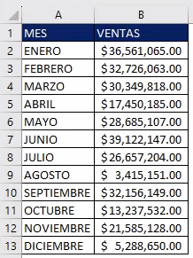

Una vez que los tengas, hay varias maneras de crear un gráfico en Excel.

## Utilizando el Asistente de gráficos.

La primera opción, es usando los gráficos recomendados, que vienen por defecto en Excel.

[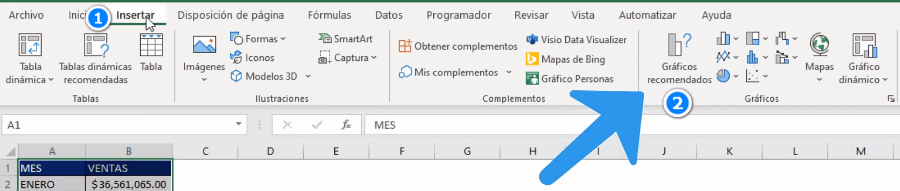](https://raymundoycaza.com/wp-content/uploads/2023/07/image-1.png)

Para hacer esto, simplemente tienes que seleccionar los datos que quieres graficar, te diriges a la pestaña "Insertar" y seleccionas la opción "Gráficos recomendados".

[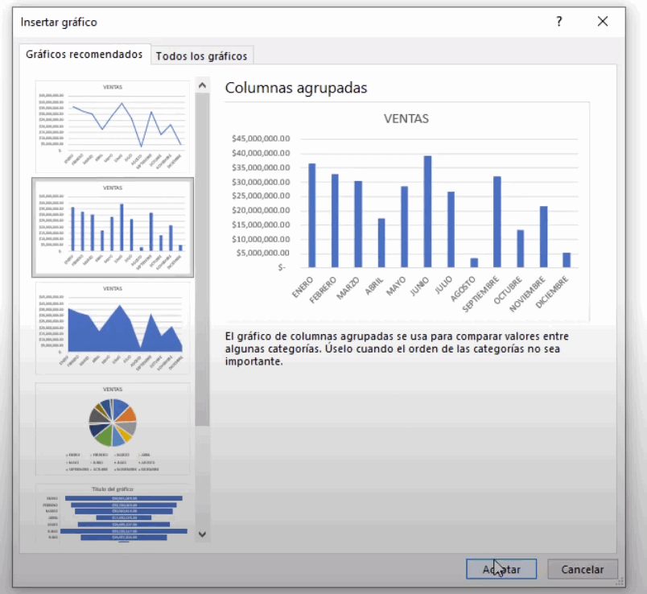](https://raymundoycaza.com/wp-content/uploads/2023/07/image-2.png)

Ahí, podrás elegir entre una gran variedad de gráficos, y ver cuál se ajusta mejor a tus necesidades.

La ventaja de este método, es que Excel predice cuál sería el tipo de gráfico que se adapta mejor a tus datos.

Te ahorrará tiempo, y tendrás más probabilidades de alcanzar un resultado efectivo.

## Insertando directamente el gráfico deseado.

La segunda opción, es seleccionar el gráfico manualmente.

[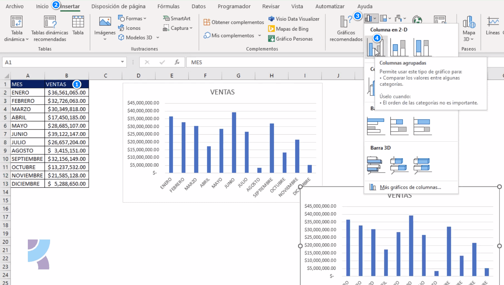](https://raymundoycaza.com/wp-content/uploads/2023/07/image-4.png)

Primero selecciona tus datos, luego dirígete a la pestaña "Insertar", selecciona el tipo de gráfico que deseas, y finalmente ajusta los detalles como títulos y etiquetas.

Si ya tienes claro el gráfico que necesitas y quieres ir directamente a él, esta es la opción que deberías usar.

## Insertando el gráfico manualmente.

La tercera opción es hacerlo manualmente.

Aunque puede parecer más complicado, en realidad es muy fácil.

[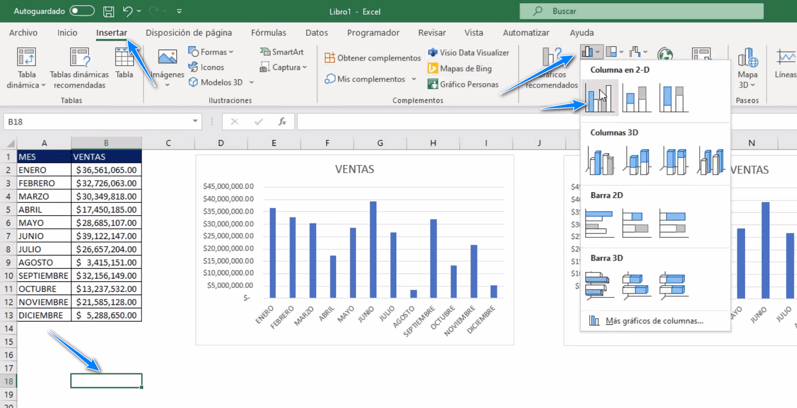](https://raymundoycaza.com/wp-content/uploads/2023/07/image-6.png)

1️⃣ Selecciona una celda en blanco.

2️⃣ Inserta normalmente tu gráfico. Se creará, en blanco.

3️⃣ Haz clic derecho sobre tu gráfico en blanco, y haz clic en "Seleccionar datos".

[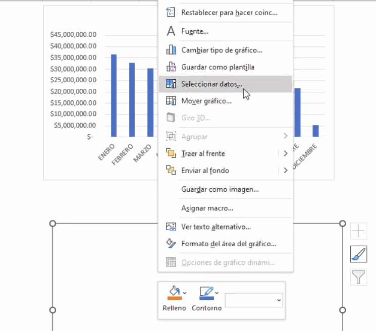](https://raymundoycaza.com/wp-content/uploads/2023/07/image-7.png)

4️⃣ En el panel de series, haz clic en "Agregar".

[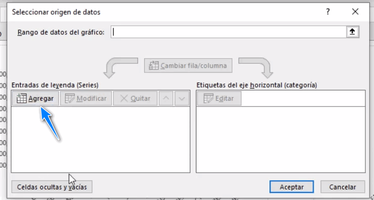](https://raymundoycaza.com/wp-content/uploads/2023/07/image-8.png)

5️⃣ Aquí, puedes seleccionar la celda que tendrá el título de tu serie.

[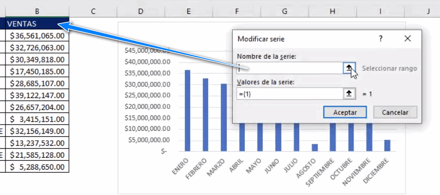](https://raymundoycaza.com/wp-content/uploads/2023/07/image-9.png)

O puedes escribir un título diferente, según lo necesites.

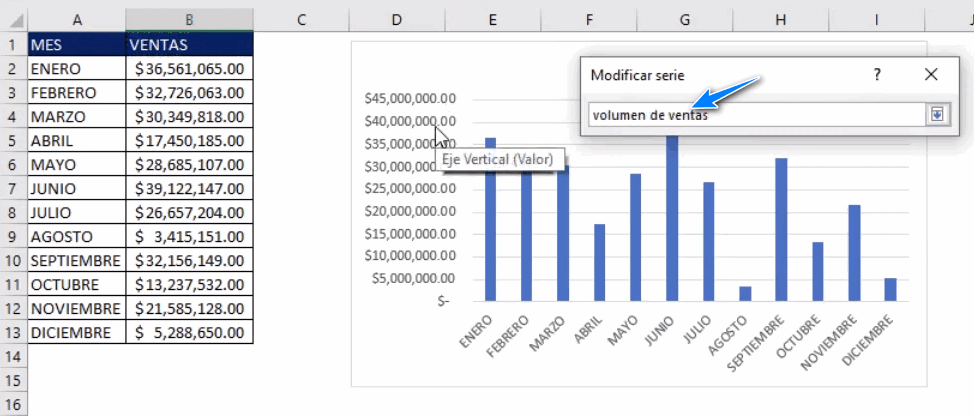

6️⃣ Luego, selecciona el rango con los datos, y haz clic en "Aceptar".

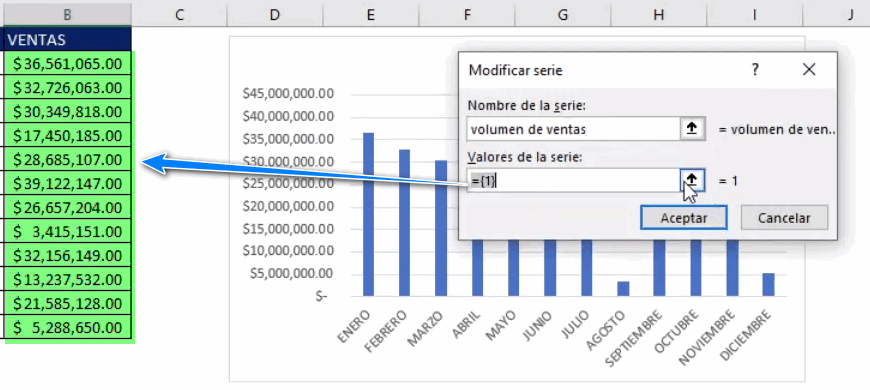

7️⃣ Ahora, podrías dejar las etiquetas como están, o puedes seleccionar un rango desde donde quieres que tome los valores para las etiquetas. Haz clic en "Editar" y selecciona el rango deseado para las etiquetas (los valores que van "abajo" en el gráfico).

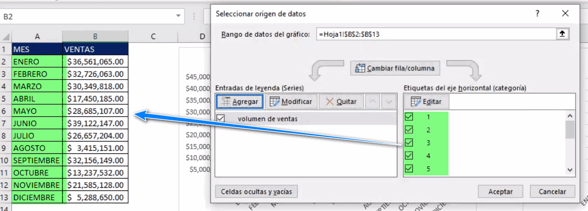

```
Recuerda que el número de etiquetas, debe coincidir con el número de datos, o tendrás un error.
```

8️⃣ Clic en "Aceptar".

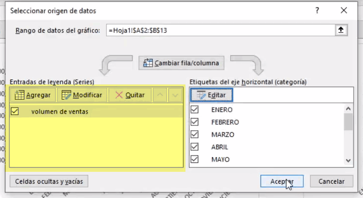

Aquí podrás agregar más series si lo deseas.

9️⃣ Cuando hayas terminado, clic en "Aceptar".

Ahora ya puedes añadir elementos como título, etiquetas, colores, y mucho más.

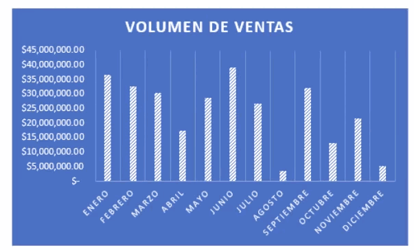

Esta opción es ideal para ti, si lo que quieres es un gráfico más personalizado, en cuestión de minutos.

Y ahí lo tienes, ¡tres formas sencillas y rápidas de crear un gráfico en Excel!

## Pon en práctica lo aprendido: cómo crear un gráfico en Excel

En este video te doy una pequeña guía para que tu memoria recuerde cómo crear un gráfico en Excel y puedas salir de ese atasco en el que todos nos vemos alguna vez.

Crear un gráfico en Excel es una de esas cosas sencillas de hacer y muy necesarias en nuestro día a día laboral. Crear un gráfico en Excel es imprescindible si tienes que hacer un reporte en el que debes comunicar efectivamente datos cuantitativos a tus clientes (internos o externos).

No subestimes la importancia de estas habilidades porque ya son parte de la realidad del trabajador moderno.

La mejor forma de aprender es practicando, practicando y practicando.

¡Ahora, corre a terminar ese reporte!

🐌
