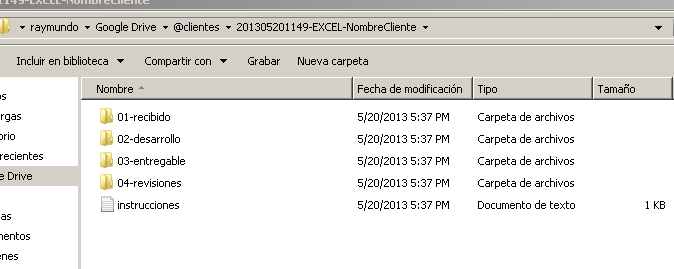
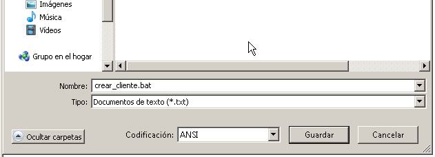
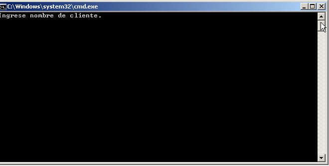

Organiza tus proyectos de una vez con una estructura fija de archivos que te permita saber siempre donde encontrar cada cosa. En esta entrada te muestro cómo puedes crear varias carpetas a la vez, para ahorrar tiempo.

Si estás realizando trabajos en Excel o cualquier otro tipo de proyectos en el que tengas que manejar varios clientes, seguramente ya tendrás definida una estructura de carpetas para organizar mejor tu información.

¿Que no? Si es así, lo estás haciendo muy mal mi amigo. El pilar fundamental de la productividad es la organización y, si no la tienes, debes ponerte ya a buscar la forma de organizarte.

## Organizarse por dentro.

Cada uno de nosotros tiene un estilo propio para organizarse, el desorden de uno es el más grande desorden para el otro. Todos tenemos necesidades diferentes y pequeñas diferencias en nuestro flujo de trabajo que marcan un rumbo distinto en cada caso.

Sea cual sea tu estilo, si realizas proyectos muy a menudo, tendrás muchas carpetas con los nombres de tus clientes o algún otro identificador según tus necesidades. Pero dentro de cada carpeta de estas, necesitas **otro nivel de organización adicional**, para que los archivos recibidos, procesados, entregados y revisados no se mezclen en un monumental testimonio al caos.

Si tienes todos los archivos en una sola carpeta, tendrás los tres archivos que te envió el cliente, los tres archivos que hiciste tú para el desarrollo más el archivo final que entregarás.

Adicional a eso, tendrás las mil y una revisiones que a veces se generan por pequeños cambios o errores en el diseño. Ahora, imagínate eso por un momento.

Tu carpeta contiene un montón de archivos del estilo: facturador, facturador-revision1, facturador-revision2, facturador-final, facturador-final-final... etc.

## Tu estructura de carpetas (directorios)

Yo puedo sugerirte la siguiente estructura de carpetas que hasta ahora me funciona bien y cada vez que un cliente me solicita un trabajo, creo las siguientes carpetas:

**20130520-EXCEL-NombreCliente**

**\->01-RECIBIDO** (Aquí coloco todos los archivos que me envía el cliente)

**\->02-DESARROLLO** (Aquí coloco todos los archivos que yo genero a partir de los datos que me envía el cliente -el trabajo en curso-)

**\->03-ENTREGABLE** (Aquí coloco el archivo final que entregaré por primera vez al cliente para su revisión y aprobación)

**\->04-REVISIONES** (La vida no siempre es color de rosa, aquí coloco las diferentes revisiones del archivo entregable, en caso de que hubieran cambios o ajustes que realizar. Me sirve de referencia también para darme una idea de cuánto me costó el proyecto en horas de trabajo)

**Instrucciones.txt** (Aquí se transcriben las instrucciones del cliente, tal cual te las hizo llegar por correo u otro medio)

En esta  imagen, te muestro cómo queda la estructura de archivos al finalizar:

 ¿Has notado cómo he nombrado a la carpeta 'madre'? `201305201149-EXCEL-NombreCliente`

1. La primera parte del nombre es la fecha y la hora, en formato YYYYMMDDHHNN. Esto me ayuda a que las carpetas automáticamente se organicen en orden cronológico y así puedo utilizar el método [FIFO](http://es.wikipedia.org/wiki/FIFO_y_LIFO_(contabilidad) "FIFO"), ya que sé de antemano cuál es el proyecto más antiguo, al cual debo darle prioridad.
2. La segunda parte del nombre es el tipo de proyecto. En mi caso, realizo trabajos de Excel, Access, .NET ocasionalmente y también realizo vídeos de Social Media en otra página. Así que en esta parte yo puedo colocar un identificador que me permita rápidamente identificar el tipo de proyecto que contiene la carpeta.
3. Y al final, tengo el nombre del cliente.  Esto es para identificar claramente de quién es el encargo. Así, solo debes hacer un escaneo visual rápido y encontrarás ese proyecto en un abrir y cerrar de ojos.

\[highlight\]**Nota**: Yo he agregado la hora porque en mi caso, recibo en el mismo día pedidos nuevos del mismo cliente y esto me ayuda a que el nombre no se repita y así poder manejar los proyectos por separado, a pesar de pertenecer al mismo cliente.\[/highlight\]

## Automatizar la tarea.

Por supuesto que estar creando todas estas carpetas cada vez que te llega un trabajo, sería una tarea por lo menos aburrida. No gastes tu tiempo haciéndolo manualmente y automatiza estas tareas mecánicas.

### Usando 'Batch'.

Esta vez, no utilizaré Excel, aunque también puede utilizarse. Así que utilizando un [archivo batch](http://es.wikipedia.org/wiki/Archivo_batch "Archivo batch"), puedes crear todas estas carpetas con un doble clic de ratón. En este código, aprovecharé para utilizar otro formato para que veas que puedes realizar cualquier variación en el nombre de tu carpeta.

Para realizar este programa, basta con crear un nuevo archivo en tu bloc de notas y pegar el siguiente código en él:

\[aviso type="codigo"\]set /P cliente="Ingrese nombre de cliente. " rem crear estructura de directorios For /f "tokens=2-4 delims=/ " %%a in ('date /t') do (set mydate=%%c-%%a-%%b) For /f "tokens=1-2 delims=/:" %%a in ('time /t') do (set mytime=%%a%%b) rem echo %mydate%\_%mytime% mkdir %cliente%-%mydate% echo "Creando estructura de directorios para el cliente: " %cliente% cd %cliente%-%mydate% mkdir 01-recibido mkdir 02-desarrollo mkdir 03-entregable mkdir 04-revisiones echo %DATE% >> instrucciones.txt\[/aviso\]

Al final, debes guardar el archivo con la extensión `.bat` tal y como te muestro en la imagen:

 

 

Al final, debe quedarte un 'Archivo por lotes de Windows', así:

 

Ahora, lo único que debes hacer, es un doble clic sobre tu flamante archivo y aparecerá una ventana de color negro que te preguntará por el nombre de tu cliente.

 

Aquí yo escribo algo así: `EXCEL-MiMejorCliente`

Y desde ahora, podrás crear automáticamente todas las subcarpetas necesarias para administrar tu proyecto. Solo falta que coloques cada cosa donde corresponde :)

## ¿Y tú, qué metodología de organización utilizas?

Si tienes ya implementado tu propia metodología de organización, me gustaría conocerla. Sería bueno que lo compartas en los comentarios para que otros usuarios puedan nutrirse con variedad de ideas que los inspiren a desarrollar su propio estilo de organización.

¡Nos vemos!
